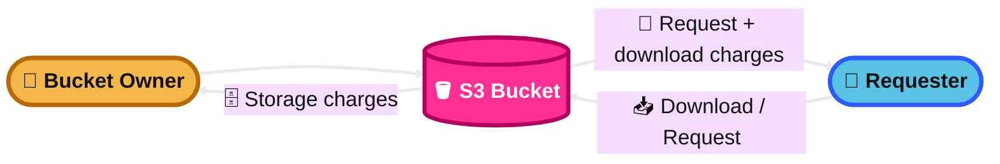
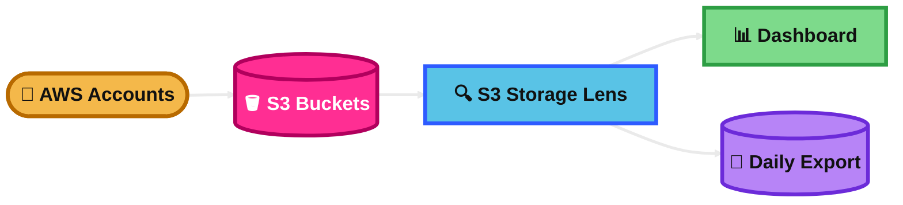
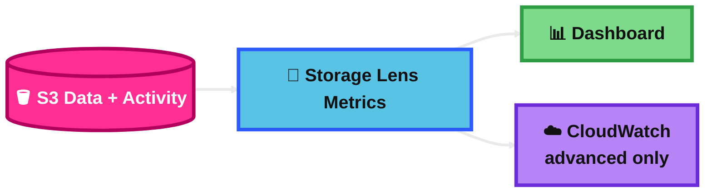
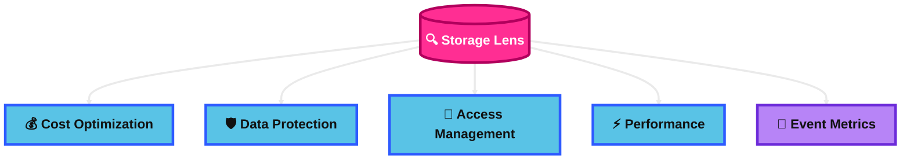
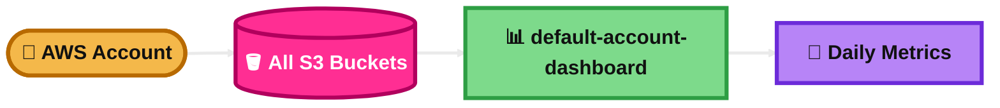

## Requester Pay (Requester Pays)

### What is it?
Requester Pays is an S3 bucket setting.

It shifts request and download charges from the bucket owner to the person who accesses the data.

The bucket owner still pays for storing the objects.

### How it works?
You enable Requester Pays on an S3 bucket.

When another account downloads objects or sends requests, that requester is billed for the request and data transfer.

The requester must explicitly say they accept the charges. In the CLI, this is done with a requester-payer option.

### Use Case
A company shares a large public dataset in S3.

They want many users to download it, but they do not want to pay every download bill.

Requester Pays is a good fit.

### Exam Tip
Look for clues like:
- “share data with other accounts”
- “bucket owner should not pay for downloads”
- “cost should be charged to the consumer”

Big trap:
Requester Pays does **not** mean the bucket owner stops paying for storage. The owner still pays to store the data.

### Visual Mermaid

## Event Notification (S3 Event Notifications)

### What is it?
S3 Event Notifications let Amazon S3 alert another service when something happens in a bucket.

Common events are object created, object deleted, restore events, and lifecycle-related events.

### How it works?
You configure a bucket to watch for specific events.

When the event happens, S3 sends a notification to a destination such as SNS, SQS, Lambda, or EventBridge.

You can also filter by object key prefix or suffix, such as `.jpg` or `incoming/`.

### Use Case
A user uploads an image to S3.

S3 sends an event to Lambda.

Lambda creates a thumbnail automatically.

### Exam Tip
Look for clues like:
- “run code when a file is uploaded”
- “send a message when an object is created”
- “process new files automatically”

Big traps:
S3 Event Notifications are **at least once**, so duplicates can happen.
Order is **not guaranteed**.
Your design should be idempotent.

### Visual Mermaid

```mermaid
%%{init: {'theme':'base','themeVariables': {
  'background':'#0B0F19',
  'primaryTextColor':'#111111',
  'secondaryTextColor':'#111111',
  'tertiaryTextColor':'#111111',
  'lineColor':'#EAEAEA',
  'fontSize':'20px'
}}}%%
flowchart LR
    U([👤 User Uploads File]):::user --> B[(🪣 S3 Bucket)]:::core
    B --> E[📣 Event Notification]:::app
    E --> L[⚙️ Lambda / SQS / SNS / EventBridge]:::data
    L --> V[📈 Processing Result]:::dash

    classDef user fill:#F4B84A,stroke:#B86A00,stroke-width:4px,color:#111111,font-weight:bold;
    classDef app fill:#59C3E6,stroke:#2E5BFF,stroke-width:4px,color:#111111,font-weight:bold;
    classDef data fill:#B784F7,stroke:#6C2BD9,stroke-width:4px,color:#111111,font-weight:bold;
    classDef core fill:#FF2E93,stroke:#B1005D,stroke-width:4px,color:#FFFFFF,font-weight:bold;
    classDef dash fill:#7DDA8B,stroke:#2E9E44,stroke-width:4px,color:#111111,font-weight:bold;

    linkStyle 0,1,2,3 stroke:#EAEAEA,stroke-width:3px;
```

## S3 Storage Lens

### What is it?
S3 Storage Lens is an analytics feature for Amazon S3.

It helps you understand storage usage and activity across buckets and even across AWS accounts in an organization.

It is mainly used for visibility, optimization, and governance.

### How it works?
S3 Storage Lens collects usage and activity metrics and shows them in dashboards.

It updates metrics daily.

You can drill down by organization, account, bucket, Region, prefix, or Storage Lens group.

You can also export reports for deeper analysis.

### Use Case
A company has many S3 buckets across many accounts.

They want to find the fastest-growing buckets, poor lifecycle usage, and data protection gaps.

S3 Storage Lens is a strong fit.

### Exam Tip
Look for clues like:
- “analyze S3 usage across many buckets”
- “find storage cost optimization opportunities”
- “organization-wide S3 visibility”
- “identify buckets missing best practices”

Big trap:
This is an **analytics/visibility** tool, not the main service for real-time app monitoring.

### Visual Mermaid

## Storage Lens Metrics

### What is it?
Storage Lens Metrics are the measurements that S3 Storage Lens collects about your S3 environment.

They show storage usage, activity, trends, and best-practice signals.

There are free metrics and paid advanced metrics.

### How it works?
S3 Storage Lens gathers metrics daily.

These metrics can be viewed in the Storage Lens dashboard.

With advanced metrics, you can also publish them to CloudWatch and get more detailed visibility, including detailed status-code insights.

Metrics can exist at different levels, such as organization, account, bucket, and prefix.

### Use Case
You want to know which buckets are growing fast, which buckets have many failed requests, or which buckets are not using lifecycle rules well.

Storage Lens metrics help answer those questions.

### Exam Tip
Look for clues like:
- “daily S3 usage trends”
- “free vs advanced S3 analytics”
- “publish S3 Storage Lens metrics to CloudWatch”
- “analyze usage across account or bucket level”

Big traps:
Advanced metrics cost extra.
Prefix-level metrics are not available in CloudWatch.

### Visual Mermaid

## Storage Lens Metrics Categories

### What is it?
Storage Lens Metrics Categories are groups of metrics that help you focus on a specific goal.

They make it easier to review S3 health from an exam point of view.

### How it works?
Storage Lens organizes metrics into categories such as:
- cost optimization
- data protection
- access management
- performance
- event-related insights

You review the category that matches the problem you are trying to solve.

### Use Case
You want to find buckets without lifecycle rules.

That points to cost optimization metrics.

You want to find buckets without strong protection settings.

That points to data protection metrics.

### Exam Tip
Match the question to the category:
- lower S3 cost → cost optimization
- missing versioning or encryption → data protection
- ACL/Object Ownership issue → access management
- failed requests or request trend issue → performance
- event setup visibility → event metrics

Big trap:
Storage Lens helps you **analyze** these areas. It does not itself fix the settings.

### Visual Mermaid

## Storage Lens Default Dashboard

### What is it?
The Storage Lens Default Dashboard is the automatically created S3 Storage Lens dashboard for your account.

Its name is `default-account-dashboard`.

It gives a quick account-wide view of S3 usage and trends.

### How it works?
Amazon S3 preconfigures it for your whole account and updates it daily.

You cannot change its scope.

You can upgrade it from free metrics to advanced metrics.

You can disable it, but you cannot delete it.

### Use Case
A team wants a fast built-in S3 dashboard without creating a custom one.

They just want a daily account-level view of S3 storage insights.

The default dashboard fits that need.

### Exam Tip
Look for clues like:
- “default built-in S3 analytics dashboard”
- “account-wide daily S3 summary”
- “no need to create custom dashboard”

Big traps:
It is not real time.
You cannot change its scope.
It can be disabled, but not deleted.

### Visual Mermaid

## Summary Table

| Topic | What It Is | How It Works | Best Use Case | Exam Trigger |
|---|---|---|---|---|
| Requester Pay (Requester Pays) | S3 bucket setting that shifts request and download charges to the requester | Requester accesses the bucket and accepts charges; owner still pays storage | Sharing large datasets without paying every consumer download cost | “Consumer should pay for downloads” |
| Event Notification (S3 Event Notifications) | S3 feature that sends alerts when bucket events happen | S3 sends events to Lambda, SQS, SNS, or EventBridge | Auto-process files after upload | “Run action when object is created” |
| S3 Storage Lens | S3 analytics and visibility feature | Collects daily metrics and shows dashboards across buckets/accounts | Analyze S3 usage, growth, and best-practice gaps | “Need account-wide or org-wide S3 visibility” |
| Storage Lens Metrics | The actual measurements collected by Storage Lens | Daily metrics shown in dashboard; advanced metrics can go to CloudWatch | Track usage trends, failed requests, and optimization signals | “Need S3 metrics, trends, free vs advanced” |
| Storage Lens Metrics Categories | Logical groups of Storage Lens metrics | Metrics are grouped by goals like cost, protection, access, and performance | Quickly focus on the right problem area | “Need to identify cost, security, or performance issue in S3” |
| Storage Lens Default Dashboard | Built-in Storage Lens dashboard for the account | Preconfigured, account-wide, daily updated, limited customization | Quick S3 visibility without creating custom dashboard | “Default S3 dashboard” |