## S3 Server-Side Encryption (SSE)

### What is it?
SSE means Amazon S3 encrypts your object after it reaches S3.

It protects data at rest. S3 decrypts the object for authorized reads, so apps usually work the same way.

### How it works?
Your app uploads an object to S3.

S3 encrypts the object on the server side before saving it. The encryption type can be SSE-S3, SSE-KMS, or SSE-C.

### Use Case
A company stores invoices in S3 and wants encryption at rest without changing the application much.

### Exam Tip
If the question says “encrypt data at rest in S3” and does not require special key control, think of SSE first.

Trap: SSE is the broad category, not one specific key option. The exam often wants you to choose between SSE-S3, SSE-KMS, or SSE-C.

### Visual Mermaid
```mermaid
%%{init: {'theme':'base','themeVariables': {
  'background':'#0B0F19',
  'primaryTextColor':'#111111',
  'secondaryTextColor':'#111111',
  'tertiaryTextColor':'#111111',
  'lineColor':'#EAEAEA',
  'fontSize':'20px'
}}}%%
flowchart LR
    U([👤 App User]):::user --> A[📤 Upload to S3]:::app
    A --> S[(🪣 S3 Bucket)]:::core
    S --> D[(🔐 Encrypted Object)]:::data
    D --> V[📥 Authorized Read]:::dash

    classDef user fill:#F4B84A,stroke:#B86A00,stroke-width:4px,color:#111111,font-weight:bold;
    classDef app fill:#59C3E6,stroke:#2E5BFF,stroke-width:4px,color:#111111,font-weight:bold;
    classDef data fill:#B784F7,stroke:#6C2BD9,stroke-width:4px,color:#111111,font-weight:bold;
    classDef core fill:#FF2E93,stroke:#B1005D,stroke-width:4px,color:#FFFFFF,font-weight:bold;
    classDef dash fill:#7DDA8B,stroke:#2E9E44,stroke-width:4px,color:#111111,font-weight:bold;

    linkStyle 0,1,2,3 stroke:#EAEAEA,stroke-width:3px;
```
## S3 Encryption with Amazon-Managed Key (SSE-S3)

### What is it?
SSE-S3 is server-side encryption where S3 manages the keys for you.

This is the simplest S3 encryption option. It is the default base encryption for all new uploads.

### How it works?
You upload an object to S3.

S3 encrypts each object with a unique key and protects that key with another key that S3 rotates. You do not manage KMS keys.

### Use Case
You want encrypted data at rest in S3 with the least cost and least management.

### Exam Tip
Good answer when the question wants simple, low-cost encryption at rest in S3.

Keywords: default encryption, no extra key management, no extra cost, easiest option.

Trap: If the question wants audit trails, key policies, cross-account KMS sharing, or tighter control, SSE-KMS is usually better.

### Visual Mermaid
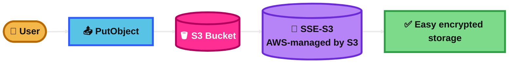
## S3 Encryption with AWS KMS (SSE-KMS)

### What is it?
SSE-KMS is server-side encryption where S3 uses AWS KMS keys.

It gives you more control than SSE-S3. You can use key policies, audit key usage, and manage customer managed keys.

### How it works?
You upload an object to S3 and choose SSE-KMS.

S3 asks KMS for a data key, encrypts the object, and stores the encrypted data. KMS helps protect the data key using envelope encryption.

### Use Case
A company stores sensitive HR files in S3 and needs audit trails, controlled key access, and compliance reporting.

### Exam Tip
Choose SSE-KMS when the question mentions audit, compliance, key rotation, customer managed keys, or fine-grained access control.

Keywords: CloudTrail for key usage, KMS key policy, customer managed key, compliance.

Trap: SSE-KMS costs more than SSE-S3 because KMS requests can add cost. S3 Bucket Keys can reduce that cost.

### Visual Mermaid
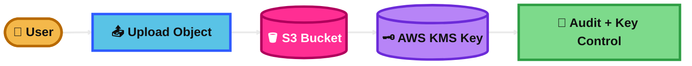
## S3 Encryption with Customer-Provided Key (SSE-C)

### What is it?
SSE-C is server-side encryption where you provide the encryption key and S3 does the encryption.

S3 does not store your key. You must send the same key again whenever you read the object.

### How it works?
Your app sends the object and the customer-provided key in the request.

S3 encrypts the object, stores the encrypted data, and forgets the key. On download, you must provide the same key again.

### Use Case
A company wants S3 to encrypt data, but wants to keep encryption keys outside AWS control.

### Exam Tip
Choose SSE-C only when the question clearly says the company must provide and keep the key itself, while still using server-side encryption.

Keywords: customer provides key, S3 does encryption, key sent with every request, HTTPS required.

Trap: Very uncommon on the exam. If the requirement is “AWS must never see plaintext,” that points more to client-side encryption, not SSE-C.

### Visual Mermaid

## S3 Client-Side Encryption

### What is it?
Client-side encryption means you encrypt the data before sending it to S3.

S3 stores ciphertext only. AWS does not perform the encryption or decryption.

### How it works?
Your application or encryption client encrypts the file locally.

Then it uploads the already-encrypted object to S3. When reading it back, the client decrypts it.

### Use Case
A medical app must ensure data is encrypted before it leaves the client and AWS should never see the plaintext.

### Exam Tip
If the question says “encrypt before upload” or “AWS must not have access to plaintext,” choose client-side encryption.

Keywords: encrypt locally, before upload, customer controls full encryption process.

Trap: Do not confuse this with SSE-C. In SSE-C, S3 still performs the encryption. In client-side encryption, your app does.

### Visual Mermaid
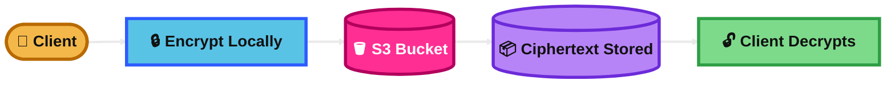
## S3 In-Transit Encryption

### What is it?
In-transit encryption protects data while it moves between the client and S3.

In S3, this usually means HTTPS using TLS.

### How it works?
The client connects to S3 over HTTPS.

You can enforce it with a bucket policy that denies requests when `aws:SecureTransport` is false.

### Use Case
A company uploads customer data to S3 and wants to block all insecure HTTP traffic.

### Exam Tip
If the question says “data in transit,” “HTTPS only,” or “block unencrypted network traffic,” think TLS plus bucket policy.

Keywords: HTTPS, TLS, `aws:SecureTransport`, deny HTTP.

Trap: This is different from encryption at rest. In-transit protects the network path, not the stored object.

### Visual Mermaid
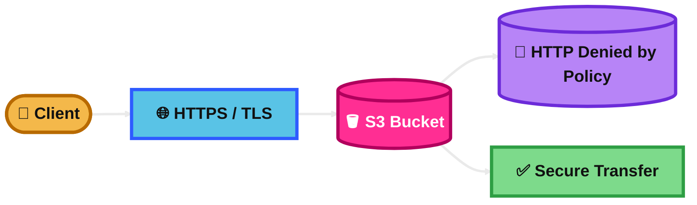
## S3 CORS

### What is it?
CORS lets a web app in one domain access S3 resources in another domain.

Without CORS, the browser blocks many cross-origin requests.

### How it works?
You add CORS rules to the S3 bucket.

Those rules say which origins, methods, and headers are allowed. Then the browser can call S3 from the allowed site.

### Use Case
A static website hosted on one domain uses JavaScript to upload images to an S3 bucket on another domain.

### Exam Tip
If the question is about a browser, JavaScript, or a frontend calling S3 from another origin, think CORS.

Keywords: browser, frontend, JavaScript, cross-origin, static website.

Trap: CORS is a browser feature. It does not grant IAM permission by itself.

### Visual Mermaid
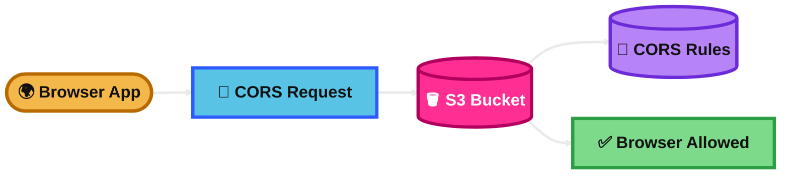
## S3 MFA Delete

### What is it?
MFA Delete adds extra protection before permanently deleting object versions.

It is meant to reduce accidental or malicious deletion.

### How it works?
You enable versioning and MFA Delete on the bucket.

Then sensitive delete actions require an MFA code. In AWS docs, only the root user can permanently delete object versions or change versioning on an MFA Delete bucket.

### Use Case
A company stores critical backups in S3 and wants stronger protection against version deletion.

### Exam Tip
Choose MFA Delete when the question is about protecting versioned objects from permanent deletion.

Keywords: versioning, permanent delete, extra factor, accidental deletion.

Trap: It works with versioning. Also remember the root-user detail, which makes it operationally awkward for normal workloads.

### Visual Mermaid
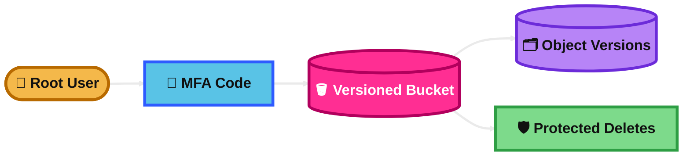
## S3 Access Logs

### What is it?
S3 access logs record requests made to your S3 bucket.

They help you review who accessed the bucket and what requests were made.

### How it works?
You enable server access logging on a source bucket.

S3 writes log files to a target bucket, usually with a prefix so they are easier to manage.

### Use Case
A security team wants request logs for an S3 bucket storing company reports.

### Exam Tip
Choose S3 access logs when the question wants request-level logging for S3 and storing those logs in S3.

Keywords: request logs, target bucket, log prefix.

Trap: For API auditing and richer event analysis, AWS recommends CloudTrail. Do not automatically pick access logs if the question focuses on API audit, search, or event investigation.

### Visual Mermaid
```mermaid
%%{init: {'theme':'base','themeVariables': {
  'background':'#0B0F19',
  'primaryTextColor':'#111111',
  'secondaryTextColor':'#111111',
  'tertiaryTextColor':'#111111',
  'lineColor':'#EAEAEA',
  'fontSize':'20px'
}}}%%
flowchart LR
    U([👤 Requester]):::user --> A[🪣 Source Bucket]:::app
    A --> S[(📝 S3 Access Logs)]:::core
    S --> D[(📦 Log Bucket)]:::data
    D --> V[🔍 Review Access]:::dash

    classDef user fill:#F4B84A,stroke:#B86A00,stroke-width:4px,color:#111111,font-weight:bold;
    classDef app fill:#59C3E6,stroke:#2E5BFF,stroke-width:4px,color:#111111,font-weight:bold;
    classDef data fill:#B784F7,stroke:#6C2BD9,stroke-width:4px,color:#111111,font-weight:bold;
    classDef core fill:#FF2E93,stroke:#B1005D,stroke-width:4px,color:#FFFFFF,font-weight:bold;
    classDef dash fill:#7DDA8B,stroke:#2E9E44,stroke-width:4px,color:#111111,font-weight:bold;

    linkStyle 0,1,2,3 stroke:#EAEAEA,stroke-width:3px;
```
## S3 Pre-signed URLs

### What is it?
A pre-signed URL gives temporary access to an S3 object without making the bucket public.

It can be used for downloads or uploads.

### How it works?
An IAM user or role with S3 permission creates a signed URL.

The recipient uses that URL for a limited time. The request works with the permissions of the identity that created the URL.

### Use Case
Your app lets customers upload profile photos directly to S3 without giving them AWS credentials.

### Exam Tip
This is a very common exam answer for temporary private access to one object.

Keywords: temporary access, upload without AWS credentials, download private object, time-limited URL.

Trap: The URL does not bypass permissions. It is limited by the creator’s permissions and expiration time.

### Visual Mermaid
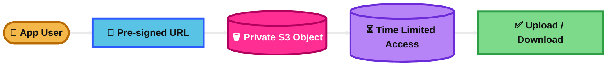
## Glacier Vault Lock

### What is it?
Glacier Vault Lock is an immutable lock policy for an Amazon Glacier vault.

It is used for compliance-style controls so the vault policy cannot be changed after it is locked.

### How it works?
You start the lock process, which puts the vault lock in `InProgress`.

Then you complete it, and the state becomes `Locked`. After that, the vault lock policy becomes unchangeable.

### Use Case
An organization stores archives in Glacier and must enforce a retention policy that cannot later be weakened.

### Exam Tip
Choose Glacier Vault Lock when the question is about immutable compliance policy at the Glacier vault level.

Keywords: Glacier vault, lock policy, immutable, compliance, unchangeable.

Trap: This is not the same as S3 Object Lock. Vault Lock is for Glacier vault policy. Object Lock is for S3 object versions.

### Visual Mermaid
```mermaid
%%{init: {'theme':'base','themeVariables': {
  'background':'#0B0F19',
  'primaryTextColor':'#111111',
  'secondaryTextColor':'#111111',
  'tertiaryTextColor':'#111111',
  'lineColor':'#EAEAEA',
  'fontSize':'20px'
}}}%%
flowchart LR
    U([👤 Admin]):::user --> A[🔒 Initiate Vault Lock]:::app
    A --> S[(🧊 Glacier Vault)]:::core
    S --> D[(📜 Lock Policy)]:::data
    D --> V[✅ Locked / Unchangeable]:::dash

    classDef user fill:#F4B84A,stroke:#B86A00,stroke-width:4px,color:#111111,font-weight:bold;
    classDef app fill:#59C3E6,stroke:#2E5BFF,stroke-width:4px,color:#111111,font-weight:bold;
    classDef data fill:#B784F7,stroke:#6C2BD9,stroke-width:4px,color:#111111,font-weight:bold;
    classDef core fill:#FF2E93,stroke:#B1005D,stroke-width:4px,color:#FFFFFF,font-weight:bold;
    classDef dash fill:#7DDA8B,stroke:#2E9E44,stroke-width:4px,color:#111111,font-weight:bold;

    linkStyle 0,1,2,3 stroke:#EAEAEA,stroke-width:3px;
```
## S3 Object Lock

### What is it?
S3 Object Lock is WORM storage for S3 object versions.

It stops protected object versions from being overwritten or deleted for a set period, or until a legal hold is removed.

### How it works?
You use it on a versioning-enabled bucket.

Then you apply retention in Governance mode or Compliance mode, or place a legal hold on specific object versions.

### Use Case
A financial firm stores records in S3 and must keep them immutable for compliance.

### Exam Tip
Choose Object Lock when the question says WORM, legal hold, retention period, immutable records, or compliance archive in S3.

Keywords: versioning required, Governance mode, Compliance mode, legal hold.

Trap: Governance mode can be bypassed by authorized users. Compliance mode cannot be shortened or removed, even by the root user.

### Visual Mermaid
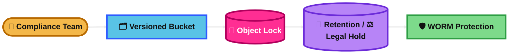
## S3 Access Points

### What is it?
S3 Access Points are named endpoints for an S3 bucket with their own policies and network controls.

They simplify access management when many apps or teams use the same bucket.

### How it works?
You create an access point for a bucket.

Requests go through that access point, and S3 applies both the access point policy and the bucket policy.

### Use Case
One shared data lake bucket is used by analytics, finance, and HR. Each team gets its own access point and policy.

### Exam Tip
Choose access points when the question mentions one bucket shared by many applications, teams, or environments with different access needs.

Keywords: shared dataset, per-application policy, separate endpoint, simpler bucket access management.

Trap: Access points are for object operations. They do not handle general bucket management tasks like deleting buckets.

### Visual Mermaid
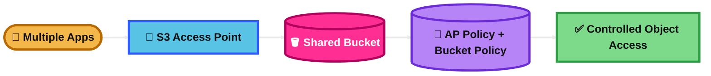
## S3 Access Points – VPC Origin

### What is it?
This is an S3 Access Point that only accepts requests coming from a specific VPC.

It makes S3 access private to your network path.

### How it works?
You create the access point with network origin set to `VPC`.

Requests through that access point must come from the specified VPC, and the VPC endpoint policy must allow access to both the access point and the bucket.

### Use Case
A private application in a VPC must read S3 data without allowing internet-origin access through that endpoint.

### Exam Tip
Choose this when the question wants private S3 access from a VPC and a separate controlled endpoint for one app or team.

Keywords: VPC-only, private access, network origin `VPC`, access point, endpoint policy.

Trap: The network origin cannot be changed after creation.

### Visual Mermaid
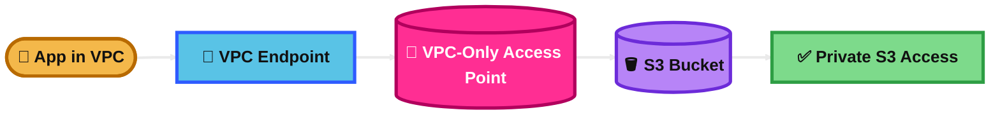
## S3 Access Points – Lambda Functions (S3 Object Lambda)

### What is it?
S3 Object Lambda lets you transform S3 data when it is returned to the application.

It can change `GET`, `LIST`, or `HEAD` results without storing a separate transformed copy.

### How it works?
You create an Object Lambda Access Point and connect it to a supporting S3 access point plus a Lambda function.

When the app requests data through the Object Lambda endpoint, S3 invokes Lambda and returns the transformed result.

### Use Case
An app retrieves images from S3 and wants them resized or watermarked on demand.

### Exam Tip
Choose this when the question is about modifying S3 results on the fly without duplicating objects.

Keywords: transform on read, dynamic image resize, redact data, custom GET response, no extra copy.

Trap: Do not confuse this with S3 event notifications to Lambda. Object Lambda transforms the response path. Also, AWS docs note S3 Object Lambda is now limited to existing customers and select APN partners, but for exam study the main concept is still on-the-fly transformation.

### Visual Mermaid
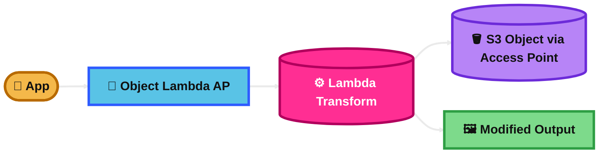
## Summary Table

| Topic | What It Is | How It Works | Best Use Case | Exam Trigger |
|---|---|---|---|---|
| S3 Server-Side Encryption (SSE) | Broad S3 at-rest encryption category | S3 encrypts object after upload | Need S3 encryption at rest | “Encrypt S3 at rest” |
| S3 Encryption with Amazon-Managed Key (SSE-S3) | S3 manages keys | S3 automatically encrypts objects with S3-managed keys | Simple, cheapest encrypted storage | “Default”, “easy”, “no key management” |
| S3 Encryption with AWS KMS (SSE-KMS) | S3 uses KMS keys | S3 gets data key from KMS and encrypts object | Compliance, audit, key control | “CloudTrail”, “customer managed key”, “audit” |
| S3 Encryption with Customer-Provided Key (SSE-C) | You provide the key, S3 encrypts | Key sent with request, same key needed to read | Rare case where customer supplies key but still wants SSE | “Provide your own key each request” |
| S3 Client-Side Encryption | App encrypts before upload | Ciphertext uploaded to S3 | AWS must not see plaintext | “Encrypt before upload” |
| S3 In-Transit Encryption | HTTPS/TLS for data in motion | Use HTTPS and optionally deny HTTP with bucket policy | Protect network traffic to S3 | “HTTPS only”, “aws:SecureTransport” |
| S3 CORS | Browser cross-origin access rules | Bucket CORS config allows frontend origin | Web app calls S3 from another domain | “Browser”, “JavaScript”, “cross-origin” |
| S3 MFA Delete | MFA for permanent version deletes | Versioning + MFA code for sensitive delete actions | Protect versioned backups from deletion | “Permanent delete protection”, “versioning” |
| S3 Access Logs | Request logs for S3 bucket access | S3 writes logs to target bucket | Review bucket access history | “Store S3 request logs in S3” |
| S3 Pre-signed URLs | Temporary object access link | Signed URL uses creator’s permissions for limited time | Temporary private upload/download | “Temporary access”, “upload without credentials” |
| Glacier Vault Lock | Immutable Glacier vault policy | Initiate lock, then complete to make policy unchangeable | Compliance lock at Glacier vault level | “Vault policy immutable” |
| S3 Object Lock | WORM protection for object versions | Retention mode or legal hold on versioned objects | Compliance retention in S3 | “WORM”, “legal hold”, “immutable objects” |
| S3 Access Points | Per-app endpoint and policy for one bucket | Access point policy works with bucket policy | Shared bucket with many teams/apps | “Shared dataset with different access needs” |
| S3 Access Points – VPC Origin | Access point restricted to one VPC | Requests must come from specified VPC | Private S3 access from VPC | “VPC-only S3 endpoint” |
| S3 Access Points – Lambda Functions (S3 Object Lambda) | Transform S3 results on the fly | Object Lambda AP invokes Lambda during read path | Resize images or redact data without storing copies | “Transform on read”, “dynamic GET response” |