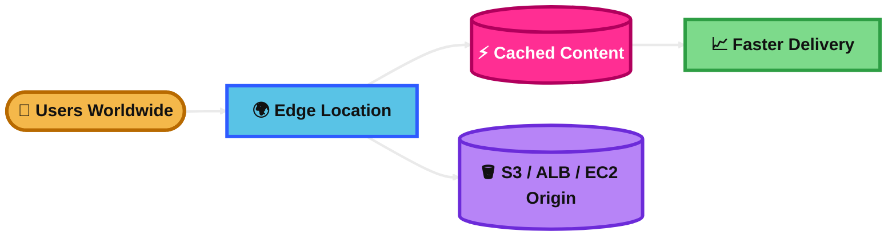
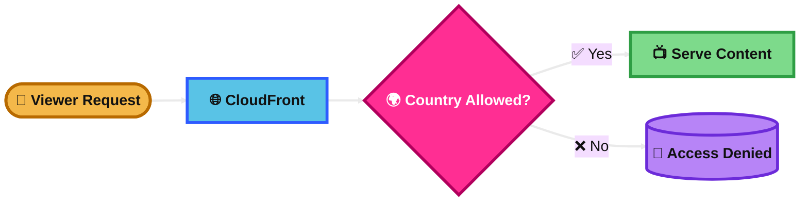
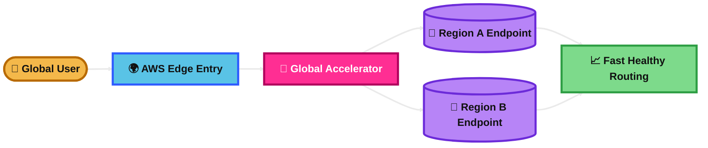

## CloudFront

### What is it?
Amazon CloudFront is AWS’s content delivery network (CDN).

It helps deliver content faster by caching copies at edge locations close to users.

It is commonly used with S3, ALB, EC2, and custom origins.

### How it works?
You create a CloudFront distribution and point it to an origin.

When a user requests content, CloudFront checks the nearest edge location.

If the object is cached, it returns it immediately.

If not, CloudFront gets it from the origin, returns it to the user, and caches it for future requests.

### Visual Mermaid

## CloudFront Geo Restriction

### What is it?
CloudFront Geo Restriction lets you allow or block viewers based on their country.

It is used when content must be limited for legal, licensing, or compliance reasons.

### How it works?
You configure the CloudFront distribution with an allowlist or blocklist of countries.

CloudFront checks the viewer location using a GeoIP database.

If the country is allowed, the request continues.

If the country is blocked, CloudFront denies access.

### Visual Mermaid

## CloudFront cache invalidation

### What is it?
CloudFront cache invalidation is a way to remove cached objects from edge locations before they expire.

It is useful when users must see updated content immediately.

### How it works?
You send an invalidation request for one or more file paths.

CloudFront removes those cached copies from edge locations.

The next user request fetches the new version from the origin.

You can also use wildcards for groups of files.

### Visual Mermaid

## AWS Global Accelerator

### What is it?
AWS Global Accelerator is a networking service that improves performance and availability for global users.

It gives you static anycast IP addresses and routes users to healthy AWS endpoints over the AWS global network.

### How it works?
You create an accelerator with listeners.

Then you add endpoint groups in one or more AWS Regions.

Inside those groups, you attach endpoints such as ALBs, NLBs, EC2 instances, or Elastic IP addresses.

User traffic enters the nearest AWS edge location and is carried across the AWS global network to the best healthy endpoint.

### Visual Mermaid

## Summary Table

| Topic | What It Is | How It Works | Best Use Case | Exam Trigger |
|---|---|---|---|---|
| CloudFront | AWS CDN for faster global content delivery | Caches content at edge locations and fetches from origin on cache miss | Websites, static assets, media, global HTTP/HTTPS delivery | CDN, edge caching, low latency, reduce origin load |
| CloudFront Geo Restriction | Country-based access control for CloudFront content | Uses allowlist or blocklist based on viewer country | Licensing or compliance restrictions by country | Block users from certain countries, content allowed only in selected countries |
| CloudFront cache invalidation | Removes cached objects before TTL expires | Sends invalidation request so edge locations drop old cached files | Urgent updates when users must stop seeing stale content | Old file still served, clear cache now, updated asset not visible |
| AWS Global Accelerator | Global traffic routing service with static anycast IPs | Routes users through AWS edge network to healthy regional endpoints | Multi-Region apps needing better availability and faster dynamic traffic routing | Static IPs, nearest healthy endpoint, fast failover, TCP/UDP, dynamic traffic |