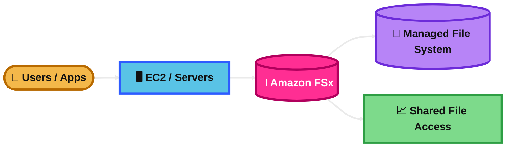

## AWS Snowball

### What is it?
AWS Snowball is a physical device from the AWS Snow Family.

It is used to move large amounts of data into or out of AWS when the network is too slow, too expensive, or unreliable.

### How it works?
You create a Snowball job in AWS.

AWS ships the device to your site. You copy data onto it locally, then ship it back to AWS. AWS loads the data into Amazon S3.

Some Snow devices also support local compute and storage at the edge.

### Use Case
A company has 500 TB of on-premises data and only a slow internet link.

Instead of uploading for weeks, they copy the data to Snowball and ship the device to AWS.

### Exam Tip
Look for clues like **petabytes**, **slow network**, **offline transfer**, **rugged device**, or **ship data to AWS**.

Pick Snowball when the question is about **large-scale offline transfer**.

Trap: Do not choose DataSync if the question clearly says the network is too limited for the migration.

### Visual Mermaid

## AWS Edge Computing

### What is it?
AWS edge computing means running storage or compute closer to where data is created or where users are located.

The goal is lower latency, local processing, and better operation when connectivity is weak or delayed.

### How it works?
Instead of sending everything to one AWS Region first, processing happens near the edge.

Examples include services and patterns such as Snowball Edge for remote processing, CloudFront for edge delivery, and other AWS options that place resources closer to users or devices.

### Use Case
A factory in a remote location collects sensor data and needs fast local processing even when the WAN link is unstable.

AWS edge solutions let the site process data locally and send selected results back to AWS later.

### Exam Tip
Look for clues like **remote site**, **disconnected environment**, **local processing**, **low latency**, or **data generated far from the Region**.

The answer is often an edge service when sending everything back to a Region first would be too slow.

Trap: Edge computing is about **location of processing**, not just storage.

### Visual Mermaid

## Snowball into Glacier

### What is it?
This usually means using Snowball to bring large data sets into AWS and then archiving that data in Glacier storage.

For exam thinking, the normal pattern is **Snowball to Amazon S3 first**, then use an S3 Lifecycle policy to move the data to **S3 Glacier Flexible Retrieval** or **S3 Glacier Deep Archive**.

### How it works?
You order Snowball and copy data onto the device.

AWS imports the data into Amazon S3. After that, S3 lifecycle rules transition the objects into a Glacier storage class for lower-cost archive storage.

### Use Case
A company must migrate many years of backup files from a data center to long-term archive storage in AWS.

They use Snowball for the offline import, then lifecycle the data into S3 Glacier Deep Archive.

### Exam Tip
Look for clues like **large archive migration**, **limited bandwidth**, **long-term retention**, and **lowest storage cost after import**.

Best answer: **Snowball + S3 + lifecycle to Glacier storage class**.

Trap: Snowball import jobs are for **Amazon S3**, not a direct “load into Glacier vault” answer on modern SAA-style questions.

### Visual Mermaid

## Amazon FSx

### What is it?
Amazon FSx is a fully managed file storage service.

It gives you managed file systems instead of making you run file servers yourself. AWS supports different file system types such as **Windows File Server, Lustre, NetApp ONTAP, and OpenZFS**.

### How it works?
You choose the file system type that matches your workload.

AWS creates and manages the file system, storage, backups, and infrastructure. Your applications connect using the file protocol that fits that file system.

### Use Case
A company needs shared Windows file storage for apps that require SMB and Active Directory integration.

FSx for Windows File Server is a strong answer.

### Exam Tip
Look for clues like **managed shared file storage**, **Windows file share**, **SMB**, **Active Directory**, **Lustre/HPC**, **NetApp features**, or **ZFS features**.

Trap: Do not pick EBS for shared file storage. Do not pick S3 when the app needs a mounted file system.

### Visual Mermaid

## AWS Storage Gateway

### What is it?
AWS Storage Gateway is a hybrid storage service.

It connects on-premises environments to AWS storage so existing applications can keep using familiar protocols while the data is stored or archived in AWS.

### How it works?
You deploy a gateway appliance in your environment or in AWS.

That gateway presents storage to your applications and connects to AWS storage in the background. AWS Storage Gateway includes **File Gateway, Volume Gateway, and Tape Gateway**.

### Use Case
A business wants to keep using its on-premises backup software and file-based apps, but wants cheaper, scalable AWS-backed storage.

Storage Gateway is built for that hybrid setup.

### Exam Tip
Look for clues like **on-premises applications**, **hybrid storage**, **keep existing interfaces**, **NFS/SMB/iSCSI/tape**, and **use AWS storage behind the scenes**.

Trap: Storage Gateway is not the best answer for bulk one-time migration. That is often Snowball or DataSync.

### Visual Mermaid

## AWS File Gateway

### What is it?
AWS File Gateway is the file-based Storage Gateway option.

It lets on-premises applications use **NFS or SMB** file shares while storing objects in Amazon S3 behind the scenes.

### How it works?
You deploy the gateway and create file shares.

Users and applications access the share like normal file storage. Frequently used files are cached locally for low-latency access, while the files are stored durably in S3.

### Use Case
A company has a local file server but wants to move file storage into AWS without rewriting applications.

File Gateway gives them a familiar file share and S3-backed storage.

### Exam Tip
Look for clues like **file share**, **NFS**, **SMB**, **local cache**, **store files in S3**, or **replace on-prem file server gradually**.

Trap: File Gateway is file-based. If the question asks for **block storage over iSCSI**, use Volume Gateway instead.

### Visual Mermaid

## AWS Volume Gateway

### What is it?
AWS Volume Gateway is the block storage option in Storage Gateway.

It presents **iSCSI block volumes** to on-premises servers and uses AWS for the backing storage and snapshots.

### How it works?
Applications connect to the gateway using iSCSI.

With **cached volumes**, primary data is stored in AWS and frequently used data is cached locally.

With **stored volumes**, primary data stays on-premises and AWS stores asynchronous backups as snapshots.

### Use Case
A company has an on-prem app that needs block storage, but they want cloud-backed storage and snapshots without buying lots of new storage hardware.

Volume Gateway fits that scenario.

### Exam Tip
Look for clues like **iSCSI**, **block storage**, **cached volumes**, **stored volumes**, **on-prem app**, and **cloud-backed snapshots**.

Trap: If the question is about file shares, do not choose Volume Gateway. If it is about backup tapes, use Tape Gateway.

### Visual Mermaid

## AWS Tape Gateway

### What is it?
AWS Tape Gateway is the virtual tape option in Storage Gateway.

It lets existing backup software keep using a virtual tape library while AWS stores the tapes in the cloud.

### How it works?
Your backup software writes to virtual tapes over a tape interface.

Active virtual tapes are backed by AWS, and when tapes are ejected, they can be archived into **S3 Glacier Flexible Retrieval** or **S3 Glacier Deep Archive**.

### Use Case
A company already uses enterprise backup software built for tape libraries.

Instead of managing physical tapes, they use Tape Gateway and archive backups in AWS.

### Exam Tip
Look for clues like **virtual tape library**, **backup software**, **replace physical tapes**, **archive backups**, or **long-term backup retention**.

Trap: Tape Gateway is for backup systems that expect tape workflows. It is not the normal answer for general file migration.

### Visual Mermaid

## AWS Transfer Family

### What is it?
AWS Transfer Family is a fully managed file transfer service.

It supports protocols such as **SFTP, FTPS, FTP, and AS2** so users and partners can send files into or out of AWS storage without you running your own transfer servers.

### How it works?
You create a Transfer Family endpoint.

Users connect using their file transfer client. Files are stored in AWS-backed storage such as Amazon S3 or Amazon EFS.

### Use Case
A business partner needs to send daily files using SFTP, but the company does not want to manage EC2-based SFTP servers.

Transfer Family is the exam-friendly answer.

### Exam Tip
Look for clues like **SFTP**, **FTPS**, **FTP**, **AS2**, **business partners**, **B2B transfer**, or **managed file transfer endpoint**.

Trap: Transfer Family is for client/user protocol access. It is not the best answer for bulk storage migration between systems. That is usually DataSync.

### Visual Mermaid

## AWS DataSync

### What is it?
AWS DataSync is a managed data transfer service.

It is designed for moving large amounts of data **online** between on-premises storage and AWS, or between AWS storage services.

### How it works?
You define a source location and a destination location.

For some on-premises transfers, you deploy a DataSync agent. Then you create a task and run or schedule the transfer. DataSync handles copying, performance optimization, metadata, and validation.

### Use Case
A company wants to move file data from its on-premises NAS to Amazon EFS every night over the network.

DataSync is a strong answer because it supports scheduled, managed online transfers.

### Exam Tip
Look for clues like **online transfer**, **scheduled sync**, **copy data between storage systems**, **NFS/SMB**, **S3/EFS/FSx**, or **automated migration/replication**.

Trap: If the network is too slow and the question wants a physical device, use Snowball instead.

### Visual Mermaid

## Summary Table

| Topic | What It Is | How It Works | Best Use Case | Exam Trigger |
|---|---|---|---|---|
| AWS Snowball | Physical device for offline data transfer | Ship device, copy data locally, AWS imports to S3 | Massive migration with weak or slow network | Petabytes, offline, shipping device |
| AWS Edge Computing | Processing closer to users or data source | Compute or storage runs near edge, not only in Region | Remote sites, low latency, poor connectivity | Local processing, remote site, low latency |
| Snowball into Glacier | Archive pattern using Snowball + S3 + Glacier class | Import to S3, then lifecycle to Glacier class | Large archive migration from on-prem | Limited bandwidth + long-term archive |
| Amazon FSx | Managed file systems | Choose Windows, Lustre, ONTAP, or OpenZFS | Shared file storage with file-system compatibility needs | SMB, Windows, HPC, NetApp, mounted file system |
| AWS Storage Gateway | Hybrid bridge from on-prem to AWS storage | Gateway appliance exposes familiar interfaces to apps | Keep on-prem apps but use AWS-backed storage | Hybrid storage, on-prem apps, familiar protocols |
| AWS File Gateway | File interface to S3 | NFS/SMB share with local cache and S3 storage | Lift file shares into AWS without app rewrite | NFS, SMB, file share, S3-backed |
| AWS Volume Gateway | Block storage gateway | iSCSI volumes with cached or stored mode | On-prem block apps needing cloud-backed storage | iSCSI, cached volumes, stored volumes |
| AWS Tape Gateway | Virtual tape library in AWS | Backup software writes tapes, archives to Glacier classes | Replace physical tapes | VTL, tape backup, long-term retention |
| AWS Transfer Family | Managed file transfer endpoints | Users connect via SFTP/FTPS/FTP/AS2 to S3 or EFS | Partner or client file exchange | SFTP, FTPS, AS2, managed B2B transfer |
| AWS DataSync | Managed online data transfer service | Agent/task copies data between storage systems | Scheduled migration or replication over network | Online transfer, sync, NFS/SMB, S3/EFS/FSx |