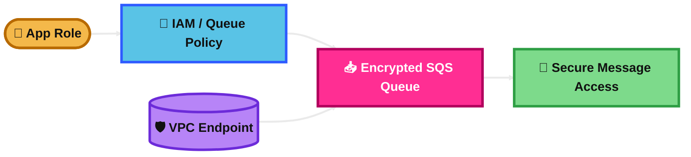
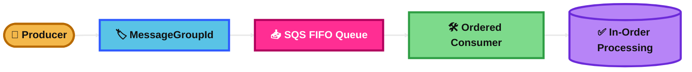
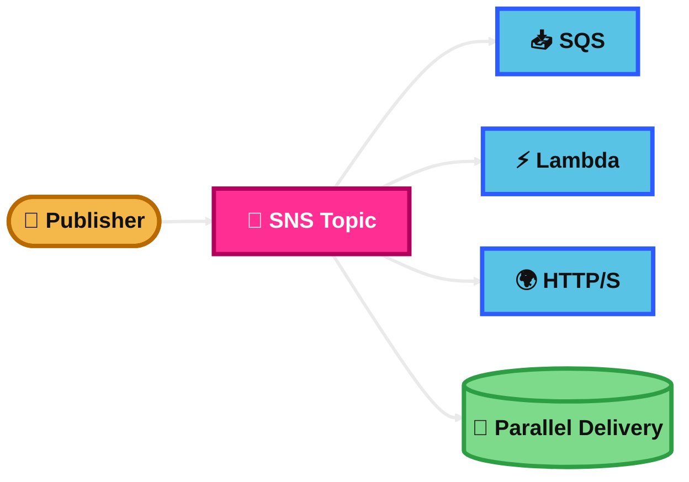
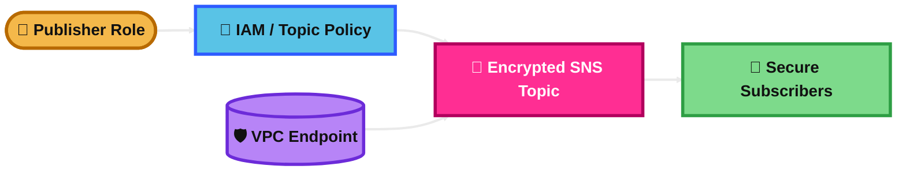
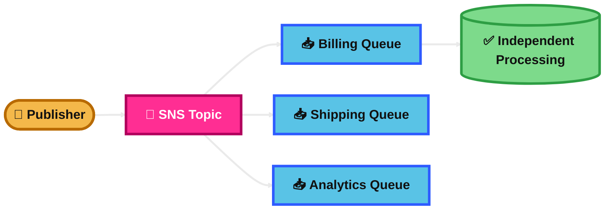
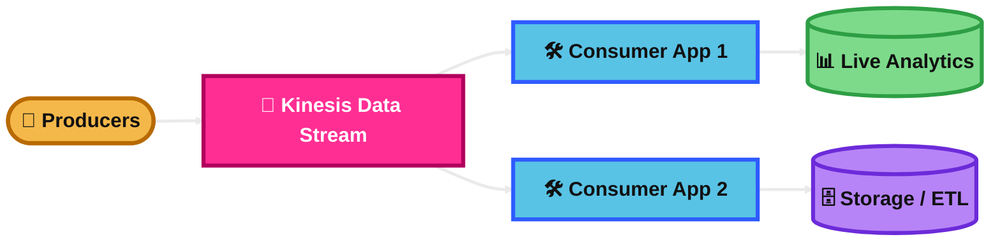
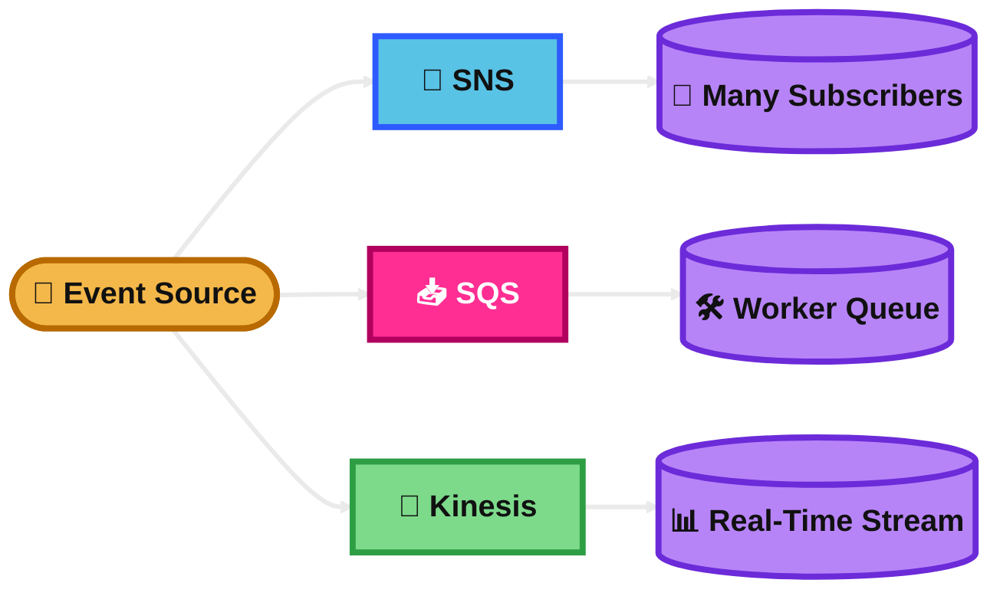
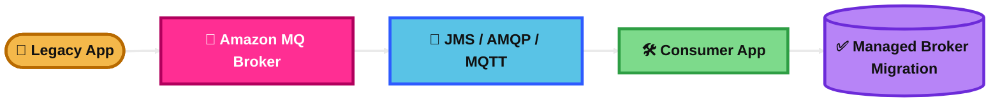

## Amazon SQS

### What is it?
Amazon SQS is a fully managed message queue service.

It lets one part of an application send messages and another part process them later. This decouples systems and improves reliability.

### How it works?
A producer sends a message to an SQS queue.

A consumer polls the queue, reads the message, processes it, and then deletes it.

If the consumer fails before delete, the message can return and be processed again.

### Use Case
An ecommerce app sends order messages to SQS.

Worker servers read the messages and process payments, emails, or inventory updates separately.

### Exam Tip
Look for clues like **decouple applications**, **buffer sudden traffic**, **asynchronous processing**, **workers process later**, or **prevent data loss during spikes**.

SQS is usually the right answer when you need a **queue**, not direct push to many subscribers.

Common trap: SQS is **pull-based**, not push-based.

### Visual Mermaid

```mermaid
%%{init: {'theme':'base','themeVariables': {
  'background':'#0B0F19',
  'primaryTextColor':'#111111',
  'secondaryTextColor':'#111111',
  'tertiaryTextColor':'#111111',
  'lineColor':'#EAEAEA',
  'fontSize':'20px'
}}}%%
flowchart LR
    P([🧑 Producer]):::user --> Q[📥 Amazon SQS Queue]:::core
    Q --> C[🛠️ Consumer / Worker]:::app
    C --> D[(📝 Processed Result)]:::data
    D --> V[📈 App Output]:::dash

    classDef user fill:#F4B84A,stroke:#B86A00,stroke-width:4px,color:#111111,font-weight:bold;
    classDef app fill:#59C3E6,stroke:#2E5BFF,stroke-width:4px,color:#111111,font-weight:bold;
    classDef data fill:#B784F7,stroke:#6C2BD9,stroke-width:4px,color:#111111,font-weight:bold;
    classDef core fill:#FF2E93,stroke:#B1005D,stroke-width:4px,color:#FFFFFF,font-weight:bold;
    classDef dash fill:#7DDA8B,stroke:#2E9E44,stroke-width:4px,color:#111111,font-weight:bold;

    linkStyle 0,1,2,3 stroke:#EAEAEA,stroke-width:3px;
```

## Amazon SQS Consumer Autoscaling using SQS metrics

### What is it?
This means scaling consumer capacity based on how many messages are waiting in SQS.

It helps you add workers when backlog grows and reduce workers when traffic drops.

### How it works?
You watch SQS metrics such as queue depth.

For EC2 Auto Scaling, AWS recommends scaling on **backlog per instance**, which is roughly queue messages divided by running instances.

More messages means scale out. Fewer messages means scale in.

### Use Case
A video processing app puts jobs into SQS.

When the queue grows, Auto Scaling launches more EC2 workers to clear the backlog faster.

### Exam Tip
Look for clues like **queue depth increasing**, **messages piling up**, **workers can’t keep up**, or **scale consumers based on queue load**.

For EC2 consumers, the exam favorite is **CloudWatch + Auto Scaling using SQS backlog metrics**.

Common trap: do not scale only on CPU if the real bottleneck is queue backlog.

### Visual Mermaid

```mermaid
%%{init: {'theme':'base','themeVariables': {
  'background':'#0B0F19',
  'primaryTextColor':'#111111',
  'secondaryTextColor':'#111111',
  'tertiaryTextColor':'#111111',
  'lineColor':'#EAEAEA',
  'fontSize':'20px'
}}}%%
flowchart LR
    Q[📥 SQS Queue Depth]:::core --> M[📊 CloudWatch Metric]:::dash
    M --> A[⚙️ Auto Scaling Group]:::app
    A --> W[🛠️ More / Fewer Consumers]:::user
    W --> O[(✅ Faster Processing)]:::data

    classDef user fill:#F4B84A,stroke:#B86A00,stroke-width:4px,color:#111111,font-weight:bold;
    classDef app fill:#59C3E6,stroke:#2E5BFF,stroke-width:4px,color:#111111,font-weight:bold;
    classDef data fill:#B784F7,stroke:#6C2BD9,stroke-width:4px,color:#111111,font-weight:bold;
    classDef core fill:#FF2E93,stroke:#B1005D,stroke-width:4px,color:#FFFFFF,font-weight:bold;
    classDef dash fill:#7DDA8B,stroke:#2E9E44,stroke-width:4px,color:#111111,font-weight:bold;

    linkStyle 0,1,2,3 stroke:#EAEAEA,stroke-width:3px;
```

## Amazon SQS Security

### What is it?
SQS security is how you protect who can send, receive, or manage messages.

It includes IAM policies, queue policies, encryption, and network controls.

### How it works?
Use IAM to control which users or roles can access SQS APIs.

Use queue policies for cross-account or service-based access.

Use SSE-SQS or SSE-KMS to encrypt messages at rest.

Use VPC endpoints if you want private access without traversing the public internet.

### Use Case
A payment app stores sensitive job messages in SQS.

The queue is encrypted, only specific IAM roles can read it, and access is restricted through a VPC endpoint.

### Exam Tip
Look for clues like **encrypt messages**, **restrict access**, **private access from VPC**, or **cross-account permission to queue**.

Good answer choices often include **IAM + queue policy + KMS + VPC endpoint**.

Common trap: IAM alone may not solve a cross-account queue access requirement. Queue policy is often needed too.

### Visual Mermaid

## AWS SQS Visibility Timeout

### What is it?
Visibility timeout is the time a message stays hidden after a consumer reads it.

During that time, other consumers cannot see the same message.

### How it works?
A consumer receives a message.

SQS hides it for the visibility timeout period.

If the consumer finishes successfully, it deletes the message.

If not, the timeout expires and the message becomes visible again.

### Use Case
A worker needs 2 minutes to process an image.

Set visibility timeout long enough so another worker does not pick the same message too soon.

### Exam Tip
Look for clues like **same message processed twice**, **message reappears**, **processing takes time**, or **consumer crashes before delete**.

If processing is longer than expected, increase visibility timeout.

Common trap: visibility timeout does **not** delete the message. Delete still has to happen.

### Visual Mermaid
```mermaid
%%{init: {'theme':'base','themeVariables': {
  'background':'#0B0F19',
  'primaryTextColor':'#111111',
  'secondaryTextColor':'#111111',
  'tertiaryTextColor':'#111111',
  'lineColor':'#EAEAEA',
  'fontSize':'20px'
}}}%%
flowchart LR
    Q[📥 SQS Message]:::core --> C[🛠️ Consumer Reads]:::app
    C --> T[⏳ Visibility Timeout]:::dash
    T --> D[(✅ Delete on Success)]:::data
    T --> R[(🔁 Reappears on Failure)]:::data

    classDef user fill:#F4B84A,stroke:#B86A00,stroke-width:4px,color:#111111,font-weight:bold;
    classDef app fill:#59C3E6,stroke:#2E5BFF,stroke-width:4px,color:#111111,font-weight:bold;
    classDef data fill:#B784F7,stroke:#6C2BD9,stroke-width:4px,color:#111111,font-weight:bold;
    classDef core fill:#FF2E93,stroke:#B1005D,stroke-width:4px,color:#FFFFFF,font-weight:bold;
    classDef dash fill:#7DDA8B,stroke:#2E9E44,stroke-width:4px,color:#111111,font-weight:bold;

    linkStyle 0,1,2,3,4 stroke:#EAEAEA,stroke-width:3px;
```
## AWS SQS Long Polling

### What is it?
Long polling lets SQS wait a little before replying to a receive request.

This reduces empty responses and lowers cost.

### How it works?
Instead of checking quickly and returning nothing, SQS waits for messages to arrive.

If a message appears during the wait time, SQS returns it.

If no message appears, the request ends after the wait time.

### Use Case
A worker app polls an SQS queue all day.

Using long polling reduces useless API calls when the queue is often empty.

### Exam Tip
Look for clues like **reduce empty responses**, **lower polling cost**, **queue is mostly idle**, or **improve efficiency when receiving messages**.

The key number to remember is **maximum 20 seconds**.

Common trap: long polling improves receive behavior, but it does not change message durability or ordering.

### Visual Mermaid
```mermaid
%%{init: {'theme':'base','themeVariables': {
  'background':'#0B0F19',
  'primaryTextColor':'#111111',
  'secondaryTextColor':'#111111',
  'tertiaryTextColor':'#111111',
  'lineColor':'#EAEAEA',
  'fontSize':'20px'
}}}%%
flowchart LR
    C([🛠️ Consumer Poll]):::user --> W[⏳ Wait up to 20s]:::app
    W --> Q[📥 SQS Queue]:::core
    Q --> M[(📨 Return Message)]:::data
    Q --> E[(🫥 Fewer Empty Responses)]:::dash

    classDef user fill:#F4B84A,stroke:#B86A00,stroke-width:4px,color:#111111,font-weight:bold;
    classDef app fill:#59C3E6,stroke:#2E5BFF,stroke-width:4px,color:#111111,font-weight:bold;
    classDef data fill:#B784F7,stroke:#6C2BD9,stroke-width:4px,color:#111111,font-weight:bold;
    classDef core fill:#FF2E93,stroke:#B1005D,stroke-width:4px,color:#FFFFFF,font-weight:bold;
    classDef dash fill:#7DDA8B,stroke:#2E9E44,stroke-width:4px,color:#111111,font-weight:bold;

    linkStyle 0,1,2,3,4 stroke:#EAEAEA,stroke-width:3px;
```
## AWS SQS FIFO

### What is it?
FIFO means **First-In-First-Out**.

It is an SQS queue type for workloads that need strict order and no duplicates introduced by the queue.

### How it works?
Messages are processed in order within a **MessageGroupId**.

SQS uses deduplication to avoid introducing duplicate messages within the deduplication interval.

Messages in the same message group are processed one at a time in order.

### Use Case
A banking app processes account transactions.

The app must preserve exact order for each account and avoid duplicate transaction events.

### Exam Tip
Look for clues like **strict ordering**, **exactly-once processing**, **financial transactions**, or **same sequence must be preserved**.

Remember: ordering is guaranteed **within a message group**.

Common trap: FIFO is not the best answer if the question mainly wants maximum throughput and order does not matter.

### Visual Mermaid

## Amazon SNS

### What is it?
Amazon SNS is a fully managed pub/sub messaging service.

It pushes messages to many subscribers at the same time.

### How it works?
A publisher sends a message to an SNS topic.

SNS immediately pushes that message to subscribed endpoints like SQS, Lambda, HTTP/S, or email.

This is great for one-to-many messaging.

### Use Case
An order system publishes “OrderPlaced” to SNS.

Different subscribers handle billing, shipping, analytics, and notifications in parallel.

### Exam Tip
Look for clues like **publish once, send to many**, **fan-out**, **push notifications**, or **multiple systems must react to one event**.

Common trap: SNS is push-based. SQS is pull-based.

### Visual Mermaid

## Amazon SNS Security

### What is it?
SNS security is how you protect topics, messages, and subscriptions.

It focuses on access control, encryption, and safe endpoint delivery.

### How it works?
Use IAM policies and SNS topic policies to control who can publish or subscribe.

Use KMS-based server-side encryption for message protection at rest.

Use TLS for data in transit.

Use VPC endpoints for private access when needed.

### Use Case
A medical alerting system publishes sensitive events through SNS.

The topic uses KMS encryption and only approved roles can publish or subscribe.

### Exam Tip
Look for clues like **encrypted notifications**, **restrict who can publish**, **private SNS access**, or **prevent public topic access**.

Good answers usually mention **IAM/topic policy + KMS + TLS + VPC endpoint**.

Common trap: never leave an SNS topic publicly accessible unless the scenario explicitly requires it.

### Visual Mermaid

## Amazon SNS + SQS Fan out

### What is it?
This pattern uses SNS to publish one message and SQS to copy that message into multiple queues.

Each queue then processes the event independently.

### How it works?
A producer publishes to an SNS topic.

Multiple SQS queues subscribe to that topic.

SNS pushes a copy of the message to each queue.

Each consumer reads from its own queue at its own speed.

### Use Case
A new order event must trigger shipping, billing, fraud checks, and analytics.

SNS sends the event to multiple SQS queues so each team or service can process it separately.

### Exam Tip
Look for clues like **one event to many independent systems**, **each consumer needs its own retry behavior**, or **downstream systems should not affect each other**.

This is a strong answer when you want both **fan-out** and **durable buffering**.

Common trap: SNS alone is not enough when each subscriber needs independent retries or queue storage.

### Visual Mermaid

## Amazon Kinesis Data Stream

### What is it?
Amazon Kinesis Data Streams is a service for real-time streaming data ingestion and processing.

It is designed for high-throughput streaming workloads where multiple consumers may read the same data stream.

### How it works?
Producers write records into a stream.

The stream is made of **shards**.

Consumers read records from the shards and process them in near real time.

Different consumers can read the same stream for different purposes.

### Use Case
A mobile app sends clickstream events into Kinesis Data Streams.

One consumer updates a live dashboard while another stores events for analytics.

### Exam Tip
Look for clues like **real-time streaming**, **high throughput**, **multiple consumers reading the same stream**, **clickstream**, **IoT**, or **analytics pipeline**.

Think Kinesis Data Streams when you need more control over the stream and consumer applications.

Common trap: if the question wants fully managed delivery to S3 or Redshift with minimal admin, Firehose may be better.

### Visual Mermaid

## Amazon Data Firehose

### What is it?
Amazon Data Firehose is a fully managed service for delivering streaming data to destinations.

It is easier than building your own consumer applications.

### How it works?
Producers send streaming data to Firehose.

Firehose buffers the data, can transform it with Lambda, and then delivers it to destinations like S3, Redshift, OpenSearch, or others.

You do not manage shards or polling consumers.

### Use Case
Application logs are streamed into Firehose.

Firehose buffers them and loads them into S3 and then into analytics tools.

### Exam Tip
Look for clues like **deliver streaming data to S3/Redshift/OpenSearch**, **fully managed**, **minimal operational effort**, or **automatic buffering and loading**.

Firehose is a strong answer when the goal is delivery, not custom stream processing logic.

Common trap: Firehose is easier, but it gives less low-level control than Kinesis Data Streams.

### Visual Mermaid
```mermaid
%%{init: {'theme':'base','themeVariables': {
  'background':'#0B0F19',
  'primaryTextColor':'#111111',
  'secondaryTextColor':'#111111',
  'tertiaryTextColor':'#111111',
  'lineColor':'#EAEAEA',
  'fontSize':'20px'
}}}%%
flowchart LR
    P([📱 Producers]):::user --> F[🚒 Amazon Data Firehose]:::core
    F --> T[🧪 Optional Lambda Transform]:::app
    T --> S3[(🪣 S3 / Redshift / OpenSearch)]:::data
    S3 --> O[📈 Analytics Output]:::dash

    classDef user fill:#F4B84A,stroke:#B86A00,stroke-width:4px,color:#111111,font-weight:bold;
    classDef app fill:#59C3E6,stroke:#2E5BFF,stroke-width:4px,color:#111111,font-weight:bold;
    classDef data fill:#B784F7,stroke:#6C2BD9,stroke-width:4px,color:#111111,font-weight:bold;
    classDef core fill:#FF2E93,stroke:#B1005D,stroke-width:4px,color:#FFFFFF,font-weight:bold;
    classDef dash fill:#7DDA8B,stroke:#2E9E44,stroke-width:4px,color:#111111,font-weight:bold;

    linkStyle 0,1,2,3,4 stroke:#EAEAEA,stroke-width:3px;
```
## Amazon Data Firehose vs Amazon Kinesis Data Stream

### What is it?
This is a comparison between two streaming services.

Kinesis Data Streams is for building custom real-time streaming apps. Firehose is for simple managed delivery to destinations.

### How it works?
With Kinesis Data Streams, producers write to shards and your consumers read and process the stream.

With Firehose, producers send data and Firehose buffers, optionally transforms, and delivers it automatically.

### Use Case
Use Kinesis Data Streams for clickstream analysis with custom consumers.

Use Firehose for sending logs directly into S3 or Redshift with low operational effort.

### Exam Tip
Choose **Kinesis Data Streams** when the question says **custom consumers**, **multiple apps read same stream**, or **fine-grained real-time processing**.

Choose **Firehose** when the question says **load streaming data into S3/Redshift/OpenSearch**, **fully managed**, or **least operational overhead**.

Common trap: Firehose is not the best answer when the question clearly needs custom stream applications reading from shards.

### Visual Mermaid
```mermaid
%%{init: {'theme':'base','themeVariables': {
  'background':'#0B0F19',
  'primaryTextColor':'#111111',
  'secondaryTextColor':'#111111',
  'tertiaryTextColor':'#111111',
  'lineColor':'#EAEAEA',
  'fontSize':'20px'
}}}%%
flowchart LR
    P([📱 Producers]):::user --> K[🌊 Kinesis Data Streams]:::app
    P --> F[🚒 Data Firehose]:::core
    K --> C[🛠️ Custom Consumers]:::dash
    F --> D[(🪣 Managed Delivery)]:::data

    classDef user fill:#F4B84A,stroke:#B86A00,stroke-width:4px,color:#111111,font-weight:bold;
    classDef app fill:#59C3E6,stroke:#2E5BFF,stroke-width:4px,color:#111111,font-weight:bold;
    classDef data fill:#B784F7,stroke:#6C2BD9,stroke-width:4px,color:#111111,font-weight:bold;
    classDef core fill:#FF2E93,stroke:#B1005D,stroke-width:4px,color:#FFFFFF,font-weight:bold;
    classDef dash fill:#7DDA8B,stroke:#2E9E44,stroke-width:4px,color:#111111,font-weight:bold;

    linkStyle 0,1,2,3,4 stroke:#EAEAEA,stroke-width:3px;
```
## SQS vs SNS vs Kinesis

### What is it?
These are three different messaging and streaming patterns.

SQS is a queue. SNS is pub/sub push. Kinesis is a real-time data stream.

### How it works?
SQS stores messages until consumers poll and process them.

SNS pushes messages to many subscribers immediately.

Kinesis stores streaming records in shards so one or more consumers can process the stream in near real time.

### Use Case
Use SQS for background jobs.

Use SNS for fan-out notifications.

Use Kinesis for clickstream, IoT, telemetry, or real-time analytics.

### Exam Tip
Choose **SQS** for **decoupling + queue + buffering + consumer polling**.

Choose **SNS** for **publish once to many subscribers**.

Choose **Kinesis** for **high-throughput real-time streaming with multiple consumers**.

Common trap: SNS and SQS can work together. They are not always competitors.

### Visual Mermaid

## Amazon MQ

### What is it?
Amazon MQ is a managed message broker service.

It supports **Apache ActiveMQ Classic** and **RabbitMQ**.

### How it works?
AWS manages broker setup, patching, and maintenance.

Your applications connect using common broker protocols and APIs.

This makes it useful when you want managed infrastructure but still need traditional broker compatibility.

### Use Case
A company has an old application using JMS or AMQP with an existing broker design.

Instead of rewriting the app for SQS or SNS, it migrates to Amazon MQ.

### Exam Tip
Look for clues like **migrate existing broker**, **JMS**, **AMQP**, **MQTT**, **RabbitMQ**, **ActiveMQ**, or **do not rewrite application messaging code**.

Amazon MQ is often the best answer for **compatibility**, not for building new cloud-native messaging from scratch.

Common trap: for new simple cloud-native apps, AWS usually prefers SQS or SNS because they scale well and are often more cost-effective.

### Visual Mermaid

## Summary Table

| Topic | What It Is | How It Works | Best Use Case | Exam Trigger |
|---|---|---|---|---|
| Amazon SQS | Managed message queue | Producers send, consumers poll and delete | Decoupled async processing | Queue, buffering, worker pattern |
| Amazon SQS Consumer Autoscaling using SQS metrics | Scale consumers from queue load | Use CloudWatch and backlog metrics | Growing message backlog | Scale workers when queue depth rises |
| Amazon SQS Security | Protect queue access and data | IAM, queue policy, KMS, VPC endpoint | Sensitive async workloads | Encrypt queue, restrict access, private connectivity |
| AWS SQS Visibility Timeout | Hides message after read | Message stays hidden until delete or timeout | Long-running message processing | Message reappears if not deleted |
| AWS SQS Long Polling | Waits before returning receive response | Reduces empty polls | Mostly idle queues | Lower cost, fewer empty receives |
| AWS SQS FIFO | Ordered queue with deduplication | Uses MessageGroupId and FIFO logic | Transactions, ordered workflows | Strict order, exactly-once style processing |
| Amazon SNS | Managed pub/sub service | Publisher sends to topic, SNS pushes to subscribers | Broadcast event to many systems | Fan-out, push, one-to-many |
| Amazon SNS Security | Protect topics and subscriptions | IAM/topic policy, KMS, TLS, VPC endpoint | Sensitive notifications | Encrypted topic, controlled publish/subscribe |
| Amazon SNS + SQS Fan out | SNS pushes copies into multiple queues | One publish, many queues, independent consumers | One event for many teams/services | Fan-out plus durable buffering |
| Amazon Kinesis Data Stream | Real-time streaming platform | Producers write to shards, consumers read stream | Clickstream, IoT, telemetry | Multiple consumers, high-throughput streaming |
| Amazon Data Firehose | Fully managed delivery for streaming data | Buffers, optionally transforms, then delivers | Send logs/events to S3/Redshift/OpenSearch | Fully managed stream delivery |
| Amazon Data Firehose vs Amazon Kinesis Data Stream | Comparison of delivery vs custom streaming | Firehose delivers; KDS supports custom consumers | Pick based on control vs simplicity | Custom processing vs low ops |
| SQS vs SNS vs Kinesis | Queue vs pub/sub vs stream | Poll vs push vs shard stream | Messaging pattern selection | Queue, fan-out, or analytics stream |
| Amazon MQ | Managed broker service | Managed RabbitMQ or ActiveMQ broker | Legacy broker migration | JMS, AMQP, MQTT, no rewrite |