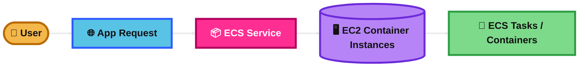
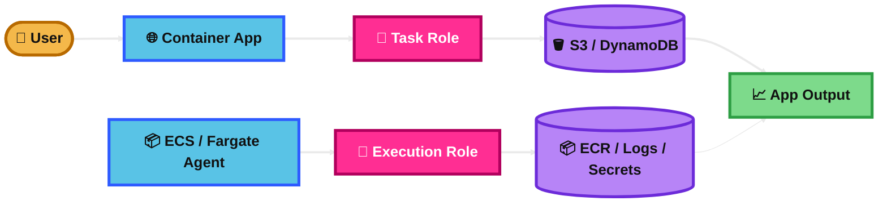
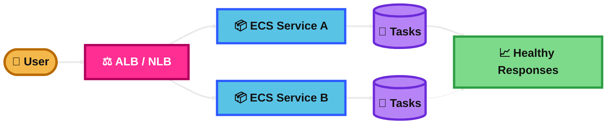
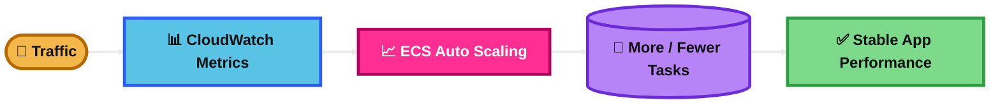
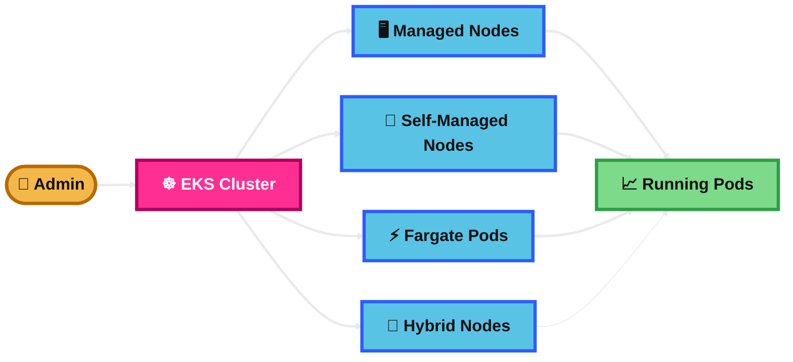
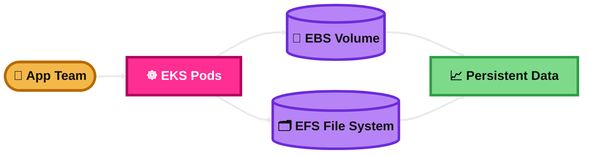
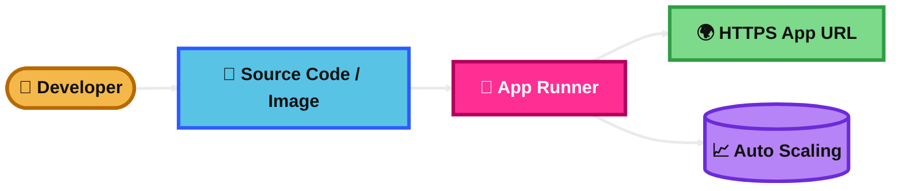

## Amazon ECS - EC2 Launch Type

### What is it?
Amazon ECS with the EC2 launch type runs your containers on EC2 instances that **you manage**.

You choose the instance type, scale the EC2 fleet, patch the OS, and control the cluster capacity.

### How it works?
You create an ECS cluster and add EC2 container instances to it.

Then you define a task definition, and ECS places containers on those EC2 instances.

ECS manages task scheduling, but **you are responsible for the servers** underneath.

### Use Case
A company runs many containers all day and wants the **lowest cost** by using Reserved Instances or Spot Instances.

It is also useful when you need more control over the host, such as custom AMIs, special networking, GPUs, or daemon processes.

### Exam Tip
Pick **ECS EC2** when the question wants **more control** over the infrastructure or **lower cost at scale**.

Good clues:
- “Need access to the host”
- “Custom AMI”
- “GPU workload”
- “Use Spot for containers”
- “Control instance type”

Common trap:
If the question says **no server management**, **simpler operations**, or **serverless containers**, the answer is usually **Fargate**, not ECS EC2.

### Visual Mermaid

## Amazon ECS – Fargate Launch Type

### What is it?
Amazon ECS with Fargate runs containers **without managing servers**.

AWS provides the compute for the tasks, so you focus on the container and task settings.

### How it works?
You define CPU, memory, networking, and the container image in the task definition.

When the task starts, AWS launches it on Fargate-managed infrastructure.

You do not manage EC2 instances, patching, or cluster capacity.

### Use Case
A startup wants to deploy containers fast and reduce operations work.

It is a strong fit for APIs, microservices, and event-driven workloads where simplicity matters more than deep host control.

### Exam Tip
Pick **Fargate** when the question says:
- “Serverless containers”
- “No EC2 management”
- “Reduce operational overhead”
- “Simplify deployment”
- “Pay for task resources”

Common trap:
Fargate is easier, but it gives you **less host-level control** than ECS EC2.

If the scenario needs custom host tuning or direct control of the worker nodes, Fargate is usually not the best answer.

### Visual Mermaid

```mermaid
%%{init: {'theme':'base','themeVariables': {
  'background':'#0B0F19',
  'primaryTextColor':'#111111',
  'secondaryTextColor':'#111111',
  'tertiaryTextColor':'#111111',
  'lineColor':'#EAEAEA',
  'fontSize':'20px'
}}}%%
flowchart LR
    U([👤 User]):::user --> A[🌐 App Request]:::app
    A --> S[📦 ECS Service]:::core
    S --> F[(⚡ Fargate Compute)]:::data
    F --> T[🚀 Tasks / Containers]:::dash

    classDef user fill:#F4B84A,stroke:#B86A00,stroke-width:4px,color:#111111,font-weight:bold;
    classDef app fill:#59C3E6,stroke:#2E5BFF,stroke-width:4px,color:#111111,font-weight:bold;
    classDef data fill:#B784F7,stroke:#6C2BD9,stroke-width:4px,color:#111111,font-weight:bold;
    classDef core fill:#FF2E93,stroke:#B1005D,stroke-width:4px,color:#FFFFFF,font-weight:bold;
    classDef dash fill:#7DDA8B,stroke:#2E9E44,stroke-width:4px,color:#111111,font-weight:bold;

    linkStyle 0,1,2,3 stroke:#EAEAEA,stroke-width:3px;
```

## Amazon ECS – IAM Roles for ECS

### What is it?
IAM roles in ECS let containers and ECS infrastructure access AWS services securely.

The most important exam roles are:
- **Task role** = permissions for your application inside the container
- **Task execution role** = permissions ECS/Fargate uses on your behalf
- **Container instance role** = role attached to ECS EC2 hosts

### How it works?
If your app in the container needs S3 or DynamoDB, give that permission to the **task role**.

If ECS needs to pull an image from ECR or write logs to CloudWatch Logs, use the **task execution role**.

If you use the EC2 launch type, the EC2 instance itself also has an IAM role for ECS agent and host-level actions.

### Use Case
A containerized app uploads files to S3.

You attach an S3 policy to the **task role**, so the app gets only the permissions it needs.

### Exam Tip
This is a very common exam trap.

Remember:
- **Task role** = app code permissions
- **Execution role** = pull image, send logs, read secrets on behalf of ECS
- **EC2 instance role** = permissions for the ECS host

Good clues:
- “Container needs to call S3” → **task role**
- “Pull image from ECR” or “send logs to CloudWatch” → **execution role**

Common trap:
Do **not** put application permissions on the EC2 instance role when the safer answer is a **task role**.

### Visual Mermaid

## Amazon ECS – Load Balancer Integrations

### What is it?
ECS integrates with Elastic Load Balancing so traffic can be distributed across running tasks.

The common choices are:
- **ALB** for HTTP/HTTPS and path-based routing
- **NLB** for very high-performance TCP/UDP-style traffic and static IP use cases

### How it works?
You create an ECS service and attach it to a target group.

As tasks start and stop, ECS registers and deregisters them with the load balancer.

This gives you health checks, fault tolerance, and easier scaling.

### Use Case
You run a microservices app with `/api`, `/admin`, and `/images`.

An **ALB** can route traffic to different ECS services using path-based rules.

### Exam Tip
Choose **ALB** when the question mentions:
- HTTP/HTTPS
- path-based routing
- host-based routing
- microservices behind one load balancer

Choose **NLB** when the question mentions:
- very high performance
- TCP
- static IP needs
- ultra-low latency style networking

Common trap:
If the exam asks for **Layer 7 routing**, that is **ALB**, not NLB.

### Visual Mermaid

## Amazon ECS – Data Volumes (EFS)

### What is it?
ECS can use **Amazon EFS** to give containers shared, persistent file storage.

EFS is a managed network file system that can be mounted by multiple tasks.

### How it works?
You create an EFS file system and mount targets in your VPC.

Then your ECS task definition mounts that EFS volume into the container.

Because EFS is shared storage, tasks can read and write the same files even if they run on different hosts.

### Use Case
Several ECS tasks process uploaded files and all need access to the same shared directory.

EFS is a good fit because the data survives task restarts and can be shared across tasks.

### Exam Tip
Pick **EFS with ECS** when the question says:
- “shared storage”
- “multiple containers need the same files”
- “persistent file system”
- “Linux file system across tasks”

Common trap:
Do not confuse **EFS** with **EBS**.
- **EFS** = shared file storage
- **EBS** = block storage, usually attached to one instance at a time

### Visual Mermaid

## Amazon ECS - Auto Scaling

### What is it?
ECS Auto Scaling increases or decreases the number of running tasks based on demand.

It helps keep performance stable while controlling cost.

### How it works?
You set scaling policies for an ECS service.

Application Auto Scaling can adjust the desired task count using:
- target tracking
- step scaling
- scheduled scaling
- predictive scaling

CloudWatch metrics are commonly used to trigger scaling.

### Use Case
An API gets heavy traffic every evening.

ECS can automatically increase task count during peak time and scale back later to save money.

### Exam Tip
Think of **two layers**:
- scale the **number of tasks**
- and, if using ECS EC2, also make sure you can scale the **EC2 capacity**

Good clues:
- “increase containers when CPU rises”
- “maintain responsiveness”
- “reduce cost when traffic drops”

Common trap:
Scaling ECS tasks alone is not enough on **EC2 launch type** if the cluster has no available EC2 capacity.

### Visual Mermaid

## Amazon EKS

### What is it?
Amazon EKS is AWS’s managed Kubernetes service.

AWS manages the Kubernetes control plane, and you run your workloads on worker nodes or Fargate.

### How it works?
You create an EKS cluster.

AWS runs the Kubernetes control plane for you, including key components like the API server and etcd.

You then add compute capacity and deploy pods just like standard Kubernetes.

### Use Case
A company already uses Kubernetes and wants AWS to manage the hard control-plane work.

EKS is useful when teams want Kubernetes features, portability, and ecosystem tools.

### Exam Tip
Pick **EKS** when the question clearly wants **Kubernetes**.

Good clues:
- “Kubernetes”
- “pods”
- “kubectl”
- “node groups”
- “managed Kubernetes control plane”

Common trap:
If the question only says “run containers simply” and does not need Kubernetes, **ECS** or **Fargate** may be the better answer.

### Visual Mermaid

## Amazon EKS – Node Types

### What is it?
EKS can run workloads on different node types.

The main exam-friendly types are:
- **Managed node groups**
- **Self-managed nodes**
- **Fargate for EKS**
- **Hybrid nodes**

### How it works?
Managed node groups use EC2 and AWS helps manage lifecycle tasks like provisioning and updates.

Self-managed nodes give you more control, but you manage more yourself.

Fargate runs pods without managing EC2 nodes.

Hybrid nodes let you use on-premises or edge infrastructure as part of an EKS environment.

### Use Case
A company wants Kubernetes but does not want to handle lots of node administration.

**Managed node groups** are often the easiest fit.

### Exam Tip
Match the need to the node type:
- **Managed node groups** = easier EC2 node management
- **Self-managed nodes** = maximum control
- **Fargate** = no node management
- **Hybrid nodes** = on-premises or edge with EKS

Common trap:
Do not confuse **EKS Fargate** with **ECS Fargate**.
Both remove server management, but one is for **Kubernetes pods** and the other is for **ECS tasks**.

### Visual Mermaid

## Amazon EKS – Data Volumes

### What is it?
EKS uses storage through Kubernetes volumes, usually with AWS CSI drivers.

For the SAA exam, the most important storage choices are:
- **EBS** for block storage
- **EFS** for shared file storage

### How it works?
A CSI driver connects Kubernetes storage requests to AWS storage services.

With **EBS**, a pod can use persistent block storage.

With **EFS**, multiple pods can share the same file system.

### Use Case
A database pod in EKS needs persistent storage.

Use **EBS** for that kind of stateful workload.

If many pods need the same shared files, use **EFS** instead.

### Exam Tip
Use this memory rule:
- **EBS** = single workload style block storage
- **EFS** = shared file storage across pods

Important clue:
AWS states that **EBS volumes can’t be mounted to Fargate pods**.

Common trap:
If the scenario says **shared access from multiple pods**, EBS is usually the wrong choice. Think **EFS**.

### Visual Mermaid

## AWS App Runner

### What is it?
AWS App Runner is a fully managed service for running web applications and APIs directly from source code or a container image.

It is designed for simple deployment, built-in scaling, and less infrastructure work.

### How it works?
You connect App Runner to source code or a container image.

App Runner builds and deploys the app, gives it a service URL, handles load balancing, and automatically scales instances up or down.

It can also connect outbound traffic to your VPC by using a VPC connector.

### Use Case
A developer wants to deploy a small web API quickly without managing ECS, EKS, ALB, or EC2.

App Runner is meant for that kind of fast web-service deployment.

### Exam Tip
Pick **App Runner** when the question says:
- “deploy directly from source code”
- “simple web app or API”
- “minimal infrastructure management”
- “automatic scaling and load balancing”

Common trap:
App Runner is for **web apps and APIs**, not a general replacement for all container platforms.

Real-world note:
As of **April 30, 2026**, App Runner is **no longer open to new customers**, but existing customers can continue using it. For exam study, still remember the service pattern and when AWS expects you to choose it.

### Visual Mermaid

## AWS App2Container

### What is it?
AWS App2Container is a migration tool that helps move existing applications into containers.

It analyzes apps running on servers or VMs, creates container artifacts, and prepares deployment artifacts for AWS container services.

### How it works?
App2Container inspects the existing application, identifies dependencies, generates Dockerfiles and container images, and can generate deployment artifacts for:
- Amazon ECS
- Amazon EKS
- AWS App Runner

So it helps with **containerization and migration**, not with running production workloads by itself.

### Use Case
A company has a legacy Java or .NET web app running on VMs and wants to move it into containers faster.

App2Container helps automate part of that migration work.

### Exam Tip
Think of App2Container as a **modernization helper**.

Good clues:
- “move legacy app into containers”
- “analyze existing VM app”
- “generate Dockerfile and deployment artifacts”
- “replatform to ECS or EKS”

Common trap:
App2Container is **not** the runtime platform. It prepares apps for services like ECS, EKS, or App Runner.

Real-world note:
AWS documentation says App2Container is **no longer open to new customers** and points users to **AWS Transform** for newer modernization work. For exam prep, still remember its migration purpose.

### Visual Mermaid

```mermaid
%%{init: {'theme':'base','themeVariables': {
  'background':'#0B0F19',
  'primaryTextColor':'#111111',
  'secondaryTextColor':'#111111',
  'tertiaryTextColor':'#111111',
  'lineColor':'#EAEAEA',
  'fontSize':'20px'
}}}%%
flowchart LR
    U([👤 Legacy App Team]):::user --> VM[🖥️ VM / On-Prem App]:::app
    VM --> A2C[🛠️ App2Container]:::core
    A2C --> ART[(📦 Dockerfile / Image / Artifacts)]:::data
    ART --> V[🚀 ECS / EKS / App Runner Deploy]:::dash

    classDef user fill:#F4B84A,stroke:#B86A00,stroke-width:4px,color:#111111,font-weight:bold;
    classDef app fill:#59C3E6,stroke:#2E5BFF,stroke-width:4px,color:#111111,font-weight:bold;
    classDef data fill:#B784F7,stroke:#6C2BD9,stroke-width:4px,color:#111111,font-weight:bold;
    classDef core fill:#FF2E93,stroke:#B1005D,stroke-width:4px,color:#FFFFFF,font-weight:bold;
    classDef dash fill:#7DDA8B,stroke:#2E9E44,stroke-width:4px,color:#111111,font-weight:bold;

    linkStyle 0,1,2,3 stroke:#EAEAEA,stroke-width:3px;
```

## Summary Table

| Topic | What It Is | How It Works | Best Use Case | Exam Trigger |
|---|---|---|---|---|
| Amazon ECS - EC2 Launch Type | Containers on EC2 instances you manage | ECS schedules tasks onto your EC2 hosts | Need cost control, custom hosts, GPUs, or deep control | “Need host control”, “custom AMI”, “Spot containers” |
| Amazon ECS – Fargate Launch Type | Serverless containers for ECS | AWS runs tasks on managed compute | Simple container apps with low ops overhead | “No server management”, “serverless containers” |
| Amazon ECS – IAM Roles for ECS | Secure permissions for apps and ECS components | Task role for app, execution role for ECS/Fargate actions, instance role for ECS EC2 hosts | Least-privilege access from containers to AWS services | “Container needs S3” = task role; “pull from ECR/logs” = execution role |
| Amazon ECS – Load Balancer Integrations | ECS traffic distribution through ALB or NLB | ECS services register tasks in target groups | Public APIs, microservices, resilient traffic routing | ALB = HTTP/path routing, NLB = TCP/high performance |
| Amazon ECS – Data Volumes (EFS) | Shared persistent file storage for ECS tasks | Tasks mount the same EFS file system | Shared files across many containers | “Shared file system”, “persistent shared storage” |
| Amazon ECS - Auto Scaling | Automatic scaling of ECS task count | Uses CloudWatch + Application Auto Scaling policies | Traffic that rises and falls over time | “Scale tasks on CPU/request load” |
| Amazon EKS | Managed Kubernetes on AWS | AWS manages control plane, you run workloads on nodes or Fargate | Teams that want Kubernetes | “Kubernetes”, “pods”, “kubectl” |
| Amazon EKS – Node Types | Different compute options for EKS | Use managed nodes, self-managed nodes, Fargate, or hybrid nodes | Match control vs simplicity vs hybrid needs | “Managed node groups”, “Fargate pods”, “on-prem nodes” |
| Amazon EKS – Data Volumes | Kubernetes storage using AWS CSI drivers | Pods use EBS or EFS through CSI drivers | Stateful apps or shared pod storage | EBS = block, EFS = shared files |
| AWS App Runner | Fully managed web app/API deployment from code or image | Builds/deploys app, provides URL, scales automatically | Fast deployment of small web apps and APIs | “Deploy from source/image with minimal ops” |
| AWS App2Container | Migration tool for containerizing legacy apps | Analyzes existing app, creates container and deployment artifacts | Replatform VM/on-prem apps to containers | “Modernize legacy app into ECS/EKS containers” |