## Lambda

### What is it?
AWS Lambda is a serverless compute service.

You run code without managing servers.
AWS handles scaling, patching, and availability.

You usually pay for requests and execution time.
It is a strong exam answer when the question wants event-driven, short-running, managed compute.

### How it works?
You upload code or a container image.

An event triggers the function, such as API Gateway, S3, EventBridge, or DynamoDB Streams.

Lambda runs your code in an execution environment, returns the result, and scales automatically by creating more environments when needed.

### Visual Mermaid
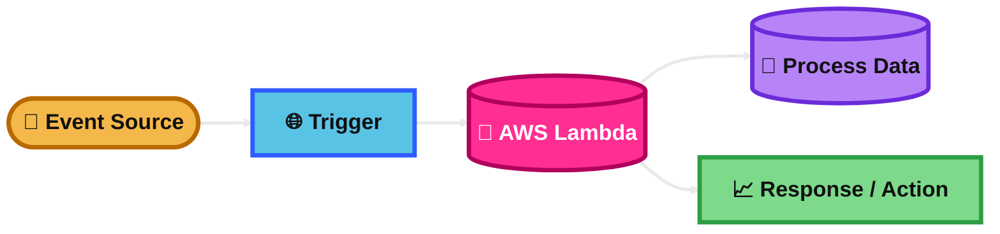
## Lambda Concurrency Error

### What is it?
A Lambda concurrency error usually means Lambda hit a concurrency limit.

Concurrency means how many function invocations are running at the same time.

When the limit is reached, extra requests can be throttled.

### How it works?
Each running invocation uses one concurrency unit.

If traffic rises and Lambda needs more concurrent executions than are available, Lambda cannot start more right away.

This can happen because of the account concurrency quota or a function's reserved concurrency setting.

### Visual Mermaid
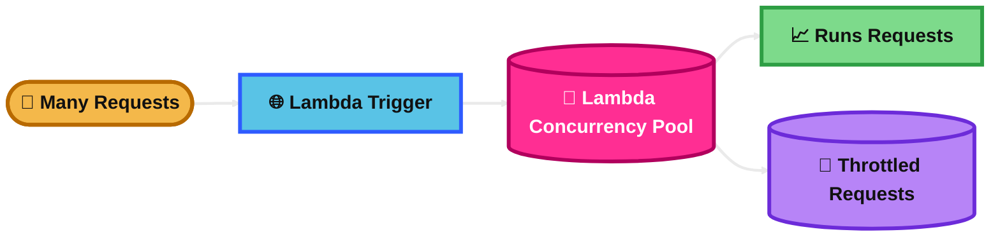
## Lambda Cold Starts & Provisioned Concurrency

### What is it?
A cold start is the extra startup time when Lambda creates a new execution environment.

Provisioned Concurrency keeps execution environments already initialized, so requests start faster.

This is mainly about performance and latency.

### How it works?
Without Provisioned Concurrency, Lambda creates environments on demand.

That setup time can include loading the runtime, your code, libraries, and initialization logic.

With Provisioned Concurrency, Lambda prepares a set number of environments ahead of time.

### Visual Mermaid
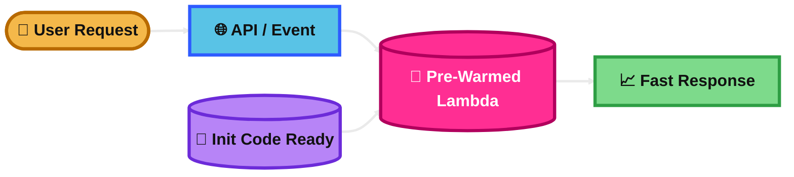
## Reserved and Provisioned Concurrency

### What is it?
Reserved Concurrency sets aside a fixed number of concurrent executions for one function.

It also acts as a cap for that function.

Provisioned Concurrency pre-initializes execution environments to reduce cold starts.

### How it works?
Reserved Concurrency protects a function from being starved by other functions.

Provisioned Concurrency prepares warm environments on a version or alias, so invocations start faster.

You can use both together:
reserved helps capacity control, provisioned helps startup speed.

### Visual Mermaid

## Lambda SnapStart

### What is it?
Lambda SnapStart reduces cold start time by restoring a function from a saved initialized snapshot.

It is designed for supported runtimes and published versions.

This is another performance feature, like Provisioned Concurrency, but it works differently.

### How it works?
Lambda runs your initialization code when you publish a function version.

It then saves a snapshot of that initialized environment.

When new execution environments are needed, Lambda restores from that snapshot instead of doing full initialization again.

### Visual Mermaid

## Lambda@Edge & CloudFront Function

### What is it?
Both services run code at CloudFront edge locations.

CloudFront Functions is for lightweight, very fast request and response changes.

Lambda@Edge is for more complex edge logic.

### How it works?
CloudFront Functions runs simple JavaScript on viewer request or viewer response.

Lambda@Edge runs Lambda code closer to users and supports more complex processing, including viewer and origin events.

Use CloudFront Functions for simple header, URL, cookie, or redirect logic.
Use Lambda@Edge for richer processing.

### Visual Mermaid
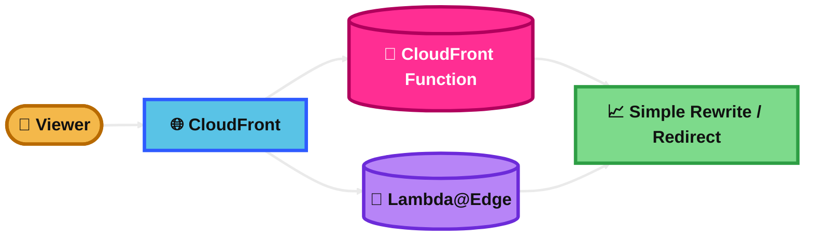
## Amazon DynamoDB

### What is it?
Amazon DynamoDB is a fully managed serverless NoSQL database.

It gives single-digit millisecond performance at scale.

It is a common exam answer when the question wants massive scale, low latency, and no database server management.

### How it works?
You store data in tables.

Each table has items and attributes, and every item is identified by a primary key.

DynamoDB automatically handles partitioning, scaling, and high availability.

### Visual Mermaid
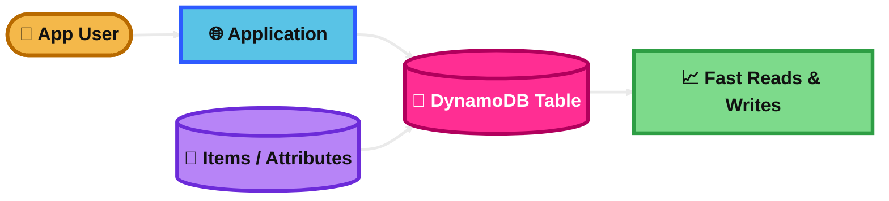
## Amazon DynamoDB Accelerator (DAX)

### What is it?
DAX is a fully managed, in-memory cache for DynamoDB.

It is built specifically to make DynamoDB reads much faster.

It is best for read-heavy workloads that need microsecond latency.

### How it works?
Your application uses the DAX client.

For supported read requests, DAX tries to serve data from memory first.

If the item is not cached, DAX gets it from DynamoDB and stores it for future reads.

### Visual Mermaid
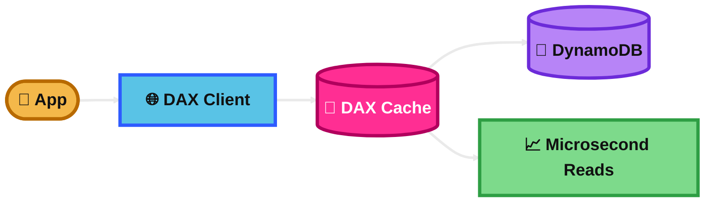
## DynamoDB Accelerator (DAX) vs. ElastiCache

### What is it?
Both can reduce read latency, but they are not the same.

DAX is purpose-built for DynamoDB.

ElastiCache is a general in-memory cache service for many use cases.

### How it works?
DAX sits in front of DynamoDB and works with DynamoDB API patterns.

ElastiCache gives you Redis or Memcached, and your application manages how data is cached and invalidated.

DAX is simpler when the problem is specifically DynamoDB read acceleration.

### Visual Mermaid
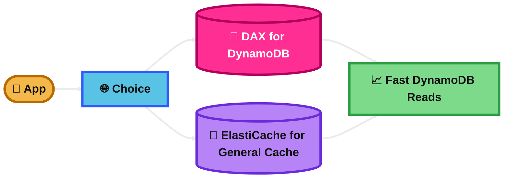
## DynamoDB – Stream Processing

### What is it?
DynamoDB Streams captures item-level changes in a DynamoDB table.

It is used for change data capture in near real time.

This is a common exam answer when a workflow must react to table inserts, updates, or deletes.

### How it works?
You enable a stream on a DynamoDB table.

When an item changes, DynamoDB writes a stream record.

A consumer such as Lambda reads those records and performs downstream actions.

### Visual Mermaid

## DynamoDB – Stream Processing vs Kinesis Data Streams (Newer)

### What is it?
Both can capture DynamoDB item changes in near real time.

DynamoDB Streams is the simpler built-in option.

Kinesis Data Streams for DynamoDB is better when you need more streaming power.

### How it works?
DynamoDB Streams keeps item change records for up to 24 hours and is commonly consumed by Lambda.

Kinesis Data Streams for DynamoDB sends table changes into a Kinesis data stream.

That gives you longer retention, more replay options, and better support for multiple independent consumers.

### Visual Mermaid
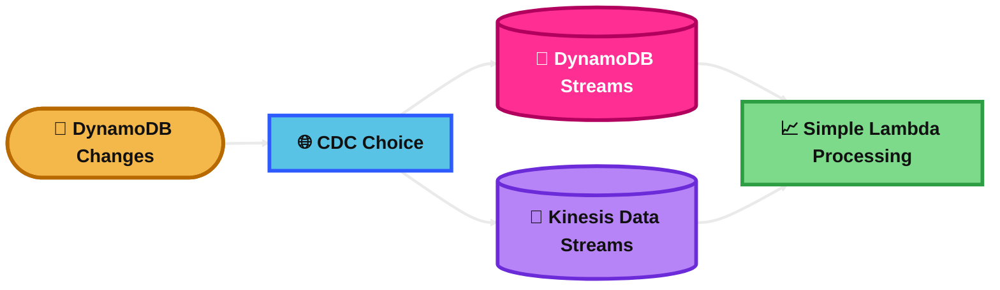
## AWS API Gateway

### What is it?
Amazon API Gateway is a fully managed service for creating, publishing, securing, and monitoring APIs.

It supports REST APIs, HTTP APIs, and WebSocket APIs.

It is often the front door for serverless and microservices architectures.

### How it works?
Clients send requests to API Gateway.

API Gateway routes the request to a backend such as Lambda, an HTTP endpoint, or another AWS service.

It can also handle authorization, throttling, request validation, and monitoring.

### Visual Mermaid
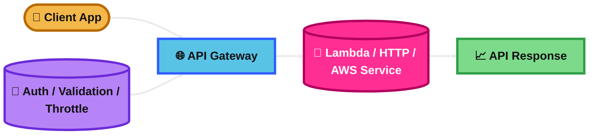
## AWS API Gateway - Endpoint Types

### What is it?
API Gateway endpoint type means how the API is exposed.

For SAA exam questions, think mainly about REST API endpoint types:
Edge-Optimized, Regional, and Private.

### How it works?
Edge-Optimized uses a CloudFront distribution managed by API Gateway.
It is good for globally distributed clients.

Regional is for clients in the same Region or when you want to control your own CloudFront setup.

Private makes the API accessible only from a VPC using an interface VPC endpoint.

### Visual Mermaid
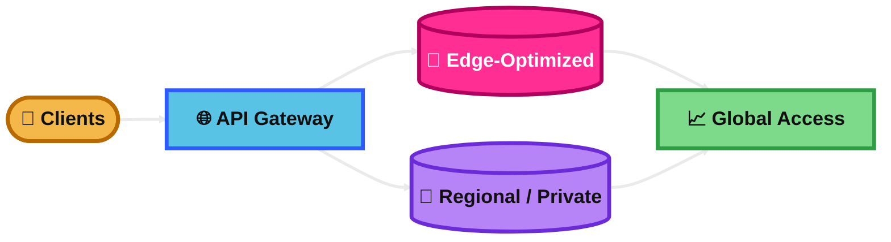
## AWS API Gateway - Security

### What is it?
API Gateway has multiple security layers.

You can control who can call the API and protect it from unwanted traffic.

### How it works?
You can secure an API with IAM authorization, Amazon Cognito user pools, or Lambda authorizers.

You can also use resource policies, WAF, throttling, and mutual TLS for stronger protection in the right design.

Different security tools solve different problems:
identity, network access, and traffic filtering.

### Visual Mermaid
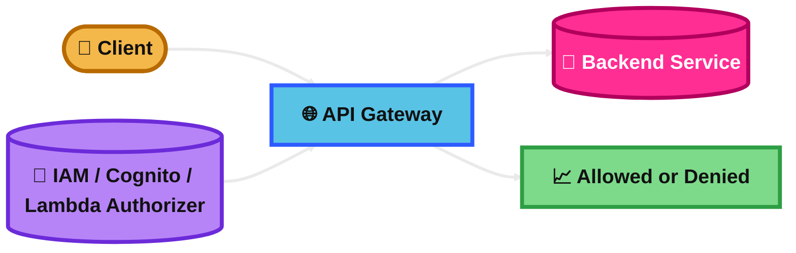
## AWS Step Functions

### What is it?
AWS Step Functions is a workflow orchestration service.

It lets you coordinate multiple steps, services, and error-handling rules in a state machine.

It is a very strong exam answer when the problem is about orchestration, retries, branching, and workflow visibility.

### How it works?
You define a workflow made of states such as Task, Choice, Wait, Parallel, or Map.

Each step can call Lambda or many AWS services directly.

Step Functions manages retries, catches errors, passes data between steps, and tracks execution progress.

### Visual Mermaid
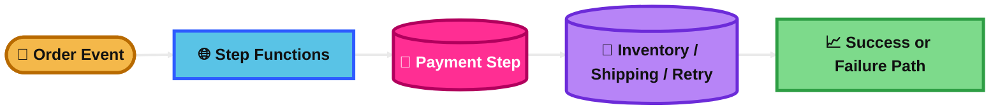
## Amazon Cognito

### What is it?
Amazon Cognito is AWS's managed service for user identity in apps.

For the exam, remember the two big parts:
User Pools and Identity Pools.

User Pools handle user sign-up and sign-in.
Identity Pools provide temporary AWS credentials.

### How it works?
Users authenticate with a User Pool or another identity provider.

If the app needs access to AWS services like S3, the user can then get temporary AWS credentials through an Identity Pool.

So the common exam pattern is:
User Pool for authentication, Identity Pool for AWS access.

### Visual Mermaid
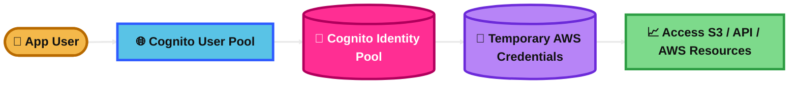
## Summary Table

| Topic | What It Is | How It Works | Best Use Case | Exam Trigger |
|---|---|---|---|---|
| Lambda | Serverless compute | Runs code on events, auto-scales | Event-driven apps | No servers, pay per use, auto scaling |
| Lambda Concurrency Error | Throttling from concurrency limits | Too many simultaneous invocations | Traffic spikes | Concurrent executions, throttled, quota reached |
| Lambda Cold Starts & Provisioned Concurrency | Cold start delay and warm capacity | Pre-initialized environments reduce startup delay | Low-latency APIs | Consistent latency, predictable traffic |
| Reserved and Provisioned Concurrency | Capacity control vs warm environments | Reserved protects capacity, provisioned reduces cold starts | Critical APIs needing capacity and speed | Guarantee capacity vs reduce startup delay |
| Lambda SnapStart | Snapshot-based cold start reduction | Restores from initialized snapshot | Slow-starting supported runtimes | Published version, cold start reduction |
| Lambda@Edge & CloudFront Function | Edge compute options for CloudFront | Functions for lightweight logic, Lambda@Edge for complex logic | Rewrites, headers, redirects, edge processing | Simple viewer logic vs complex edge logic |
| Amazon DynamoDB | Managed serverless NoSQL DB | Tables, items, attributes, auto scaling | High-scale low-latency apps | NoSQL, key-value, single-digit ms |
| Amazon DynamoDB Accelerator (DAX) | In-memory cache for DynamoDB | Serves cached DynamoDB reads | Hot read traffic | DynamoDB + microsecond read latency |
| DAX vs. ElastiCache | Purpose-built cache vs general cache | DAX for DynamoDB, ElastiCache for broader caching | DynamoDB read cache vs sessions/general cache | Minimal DynamoDB caching vs Redis/Memcached features |
| DynamoDB – Stream Processing | CDC from DynamoDB table changes | Stream records consumed by Lambda or others | Trigger actions on table changes | React to inserts, updates, deletes |
| DynamoDB – Stream Processing vs Kinesis Data Streams (Newer) | Simple CDC vs advanced streaming | Streams for simple use, Kinesis for replay/multi-consumer/retention | Event trigger vs analytics pipeline | 24h simple CDC vs long retention and replay |
| AWS API Gateway | Managed API front door | Routes requests to Lambda/HTTP/AWS services | Serverless APIs | Create, secure, throttle APIs |
| AWS API Gateway - Endpoint Types | Ways to expose REST APIs | Edge-Optimized, Regional, Private | Global public, regional public, internal VPC APIs | Global clients, same-region, VPC-only |
| AWS API Gateway - Security | API access control layers | IAM, Cognito, Lambda authorizer, resource policy, WAF | Secure public or private APIs | JWT, SigV4, custom auth, VPC endpoint restriction |
| AWS Step Functions | Workflow orchestration service | State machine with retries and branching | Multi-step business workflows | Orchestration, retries, long-running workflow |
| Amazon Cognito | Managed identity for apps | User Pools authenticate, Identity Pools give AWS creds | App login plus AWS resource access | Sign-in, JWT, temporary AWS credentials |