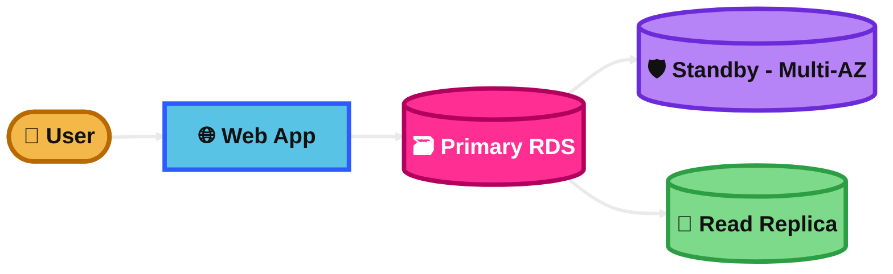
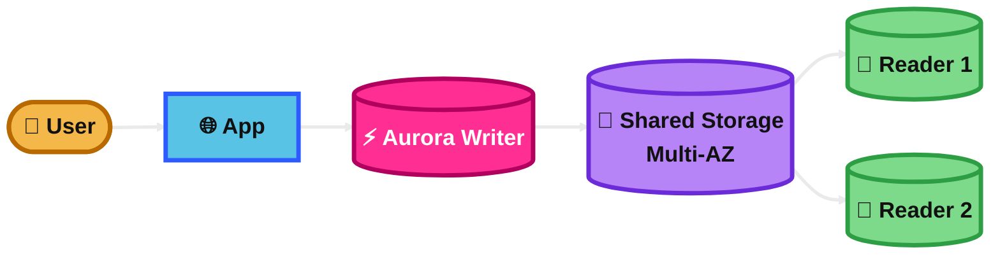
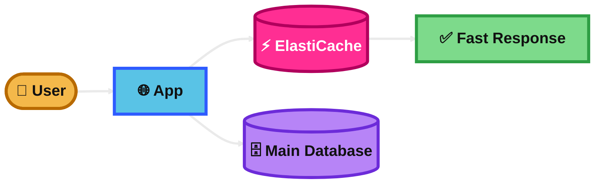
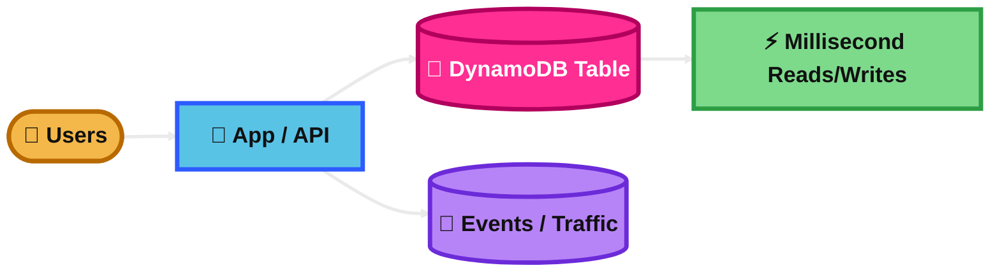
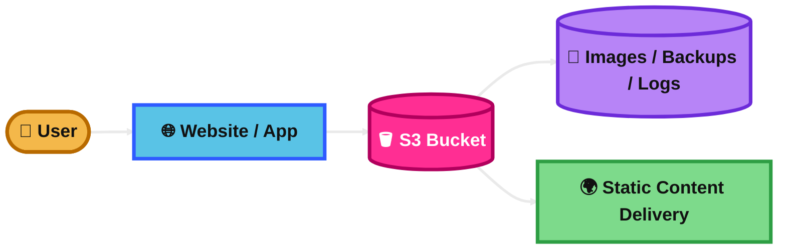
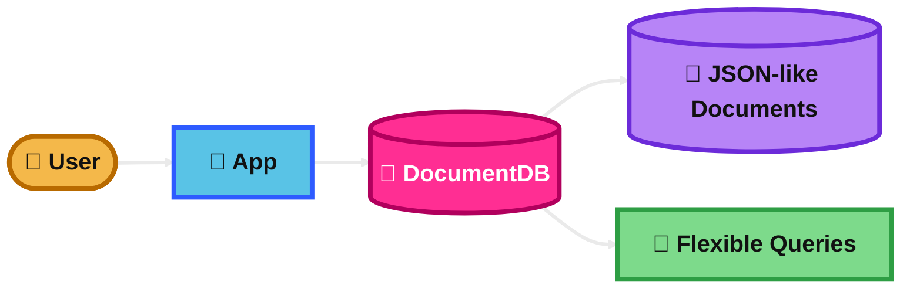
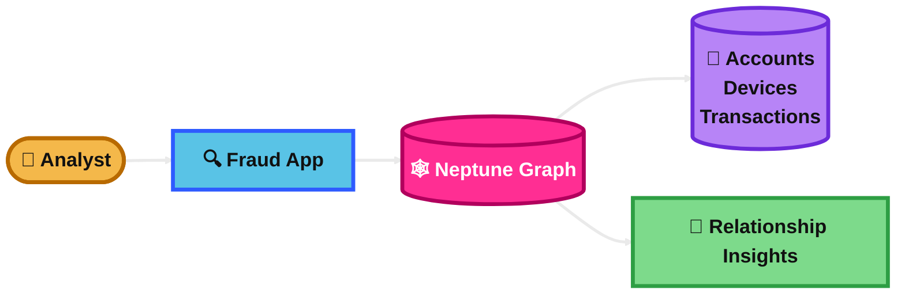

## Amazon RDS

### What is it?
Amazon RDS is a managed relational database service.

It supports engines like MySQL, PostgreSQL, MariaDB, Oracle, and SQL Server.

Use it when your app needs SQL, joins, transactions, and structured data.

### How it works?
You create a DB instance and AWS manages backups, patching, monitoring, and failover options.

You connect to it like a normal relational database.

For high availability, use Multi-AZ.

For read scaling, use Read Replicas.

### Use Case
A company runs an e-commerce app with orders, customers, and payments.

The app needs ACID transactions and SQL queries, so Amazon RDS is a strong fit.

### Exam Tip
Pick RDS when the question mentions relational data, SQL, transactions, or managed database operations.

If the question says high availability for the database, think Multi-AZ.

If the question says improve read performance, think Read Replicas.

Trap: Multi-AZ is for failover and availability, not for heavy read scaling.

### Visual Mermaid

## Amazon Aurora

### What is it?
Amazon Aurora is a high-performance managed relational database built for the cloud.

It is compatible with MySQL or PostgreSQL.

It is part of the RDS family, but it is usually faster and more highly available than standard RDS engines.

### How it works?
Aurora separates compute and storage.

Its storage automatically grows, and data is replicated across multiple Availability Zones.

You can use reader instances to scale reads.

Aurora is designed for fast failover and strong durability.

### Use Case
A SaaS app needs a relational database with better performance and availability than standard MySQL.

Aurora is a good answer when the company wants managed SQL with higher scale and resilience.

### Exam Tip
Pick Aurora when the question says relational database, MySQL/PostgreSQL compatibility, high performance, and high availability.

Good clues are “enterprise-grade,” “faster than standard MySQL/PostgreSQL,” or “replicated across multiple AZs.”

Trap: Aurora is relational, not NoSQL.

Trap: Aurora is usually chosen over standard RDS when the exam stresses performance and cloud-native design.

### Visual Mermaid

## Amazon ElastiCache

### What is it?
Amazon ElastiCache is a managed in-memory caching service.

It supports Redis and Memcached.

It is used to make applications faster by storing frequently accessed data in memory.

### How it works?
Your app checks the cache first.

If the data is there, it returns very fast.

If not, the app reads from the main database, returns the result, and can store it in the cache for next time.

Redis also supports features like replication, persistence, and pub/sub.

### Use Case
A shopping site gets heavy traffic and the database is overloaded by repeated product lookups.

ElastiCache stores hot data in memory so response times improve and database load drops.

### Exam Tip
Pick ElastiCache when the question says low latency, repeated reads, session storage, leaderboards, or offloading a database.

Redis is the better clue when you need advanced features.

Memcached is the clue when you just need simple distributed caching.

Trap: ElastiCache is not a primary durable database for most exam scenarios.

### Visual Mermaid

## Amazon DynamoDB

### What is it?
Amazon DynamoDB is a fully managed serverless NoSQL database.

It is designed for key-value and document data.

It provides very fast performance at massive scale.

### How it works?
You store items in tables.

Each item is identified by a primary key.

You design around access patterns, usually with a partition key and sometimes a sort key.

It scales automatically and is built for very low latency.

### Use Case
A mobile gaming app stores player profiles, scores, and session data for millions of users.

DynamoDB is a strong fit because it can handle huge scale with low operational overhead.

### Exam Tip
Pick DynamoDB when the question says serverless, NoSQL, massive scale, millisecond latency, or unpredictable traffic.

It is a strong answer for event-driven apps, user profiles, shopping carts, and IoT data.

Trap: DynamoDB is not for complex joins or traditional relational reporting.

Trap: You usually model the table around query patterns, not around normal relational design.

### Visual Mermaid

## Amazon S3

### What is it?
Amazon S3 is an object storage service.

It is used to store files, backups, images, videos, logs, and static website content.

It is highly durable and can scale very easily.

### How it works?
You store objects inside buckets.

Each object has data, metadata, and a key.

You can use storage classes, versioning, lifecycle rules, encryption, and replication.

Apps access S3 over HTTP-based APIs.

### Use Case
A company stores website images, user uploads, backups, and log files in S3.

It is also a common answer for static website hosting and data lakes.

### Exam Tip
Pick S3 when the question says unlimited scale, object storage, static files, backups, archival, or data lake.

It is often the best answer for durable, low-cost storage.

Trap: S3 is not a block storage service like EBS.

Trap: S3 is not a shared file system like EFS.

### Visual Mermaid

## Amazon DocumentDB

### What is it?
Amazon DocumentDB is a managed document database service.

It is designed for JSON-like document data and is compatible with MongoDB workloads.

It is useful when your application stores flexible schema data.

### How it works?
You store data as documents instead of rows and columns.

Your app reads and writes document records using document-style queries.

AWS handles the infrastructure, backups, and scaling operations.

It is easier to manage than running your own MongoDB servers.

### Use Case
A product catalog app stores product documents where each item can have different attributes.

DocumentDB works well because the schema can stay flexible.

### Exam Tip
Pick DocumentDB when the question says document database, JSON documents, MongoDB compatibility, or flexible schema.

It is a strong answer when the app structure changes often and relational tables feel too rigid.

Trap: DocumentDB is not a relational database.

Trap: Do not confuse it with DynamoDB. DynamoDB is key-value/document and serverless, while DocumentDB is for document-style database workloads similar to MongoDB use cases.

### Visual Mermaid

## Amazon Neptune

### What is it?
Amazon Neptune is a managed graph database service.

It is built for data with many relationships.

It is useful when the connection between records is the most important part of the problem.

### How it works?
Data is stored as nodes and relationships, or as graph triples.

Queries are optimized for relationship traversal.

This makes it fast for finding paths, connected items, recommendations, and network patterns.

### Use Case
A company builds a fraud detection system that must find suspicious links between accounts, devices, and transactions.

Neptune is a strong fit because graph queries are much better for relationship-heavy data than normal relational queries.

### Exam Tip
Pick Neptune when the question says social network, recommendation engine, fraud detection, knowledge graph, or relationship analysis.

The big clue is “highly connected data.”

Trap: Do not pick Neptune for simple tabular data or standard transactional apps.

Trap: If the question is mainly about documents, pick DocumentDB instead. If it is mainly about relationships, pick Neptune.

### Visual Mermaid

## Summary Table

| Topic | What It Is | How It Works | Best Use Case | Exam Trigger |
|---|---|---|---|---|
| Amazon RDS | Managed relational database | DB instance with SQL engine, backups, Multi-AZ, Read Replicas | Traditional apps needing SQL and transactions | SQL, relational, ACID, Multi-AZ, Read Replica |
| Amazon Aurora | Cloud-native high-performance relational DB in the RDS family | Shared storage across AZs, writer plus readers, fast failover | Need managed MySQL/PostgreSQL with better performance and HA | High-performance relational, MySQL/PostgreSQL compatible, cloud-native |
| Amazon ElastiCache | Managed in-memory cache | App checks cache before database | Speed up repeated reads, sessions, hot data | Caching, low latency, Redis, Memcached, reduce DB load |
| Amazon DynamoDB | Serverless NoSQL key-value/document database | Items in tables using primary keys, auto scaling | Massive scale apps with very low latency | NoSQL, serverless, millisecond latency, huge traffic |
| Amazon S3 | Object storage service | Objects stored in buckets with storage classes and lifecycle rules | Backups, static files, logs, data lake | Object storage, static website, durable, cheap storage |
| Amazon DocumentDB | Managed document database | Stores JSON-like documents with flexible schema | Product catalogs, content apps, document-style workloads | Document DB, MongoDB compatibility, flexible schema |
| Amazon Neptune | Managed graph database | Stores nodes and relationships for graph queries | Fraud detection, recommendations, social graphs | Highly connected data, graph, relationship traversal |