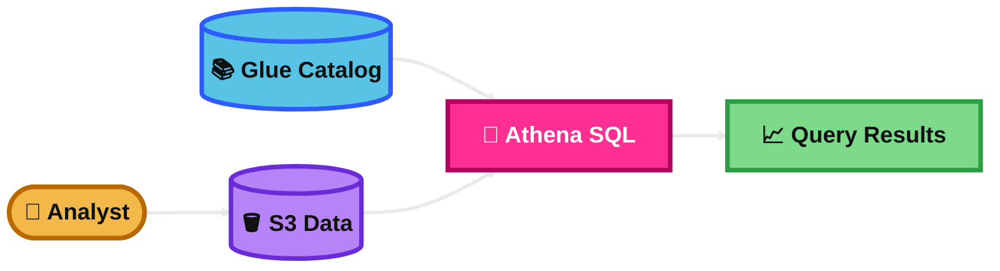
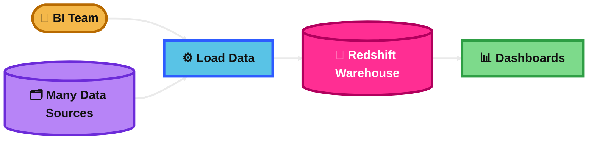
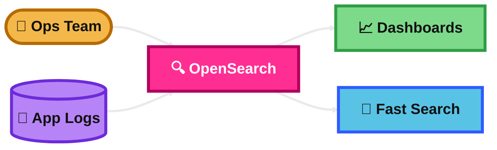
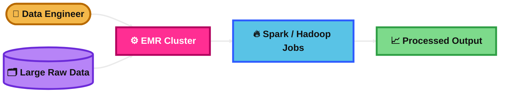
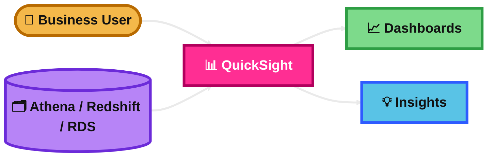
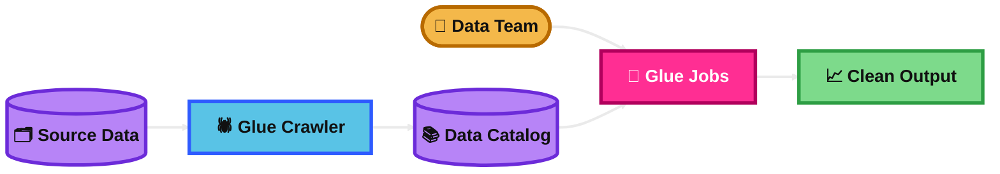
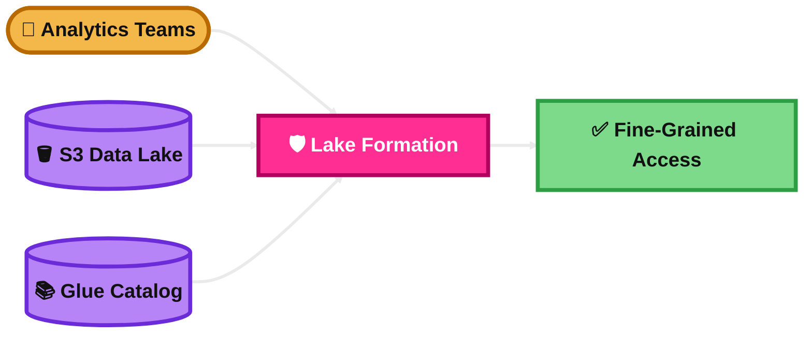
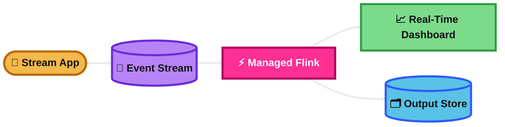
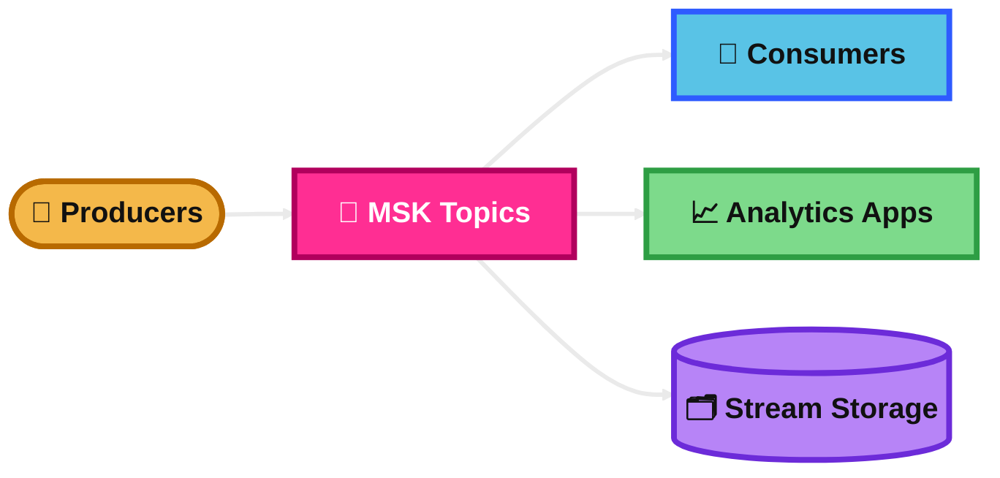
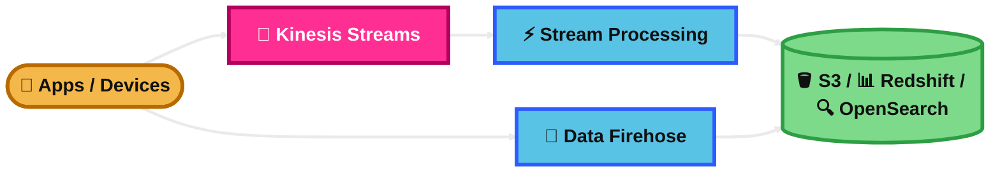

## AWS Athena

### What is it?
Amazon Athena is a serverless query service for data in Amazon S3.

You use SQL to analyze files in the data lake without managing servers.

### How it works?
Your data stays in S3.

Athena reads the data when you run a SQL query, often using metadata from the AWS Glue Data Catalog.

It is great for ad hoc analysis, log analysis, and quick queries on large datasets.

### Visual Mermaid

## Amazon Redshift

### What is it?
Amazon Redshift is a fully managed cloud data warehouse.

It is built for large-scale analytics and complex reporting across large amounts of structured and semi-structured data.

### How it works?
Data is loaded into Redshift or queried through its analytics features.

Redshift is optimized for analytical queries, not daily transaction processing.

You can use provisioned clusters or Redshift Serverless.

### Visual Mermaid

## Amazon OpenSearch

### What is it?
Amazon OpenSearch Service is a managed search and analytics service.

It is commonly used for full-text search, log analytics, application monitoring, and near real-time dashboards.

### How it works?
You send documents, logs, or events into an OpenSearch cluster.

The data is indexed so users can search it very fast.

Teams often use OpenSearch Dashboards to visualize logs and trends.

### Visual Mermaid

## Amazon EMR

### What is it?
Amazon EMR is a managed big data platform for running open-source frameworks like Apache Spark, Hadoop, Hive, Trino, and Flink.

It is for large-scale data processing when you need more control and framework flexibility.

### How it works?
You run big data jobs on managed compute.

AWS manages much of the cluster setup, but you still choose frameworks, cluster options, and job behavior.

EMR can run as clusters or in serverless form for some workloads.

### Visual Mermaid

## AWS QuickSight

### What is it?
AWS QuickSight is a cloud business intelligence service.

It helps you build dashboards, charts, and reports from many data sources.

### How it works?
QuickSight connects to data sources such as Redshift, Athena, RDS, and files.

It can use SPICE in-memory acceleration for fast dashboard performance.

Then users view dashboards and insights in the console or embedded apps.

### Visual Mermaid

## AWS Glue

### What is it?
AWS Glue is a serverless data integration service.

It is widely used for ETL, data preparation, data cataloging, and moving data between analytics systems.

### How it works?
Glue can crawl data sources to discover schema.

It stores metadata in the Glue Data Catalog.

You can run ETL jobs to clean, transform, and move data into places like S3, Redshift, or analytics systems.

### Visual Mermaid

## Lake Formation

### What is it?
AWS Lake Formation is a service for building, securing, and governing a data lake on Amazon S3.

It is especially important for controlling who can access which data.

### How it works?
You register your S3 data lake and manage permissions centrally.

Lake Formation works with the Glue Data Catalog and lets you grant fine-grained access to databases, tables, columns, and underlying S3 data.

It simplifies security for analytics teams.

### Visual Mermaid

## Amazon Managed Service for Apache Flink

### What is it?
This is a fully managed service for real-time stream processing with Apache Flink.

It is used when you need low-latency processing of streaming data.

### How it works?
Streaming data comes in from sources such as Kinesis or Kafka.

Your Flink application processes the data in real time using code or SQL.

It can enrich, aggregate, filter, and send results to dashboards, S3, OpenSearch, or other services.

### Visual Mermaid

## Amazon Managed Streaming for Apache Kafka (MSK)

### What is it?
Amazon MSK is a fully managed Apache Kafka service.

It lets you run Kafka on AWS without managing all the Kafka infrastructure yourself.

### How it works?
You create Kafka clusters or use MSK Serverless.

Producers send messages to Kafka topics.

Consumers read those messages for analytics, event-driven apps, or streaming pipelines.

### Visual Mermaid

## Amazon Big Data Ingestion Pipeline

### What is it?
This is not one single AWS service.

For the SAA exam, it usually means the ingestion part of a big data architecture that collects data and sends it into services like S3, Redshift, OpenSearch, or analytics systems.

### How it works?
On AWS, this often starts with:
Amazon Kinesis Data Streams for real-time ingestion when applications need custom consumers and replay.

Or Amazon Data Firehose for the easiest fully managed delivery into destinations like S3, Redshift, and OpenSearch.

Then the data can be processed by Glue, Flink, EMR, Athena, or Redshift depending on the use case.

### Visual Mermaid

## Summary Table

| Topic | What It Is | How It Works | Best Use Case | Exam Trigger |
|---|---|---|---|---|
| AWS Athena | Serverless SQL query service for S3 data | Queries data in S3 using SQL, often with Glue Data Catalog metadata | Ad hoc analytics on data lake files and logs | “Query S3 with SQL”, “serverless analytics”, “analyze logs in S3” |
| Amazon Redshift | Managed cloud data warehouse | Stores analytics data for fast complex reporting and BI queries | Enterprise reporting and repeated analytics workloads | “Data warehouse”, “BI reporting”, “complex analytics”, “petabyte scale” |
| Amazon OpenSearch | Managed search and log analytics service | Indexes documents and logs for fast search and dashboards | Log analytics, application monitoring, full-text search | “Search logs”, “full-text search”, “near real-time dashboard” |
| Amazon EMR | Managed big data processing platform | Runs Spark, Hadoop, Hive, Trino, Flink, and related frameworks | Large-scale custom data processing | “Spark”, “Hadoop”, “big data frameworks”, “custom processing” |
| AWS QuickSight | Cloud BI and dashboard service | Connects to sources and shows charts, reports, and dashboards | Business dashboards and visual analytics | “Dashboard”, “visualization”, “BI”, “embedded analytics” |
| AWS Glue | Serverless ETL and data integration service | Crawls data, catalogs schema, and runs ETL jobs | Prepare and move data for analytics | “ETL”, “crawler”, “schema discovery”, “data catalog” |
| Lake Formation | Data lake governance and security service | Applies central fine-grained permissions for S3 data lakes | Secure shared data lake access | “Govern data lake”, “fine-grained access”, “central permissions” |
| Amazon Managed Service for Apache Flink | Managed real-time stream processing service | Continuously processes streaming events with Flink | Fraud detection, streaming metrics, real-time event processing | “Stateful streaming”, “windowing”, “real-time processing” |
| Amazon Managed Streaming for Apache Kafka (MSK) | Managed Apache Kafka service | Runs Kafka brokers/topics for producers and consumers | Kafka-based event streaming and migrations | “Kafka”, “Kafka APIs”, “Kafka migration”, “streaming events” |
| Amazon Big Data Ingestion Pipeline | Ingestion architecture concept, usually with Kinesis and Firehose | Collects streaming data and sends it to analytics destinations | Clickstream, telemetry, logs, IoT ingestion | “Real-time ingestion”, “streaming pipeline”, “deliver to S3/Redshift/OpenSearch” |