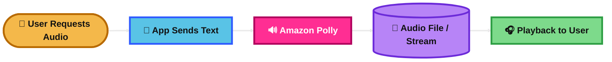
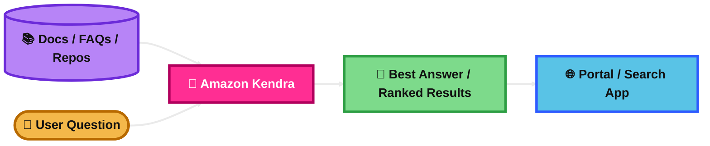
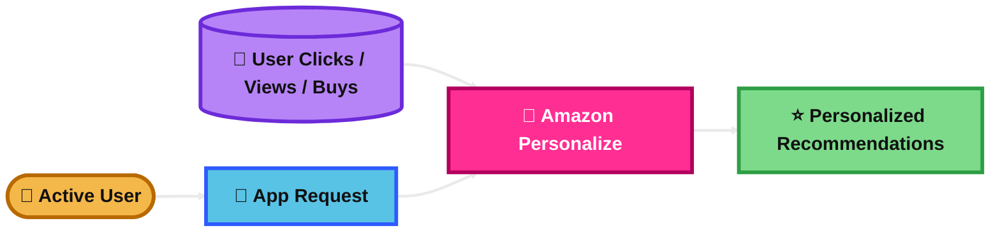

## Amazon Rekognition

### What is it?
Amazon Rekognition is an image and video analysis service.

It can detect labels, faces, celebrities, unsafe content, and text in images and videos.

### How it works?
Your app sends an image or video, often from Amazon S3, to Rekognition.

Rekognition uses prebuilt computer vision models to return results like objects, face details, or moderation labels.

For business-specific image detection, you can use Rekognition Custom Labels.

### Visual Mermaid

## Amazon Transcribe

### What is it?
Amazon Transcribe converts speech to text.

It supports batch and streaming transcription, and it can improve accuracy with custom vocabularies.

### How it works?
You send audio or video audio tracks to Transcribe.

Transcribe returns text transcripts. It can also identify speakers, help with subtitles, and in some cases detect or redact sensitive data.

### Visual Mermaid

## Amazon Polly

### What is it?
Amazon Polly converts text to speech.

It gives you realistic voices for apps, bots, and audio playback.

### How it works?
Your app sends text to Polly.

Polly generates spoken audio. You can control pronunciation and speaking style with SSML, and you can also get speech marks for timing.

### Visual Mermaid

## Amazon Translate

### What is it?
Amazon Translate is a neural machine translation service.

It translates text and documents between languages.

### How it works?
Your app sends source text or documents to Translate.

Translate returns the translated output. You can improve results with custom terminology, and batch jobs can use parallel data for more domain-specific translations.

### Visual Mermaid

```mermaid
%%{init: {'theme':'base','themeVariables': {
  'background':'#0B0F19',
  'primaryTextColor':'#111111',
  'secondaryTextColor':'#111111',
  'tertiaryTextColor':'#111111',
  'lineColor':'#EAEAEA',
  'fontSize':'20px'
}}}%%
flowchart LR
    U([👤 Global User]):::user --> A[🌐 App with Source Text]:::app
    A --> T[🌍 Amazon Translate]:::core
    T --> X[(📄 Translated Text)]:::data
    X --> D[✅ User Sees Local Language]:::dash

    classDef user fill:#F4B84A,stroke:#B86A00,stroke-width:4px,color:#111111,font-weight:bold;
    classDef app fill:#59C3E6,stroke:#2E5BFF,stroke-width:4px,color:#111111,font-weight:bold;
    classDef data fill:#B784F7,stroke:#6C2BD9,stroke-width:4px,color:#111111,font-weight:bold;
    classDef core fill:#FF2E93,stroke:#B1005D,stroke-width:4px,color:#FFFFFF,font-weight:bold;
    classDef dash fill:#7DDA8B,stroke:#2E9E44,stroke-width:4px,color:#111111,font-weight:bold;

    linkStyle 0,1,2,3 stroke:#EAEAEA,stroke-width:3px;
```

## Amazon Lex

### What is it?
Amazon Lex is a service for building conversational bots.

It understands text or speech input and figures out user intent.

### How it works?
You define intents, sample phrases, and slots.

A user sends text or speech. Lex identifies the intent, collects missing values, and can call AWS Lambda for validation or fulfillment.

### Visual Mermaid

```mermaid
%%{init: {'theme':'base','themeVariables': {
  'background':'#0B0F19',
  'primaryTextColor':'#111111',
  'secondaryTextColor':'#111111',
  'tertiaryTextColor':'#111111',
  'lineColor':'#EAEAEA',
  'fontSize':'20px'
}}}%%
flowchart LR
    U([🗣️ User Message]):::user --> L[🤖 Amazon Lex]:::core
    L --> I[🎯 Intent + Slots]:::dash
    I --> F[⚙️ Lambda Fulfillment]:::app
    F --> R[(💬 Bot Response)]:::data

    classDef user fill:#F4B84A,stroke:#B86A00,stroke-width:4px,color:#111111,font-weight:bold;
    classDef app fill:#59C3E6,stroke:#2E5BFF,stroke-width:4px,color:#111111,font-weight:bold;
    classDef data fill:#B784F7,stroke:#6C2BD9,stroke-width:4px,color:#111111,font-weight:bold;
    classDef core fill:#FF2E93,stroke:#B1005D,stroke-width:4px,color:#FFFFFF,font-weight:bold;
    classDef dash fill:#7DDA8B,stroke:#2E9E44,stroke-width:4px,color:#111111,font-weight:bold;

    linkStyle 0,1,2,3 stroke:#EAEAEA,stroke-width:3px;
```

## Amazon Comprehend

### What is it?
Amazon Comprehend is a natural language processing service.

It helps you understand text by finding things like sentiment, entities, key phrases, topics, and PII.

### How it works?
You send text documents to Comprehend.

Comprehend analyzes the text and returns results such as sentiment, named entities, or document classes. For business-specific needs, you can train custom classifiers and custom entity recognizers.

### Visual Mermaid

## Amazon Comprehend Medical

### What is it?
Amazon Comprehend Medical is a medical NLP service.

It is built for clinical and healthcare text, not general business text.

### How it works?
You send unstructured medical text, such as notes or reports, to the service.

It extracts medical information like conditions, medications, and PHI. It can also link results to medical code systems such as RxNorm and ICD-10-CM.

### Visual Mermaid

## Amazon SageMaker

### What is it?
Amazon SageMaker is AWS’s managed machine learning platform.

It helps you build, train, and deploy ML models without managing all the infrastructure yourself.

### How it works?
You prepare data, train models on managed infrastructure, and deploy them for inference.

For predictions, you can use real-time endpoints for low latency, batch transform for large offline jobs, and serverless inference for bursty traffic with idle time.

### Visual Mermaid

```mermaid
%%{init: {'theme':'base','themeVariables': {
  'background':'#0B0F19',
  'primaryTextColor':'#111111',
  'secondaryTextColor':'#111111',
  'tertiaryTextColor':'#111111',
  'lineColor':'#EAEAEA',
  'fontSize':'20px'
}}}%%
flowchart LR
    D[(🗂️ Training Data)]:::data --> S[🤖 Amazon SageMaker]:::core
    S --> M[(🧠 Trained Model)]:::data
    M --> E[⚡ Endpoint / Batch Inference]:::app
    E --> U([👤 Prediction for User/App]):::user

    classDef user fill:#F4B84A,stroke:#B86A00,stroke-width:4px,color:#111111,font-weight:bold;
    classDef app fill:#59C3E6,stroke:#2E5BFF,stroke-width:4px,color:#111111,font-weight:bold;
    classDef data fill:#B784F7,stroke:#6C2BD9,stroke-width:4px,color:#111111,font-weight:bold;
    classDef core fill:#FF2E93,stroke:#B1005D,stroke-width:4px,color:#FFFFFF,font-weight:bold;
    classDef dash fill:#7DDA8B,stroke:#2E9E44,stroke-width:4px,color:#111111,font-weight:bold;

    linkStyle 0,1,2,3 stroke:#EAEAEA,stroke-width:3px;
```

## Amazon Kendra

### What is it?
Amazon Kendra is an intelligent search service.

It helps users search across document sources using natural language instead of simple keyword matching.

### How it works?
You connect data sources or load documents into a Kendra index.

Kendra indexes the content and returns ranked answers or relevant passages when users ask questions. It can also use FAQs.

### Visual Mermaid

## Amazon Personalize

### What is it?
Amazon Personalize is a managed recommendation service.

It uses ML to recommend products, content, or actions for each user.

### How it works?
You provide data such as user interactions, items, and optional user metadata.

Personalize trains a model and serves recommendations through a recommender or campaign. It can also use real-time interaction events to improve some recommendation use cases.

### Visual Mermaid

## Amazon Textract

### What is it?
Amazon Textract extracts data from documents.

It goes beyond basic OCR by understanding document structure such as forms, tables, signatures, receipts, and IDs.

### How it works?
You send scanned documents or images to Textract.

Textract returns extracted text and relationships between fields. It has different APIs for document analysis, expense analysis, identity documents, and queries.

### Visual Mermaid

## Summary Table

| Topic | What It Is | How It Works | Best Use Case | Exam Trigger |
|---|---|---|---|---|
| Amazon Rekognition | Image and video analysis | Analyzes images/videos for labels, faces, moderation, and more | Content moderation or face analysis | Face detection, labels, unsafe images, video analysis |
| Amazon Transcribe | Speech to text | Converts audio streams or files into transcripts | Call transcription and subtitles | Audio to text, captions, speech recognition |
| Amazon Polly | Text to speech | Turns text into realistic spoken audio | Accessibility and voice playback | Read text aloud, natural voice, SSML |
| Amazon Translate | Language translation | Translates text or documents between languages | Multilingual apps and content | Translate text, documents, custom terminology |
| Amazon Lex | Chatbot and voice bot service | Detects intents and slots, can call Lambda | Conversational bots | Bot, intent, slot, conversational interface |
| Amazon Comprehend | General NLP for text | Finds sentiment, entities, key phrases, PII, classes | Review analysis and ticket classification | Sentiment, NLP, entity extraction, classify text |
| Amazon Comprehend Medical | Medical NLP | Extracts clinical entities, PHI, and medical codes | Healthcare text analysis | Clinical notes, PHI, ICD-10-CM, RxNorm |
| Amazon SageMaker | Managed ML platform | Build, train, and deploy ML models | Custom ML model development and hosting | Train model, endpoint, inference, managed ML |
| Amazon Kendra | Intelligent enterprise search | Indexes documents and returns relevant answers | Search across internal knowledge sources | Enterprise search, FAQ, indexed documents |
| Amazon Personalize | Recommendation engine | Uses interaction data to return user-specific recommendations | Ecommerce or media recommendations | Recommended for you, personalized items |
| Amazon Textract | Document OCR and extraction | Extracts text, forms, tables, receipts, and IDs | Invoice and form processing | OCR, scanned forms, tables, invoices, receipts |