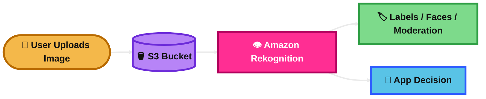
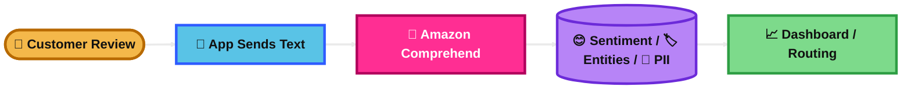
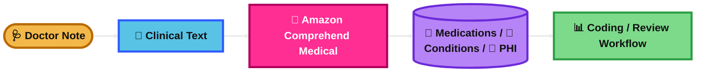
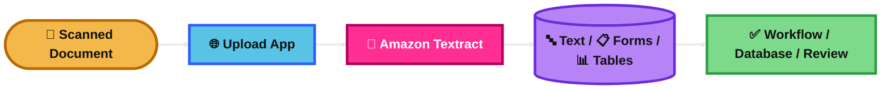

## Amazon Rekognition

### What is it?
Amazon Rekognition is an image and video analysis service.

It can detect labels, faces, celebrities, unsafe content, and text in images and videos.

### How it works?
Your app sends an image or video, often from Amazon S3, to Rekognition.

Rekognition uses prebuilt computer vision models to return results like objects, face details, or moderation labels.

For business-specific image detection, you can use Rekognition Custom Labels.

### Use Case
A social media app checks uploaded photos for unsafe content before showing them to users.

A security app compares a face in a photo against a known face collection.

### Exam Tip
Think of Rekognition when the question is about **image analysis** or **video analysis**.

Common clues: **face detection, facial comparison, content moderation, labels, celebrity recognition**.

Trap: if the question is about **extracting text, forms, tables, invoices, or scanned documents**, the better answer is usually **Amazon Textract**, not Rekognition.

### Visual Mermaid

## Amazon Transcribe

### What is it?
Amazon Transcribe converts speech to text.

It supports batch and streaming transcription, and it can improve accuracy with custom vocabularies.

### How it works?
You send audio or video audio tracks to Transcribe.

Transcribe returns text transcripts. It can also identify speakers, help with subtitles, and in some cases detect or redact sensitive data.

### Use Case
A company records support calls and converts them into searchable text for audits and analytics.

A media team turns recorded speech into subtitles.

### Exam Tip
Think of Transcribe when the question is about **speech to text**.

Common clues: **call recordings, captions, subtitles, live transcription, audio files, custom vocabulary**.

Trap: if the question is about making text sound like human speech, that is **Amazon Polly**.  
Trap: if the question is about understanding the meaning of text after transcription, that is often **Amazon Comprehend**.

### Visual Mermaid

```mermaid
%%{init: {'theme':'base','themeVariables': {
  'background':'#0B0F19',
  'primaryTextColor':'#111111',
  'secondaryTextColor':'#111111',
  'tertiaryTextColor':'#111111',
  'lineColor':'#EAEAEA',
  'fontSize':'20px'
}}}%%
flowchart LR
    U([🎤 Customer Speech]):::user --> A[📞 App / Call Audio]:::app
    A --> T[📝 Amazon Transcribe]:::core
    T --> X[(📄 Transcript)]:::data
    X --> D[📊 Search / Analytics / Captions]:::dash

    classDef user fill:#F4B84A,stroke:#B86A00,stroke-width:4px,color:#111111,font-weight:bold;
    classDef app fill:#59C3E6,stroke:#2E5BFF,stroke-width:4px,color:#111111,font-weight:bold;
    classDef data fill:#B784F7,stroke:#6C2BD9,stroke-width:4px,color:#111111,font-weight:bold;
    classDef core fill:#FF2E93,stroke:#B1005D,stroke-width:4px,color:#FFFFFF,font-weight:bold;
    classDef dash fill:#7DDA8B,stroke:#2E9E44,stroke-width:4px,color:#111111,font-weight:bold;

    linkStyle 0,1,2,3 stroke:#EAEAEA,stroke-width:3px;
```

## Amazon Polly

### What is it?
Amazon Polly converts text to speech.

It gives you realistic voices for apps, bots, and audio playback.

### How it works?
Your app sends text to Polly.

Polly generates spoken audio. You can control pronunciation and speaking style with SSML, and you can also get speech marks for timing.

### Use Case
An e-learning app reads lessons aloud.

A website adds audio playback for accessibility.

### Exam Tip
Think of Polly when the question is about **text to speech**.

Common clues: **natural voice, spoken output, read text aloud, accessibility, voice playback, SSML**.

Trap: if the question is about a chatbot conversation, that is usually **Amazon Lex**.  
Trap: if the question is about converting voice into text, that is **Amazon Transcribe**.

### Visual Mermaid

## Amazon Translate

### What is it?
Amazon Translate is a neural machine translation service.

It translates text and documents between languages.

### How it works?
Your app sends source text or documents to Translate.

Translate returns the translated output. You can improve results with custom terminology, and batch jobs can use parallel data for more domain-specific translations.

### Use Case
An ecommerce site shows product details in many languages.

A company translates support articles for global users.

### Exam Tip
Think of Translate when the question is about **language translation**.

Common clues: **multilingual website, translate text, translate documents, custom terminology, global content**.

Trap: if the question is about understanding sentiment or entities in text, use **Amazon Comprehend**.  
Trap: if the question is about chatbot conversations, use **Amazon Lex**.

### Visual Mermaid

## Amazon Lex

### What is it?
Amazon Lex is a service for building conversational bots.

It understands text or speech input and figures out user intent.

### How it works?
You define intents, sample phrases, and slots.

A user sends text or speech. Lex identifies the intent, collects missing values, and can call AWS Lambda for validation or fulfillment.

### Use Case
A bank builds a chatbot to answer account questions and help users reset cards or passwords.

### Exam Tip
Think of Lex when the question is about **chatbots** or **voice bots**.

Common clues: **intent, slot, conversational interface, bot, natural language, Lambda fulfillment**.

Trap: Lex is not for general search across documents. That is **Amazon Kendra**.  
Trap: Lex is not for text-to-speech audio generation alone. That is **Amazon Polly**.

### Visual Mermaid

## Amazon Comprehend

### What is it?
Amazon Comprehend is a natural language processing service.

It helps you understand text by finding things like sentiment, entities, key phrases, topics, and PII.

### How it works?
You send text documents to Comprehend.

Comprehend analyzes the text and returns results such as sentiment, named entities, or document classes. For business-specific needs, you can train custom classifiers and custom entity recognizers.

### Use Case
A company analyzes customer reviews to find whether feedback is positive or negative.

A support team classifies tickets automatically by issue type.

### Exam Tip
Think of Comprehend when the question is about **understanding text**.

Common clues: **sentiment analysis, entity extraction, key phrases, PII detection, classify documents, NLP**.

Trap: if the input is **voice**, convert it first with **Amazon Transcribe**.  
Trap: if the text is **medical or clinical**, the better answer is often **Amazon Comprehend Medical**.

### Visual Mermaid

## Amazon Comprehend Medical

### What is it?
Amazon Comprehend Medical is a medical NLP service.

It is built for clinical and healthcare text, not general business text.

### How it works?
You send unstructured medical text, such as notes or reports, to the service.

It extracts medical information like conditions, medications, and PHI. It can also link results to medical code systems such as RxNorm and ICD-10-CM.

### Use Case
A healthcare company processes doctor notes to find diagnoses, medications, and sensitive health data.

### Exam Tip
Think of Comprehend Medical when the text is **clinical** or **healthcare-related**.

Common clues: **medical notes, clinical text, PHI, ICD-10-CM, RxNorm, medication extraction**.

Trap: if it is regular business text, use **Amazon Comprehend**.  
Trap: if the question is about audio from doctor conversations, you may first need **Amazon Transcribe Medical** before analyzing the text.

### Visual Mermaid

## Amazon SageMaker

### What is it?
Amazon SageMaker is AWS’s managed machine learning platform.

It helps you build, train, and deploy ML models without managing all the infrastructure yourself.

### How it works?
You prepare data, train models on managed infrastructure, and deploy them for inference.

For predictions, you can use real-time endpoints for low latency, batch transform for large offline jobs, and serverless inference for bursty traffic with idle time.

### Use Case
A fraud system trains a model on past transactions and deploys it to score new transactions in real time.

A retailer runs batch predictions overnight for demand forecasting.

### Exam Tip
Think of SageMaker when the question is about **building or hosting ML models**.

Common clues: **train model, deploy endpoint, inference, feature engineering, AutoML, managed ML platform**.

Trap: if the question only needs a prebuilt AI service like OCR, chatbot, translation, or sentiment, the better answer is often **Textract, Lex, Translate, or Comprehend**, not SageMaker.

### Visual Mermaid

## Amazon Kendra

### What is it?
Amazon Kendra is an intelligent search service.

It helps users search across document sources using natural language instead of simple keyword matching.

### How it works?
You connect data sources or load documents into a Kendra index.

Kendra indexes the content and returns ranked answers or relevant passages when users ask questions. It can also use FAQs.

### Use Case
An internal company portal lets employees search HR policies, wikis, manuals, and support guides from one search box.

### Exam Tip
Think of Kendra when the question is about **enterprise search**.

Common clues: **search across documents, internal knowledge base, natural language search, FAQ search, document index**.

Trap: if the question is about chatbot conversation flow, use **Amazon Lex**.  
Trap: if the question is about recommendation engines, use **Amazon Personalize**.

### Visual Mermaid

## Amazon Personalize

### What is it?
Amazon Personalize is a managed recommendation service.

It uses ML to recommend products, content, or actions for each user.

### How it works?
You provide data such as user interactions, items, and optional user metadata.

Personalize trains a model and serves recommendations through a recommender or campaign. It can also use real-time interaction events to improve some recommendation use cases.

### Use Case
A streaming platform recommends movies based on what each user watched.

An ecommerce site shows “Recommended for you” or “Customers also viewed”.

### Exam Tip
Think of Personalize when the question is about **personal recommendations**.

Common clues: **recommend products, next best item, user-specific suggestions, real-time recommendations, interaction history**.

Trap: if the question is about document search, use **Amazon Kendra**.  
Trap: if the question is about general custom ML development, use **Amazon SageMaker**.

### Visual Mermaid

## Amazon Textract

### What is it?
Amazon Textract extracts data from documents.

It goes beyond basic OCR by understanding document structure such as forms, tables, signatures, receipts, and IDs.

### How it works?
You send scanned documents or images to Textract.

Textract returns extracted text and relationships between fields. It has different APIs for document analysis, expense analysis, identity documents, and queries.

### Use Case
A finance team uploads invoices and receipts and automatically extracts fields like vendor name, total amount, and invoice date.

A bank processes forms without manual data entry.

### Exam Tip
Think of Textract when the question is about **document OCR and structured extraction**.

Common clues: **scanned PDFs, forms, tables, invoices, receipts, IDs, key-value pairs, OCR**.

Trap: if the question is about general image labels or face detection, use **Amazon Rekognition**.  
Trap: if the question is about understanding the meaning of extracted text, use **Amazon Comprehend** after Textract if needed.

### Visual Mermaid

## Summary Table

| Topic | What It Is | How It Works | Best Use Case | Exam Trigger |
|---|---|---|---|---|
| Amazon Rekognition | Image and video analysis | Analyzes images/videos for labels, faces, moderation, and more | Content moderation or face analysis | Face detection, labels, unsafe images, video analysis |
| Amazon Transcribe | Speech to text | Converts audio streams or files into transcripts | Call transcription and subtitles | Audio to text, captions, speech recognition |
| Amazon Polly | Text to speech | Turns text into realistic spoken audio | Accessibility and voice playback | Read text aloud, natural voice, SSML |
| Amazon Translate | Language translation | Translates text or documents between languages | Multilingual apps and content | Translate text, documents, custom terminology |
| Amazon Lex | Chatbot and voice bot service | Detects intents and slots, can call Lambda | Conversational bots | Bot, intent, slot, conversational interface |
| Amazon Comprehend | General NLP for text | Finds sentiment, entities, key phrases, PII, classes | Review analysis and ticket classification | Sentiment, NLP, entity extraction, classify text |
| Amazon Comprehend Medical | Medical NLP | Extracts clinical entities, PHI, and medical codes | Healthcare text analysis | Clinical notes, PHI, ICD-10-CM, RxNorm |
| Amazon SageMaker | Managed ML platform | Build, train, and deploy ML models | Custom ML model development and hosting | Train model, endpoint, inference, managed ML |
| Amazon Kendra | Intelligent enterprise search | Indexes documents and returns relevant answers | Search across internal knowledge sources | Enterprise search, FAQ, indexed documents |
| Amazon Personalize | Recommendation engine | Uses interaction data to return user-specific recommendations | Ecommerce or media recommendations | Recommended for you, personalized items |
| Amazon Textract | Document OCR and extraction | Extracts text, forms, tables, receipts, and IDs | Invoice and form processing | OCR, scanned forms, tables, invoices, receipts |