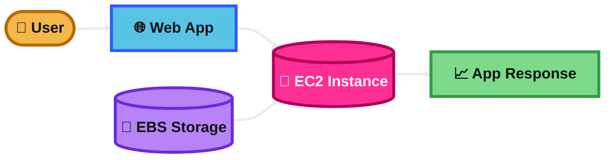
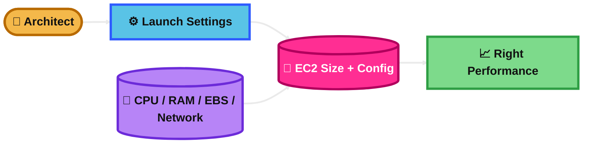
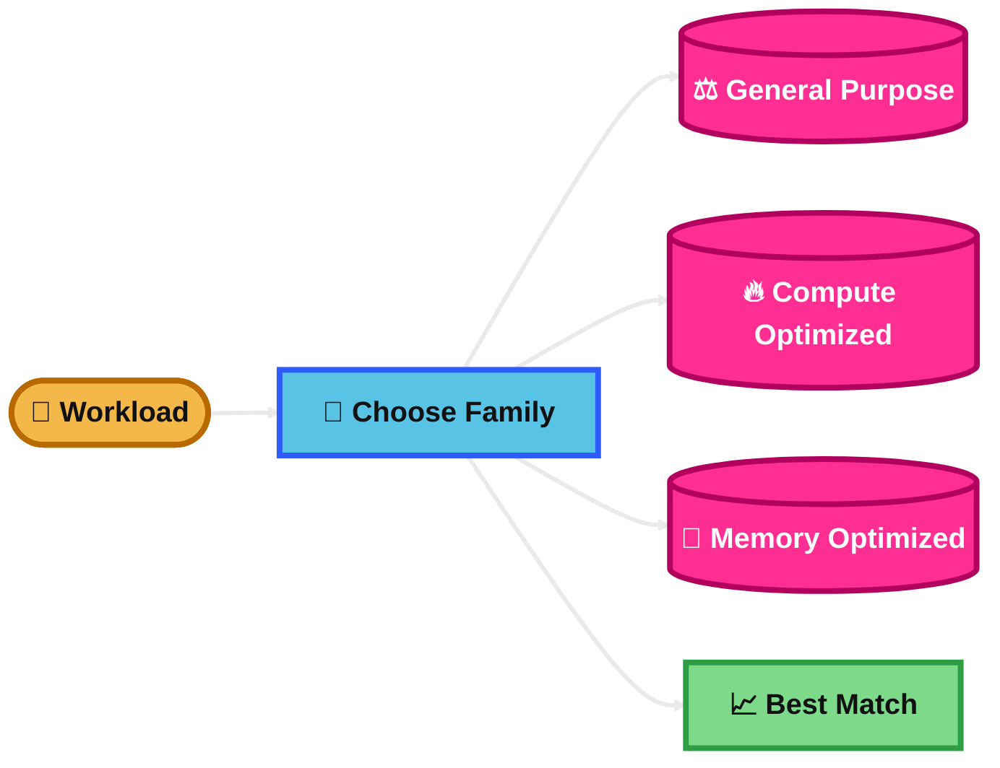
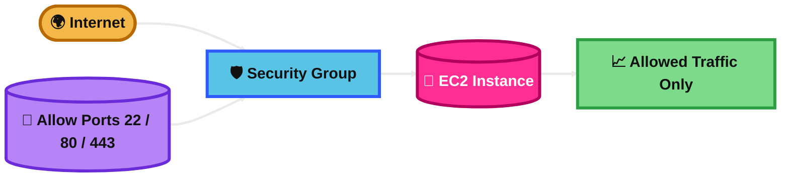
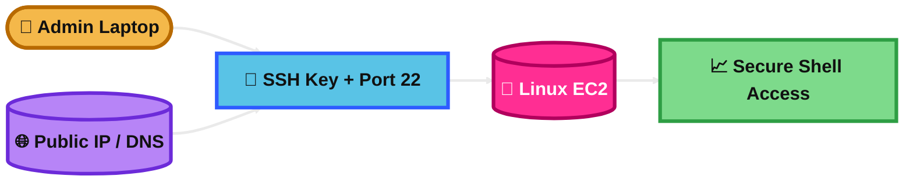
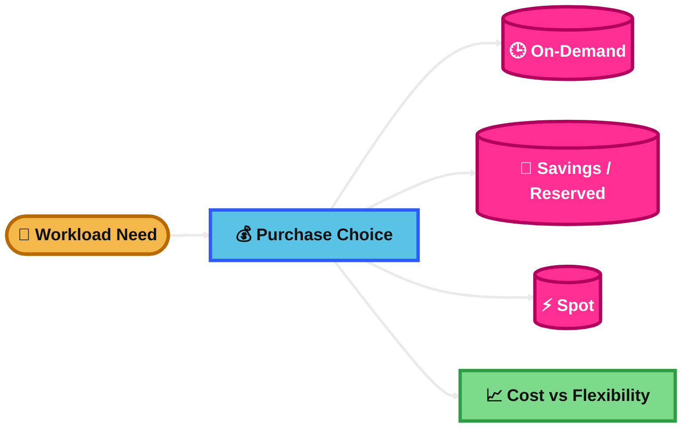

## EC2 Basics

### What is it?
Amazon EC2 stands for Elastic Compute Cloud.

It gives you virtual servers in AWS.

You use EC2 when you want full control of the operating system, storage, networking, and installed software.

### How it works?
You launch an EC2 instance from an Amazon Machine Image (AMI).

You choose the instance type, storage, network, and security settings.

AWS runs that virtual machine for you in an Availability Zone inside a Region.

You connect to it, install your app, and manage it like a normal server.

### Visual Mermaid

## EC2 Sizing & Configuration Options

### What is it?
This means choosing the right EC2 setup for your workload.

You choose CPU, memory, storage, network, operating system, and other options.

### How it works?
When launching EC2, you pick an instance type such as general purpose or memory optimized.

You also choose the AMI, EBS volume size and type, security group, key pair, VPC, subnet, and IAM role.

You can also enable Auto Scaling, load balancing, detailed monitoring, and user data scripts.

### Visual Mermaid

## EC2 Instance Types

### What is it?
EC2 instance types are families of servers with different hardware profiles.

Each type is built for different workloads.

### How it works?
AWS groups instance types by purpose.

General purpose gives balanced CPU and memory.

Compute optimized gives more CPU power.

Memory optimized gives more RAM.

Storage optimized gives fast local storage.

Accelerated computing uses GPUs or special hardware.

### Visual Mermaid

## Security Group

### What is it?
A security group is a virtual firewall for EC2.

It controls inbound and outbound traffic.

### How it works?
You create rules that allow specific traffic such as SSH on port 22 or HTTP on port 80.

Security groups are stateful.

That means if inbound traffic is allowed, the response traffic is automatically allowed back.

You attach the security group to EC2 instances.

### Visual Mermaid

## EC2 SSH Connection

### What is it?
SSH is a secure way to connect to a Linux EC2 instance from your computer.

It is mainly used for administration.

### How it works?
You launch the instance with a key pair.

The instance must allow inbound SSH on port 22 in its security group.

You connect using the private key and the instance public IP or public DNS name.

For private instances, you usually connect through a bastion host, VPN, or Session Manager.

### Visual Mermaid

## EC2 IAM Role

### What is it?
An IAM role for EC2 gives the instance temporary AWS permissions.

It lets applications on the instance access AWS services securely.

### How it works?
You create an IAM role with permissions such as reading from S3 or writing to CloudWatch Logs.

You attach the role to the EC2 instance.

The instance gets temporary credentials automatically from the Instance Metadata Service.

Your app uses those temporary credentials instead of storing access keys on the server.

### Visual Mermaid

## EC2 Purchase Options

### What is it?
EC2 purchase options are different ways to pay for EC2.

AWS gives options for flexibility, savings, or handling interruptions.

### How it works?
On-Demand is pay as you go with no long commitment.

Reserved Instances and Savings Plans reduce cost for steady usage over time.

Spot Instances use spare AWS capacity at a big discount, but AWS can interrupt them.

Dedicated Hosts or Dedicated Instances are for special compliance or licensing needs.

### Visual Mermaid

## Summary Table

| Topic | What It Is | How It Works | Best Use Case | Exam Trigger |
|---|---|---|---|---|
| EC2 Basics | Virtual server in AWS | Launch from an AMI and manage OS, storage, and network | Custom app hosting or lift-and-shift workloads | Need full server control |
| EC2 Sizing & Configuration Options | Choosing the right CPU, memory, storage, network, and settings | Pick instance type, AMI, EBS, security group, subnet, IAM role, scaling options | Matching infrastructure to workload needs | CPU-heavy, memory-heavy, bursty, fast storage, cost-performance clues |
| EC2 Instance Types | Different EC2 families for different workloads | Choose family based on workload profile | Web apps, compute jobs, caches, ML, high-storage workloads | Match family to workload: balanced, CPU, RAM, storage, GPU |
| Security Group | Stateful instance-level firewall | Allow inbound and outbound traffic rules for EC2 | Restrict access to app, SSH, or DB ports | “Firewall for instance,” “allow port 80/443/22,” stateful |
| EC2 SSH Connection | Secure Linux remote access | Use key pair, port 22, security group, and public or private path | Admin access to Linux server | Key pair, port 22, terminal login, Linux admin access |
| EC2 IAM Role | Temporary AWS permissions for EC2 | Attach role, EC2 gets temporary credentials automatically | EC2 app accessing S3, CloudWatch, or other AWS services | Secure access to AWS services without storing keys |
| EC2 Purchase Options | Different EC2 pricing models | Choose On-Demand, Savings/Reserved, Spot, or Dedicated | Optimize cost based on flexibility and workload stability | Predictable vs unpredictable usage, interruption tolerance, compliance needs |