## AWS Organizations

AWS Organizations is the service for managing many AWS accounts from one place.

It helps you group accounts, apply central rules, handle billing together, and build a multi-account environment for security and scale.

### Key Use Case
Use it when a company has multiple AWS accounts and wants central governance, account grouping, and shared billing.

### Practical Scenario
A company has separate accounts for dev, test, prod, and security. It uses AWS Organizations to manage them under one structure instead of managing each account alone.

### Exam Tip / Trigger
Look for clues like **multi-account environment**, **central governance**, **consolidated billing**, **apply policies across accounts**, or **separate workloads by account**.

A common trap is choosing Control Tower when the question only needs the core account-management service. Control Tower builds on top of Organizations.

### Difference Comparison
**AWS Organizations vs AWS Control Tower**

- **Organizations** = the core service for grouping accounts and applying org-level policies.
- **Control Tower** = a setup and governance layer built on top of Organizations for faster multi-account landing zones.

### Memory Hook
**Organizations = the parent folder for all AWS accounts.**

### Mermaid Diagram
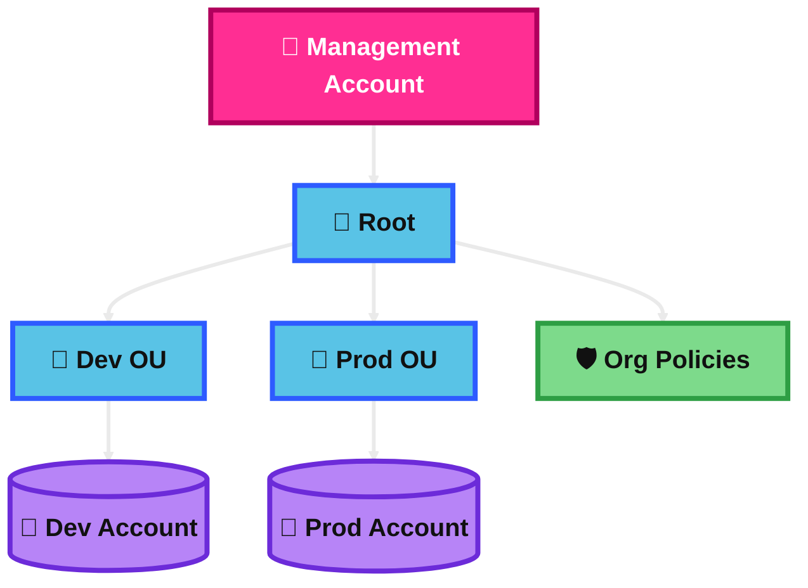
## AWS Organizational Units (OU)

An Organizational Unit, or OU, is a folder-like group inside AWS Organizations.

You use OUs to group accounts that should share the same rules. Policies attached to an OU are inherited by the accounts inside it.

### Key Use Case
Use OUs to separate accounts by environment, team, business unit, or security level.

### Practical Scenario
A company creates a **Sandbox OU** for learning accounts and a **Production OU** for critical accounts. The company applies stricter controls to Production.

### Exam Tip / Trigger
Look for phrases like **group accounts by department or environment**, **inherit policies**, **apply one rule to many accounts**, or **move accounts between groups**.

A common trap is thinking an OU is an AWS account. It is only a grouping layer.

### Difference Comparison
**OU vs Account**

- **OU** = a logical container for accounts.
- **Account** = the actual AWS environment that holds resources.

### Memory Hook
**OU = a policy folder for accounts.**

### Mermaid Diagram
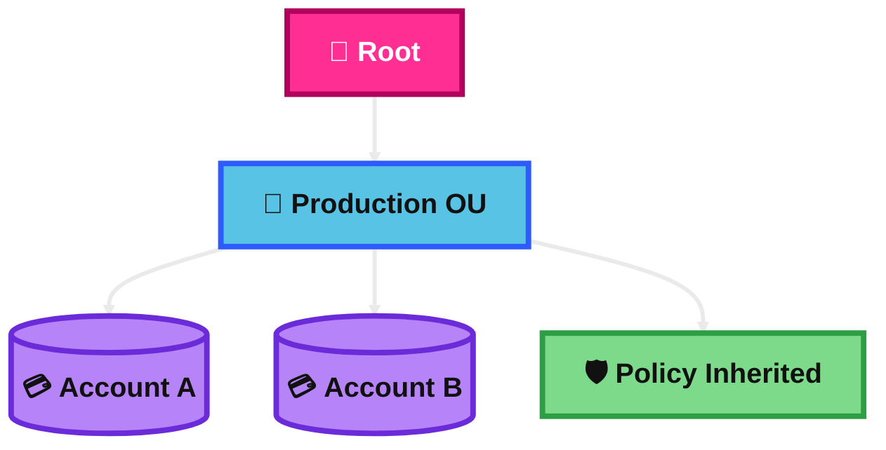
## AWS Organization Policies

AWS Organization Policies are organization-level policies that let you control or manage behavior across accounts in AWS Organizations.

For the SAA exam, this topic usually points most strongly to **Service Control Policies (SCPs)**. But AWS Organizations also supports other policy types, such as **Resource Control Policies (RCPs)** and management policies like tag, backup, and AI services opt-out policies.

### Key Use Case
Use organization policies when you want central rules for many accounts instead of configuring each account one by one.

### Practical Scenario
A company wants to block certain services in all member accounts, enforce central resource protections, and standardize some settings from the organization level.

### Exam Tip / Trigger
If the question says **across the organization**, **across many accounts**, **centrally manage permissions**, or **applies at root / OU / account**, think organization policies.

For SAA, the safest exam move is usually:  
**“organization policies” → first think SCPs unless the question clearly points to another policy type.**

### Difference Comparison
**Organization Policies vs IAM Policies**

- **Organization policies** = central, org-wide governance.
- **IAM policies** = permissions for specific users, roles, or resources inside an account.

### Memory Hook
**Organization policies = company-wide rules from the top.**

### Mermaid Diagram
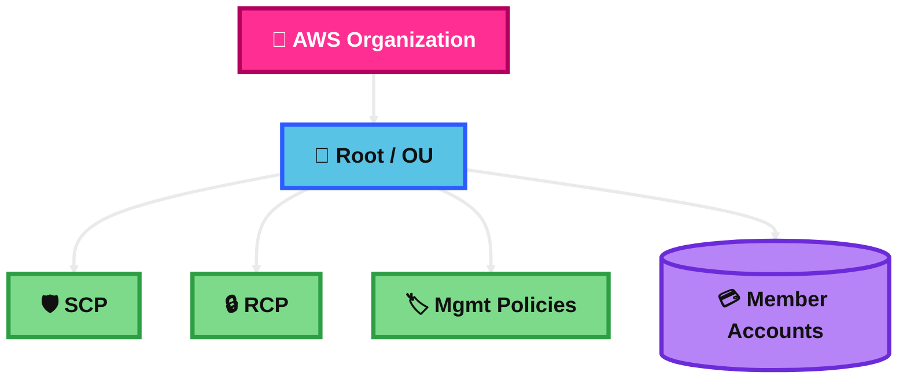
## IAM Conditions

IAM Conditions are extra checks inside a policy.

They let AWS allow or deny access only when specific facts are true, such as source IP, MFA used, requested Region, time, tag, or VPC endpoint.

### Key Use Case
Use IAM Conditions when basic allow/deny is not enough and you need context-based control.

### Practical Scenario
A company allows S3 access only if the user is using MFA and the request comes from a trusted IP range.

### Exam Tip / Trigger
Look for keywords like **only if**, **must use MFA**, **from specific IP**, **specific Region**, **tag-based access**, or **through a VPC endpoint**.

A common trap is choosing a separate AWS service when the requirement is just a smarter IAM policy.

### Difference Comparison
**IAM Conditions vs Basic IAM Allow**

- **Basic allow** = broad permission.
- **Condition** = permission only when extra requirements are met.

### Memory Hook
**Condition = “Allow, but only if...”**

### Mermaid Diagram
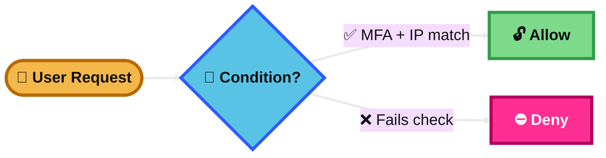
## IAM Resource-based Policies vs IAM Roles

A **resource-based policy** is attached directly to a resource, like an S3 bucket, SNS topic, SQS queue, or Lambda function.

An **IAM role** is an identity you assume to get temporary credentials.

### Key Use Case
- Use a **resource-based policy** when the resource itself should trust another principal.
- Use an **IAM role** when a user, app, or AWS service needs temporary permissions.

### Practical Scenario
An S3 bucket in Account A allows a role from Account B to read objects. The bucket policy is the resource-based policy. The app in Account B assumes the role to get credentials.

### Exam Tip / Trigger
- **“Grant cross-account access to an S3 bucket / SNS topic / SQS queue / Lambda”** → think resource-based policy.
- **“EC2 instance needs permissions”**, **“Lambda needs to call DynamoDB”**, or **“temporary credentials”** → think IAM role.

A common trap is forgetting that some services support resource-based policies and some do not.

### Difference Comparison
**Resource-based Policy vs IAM Role**

- **Resource-based policy** = attached to the resource and says who can access it.
- **IAM role** = assumed identity that gives temporary permissions to whoever uses it.

### Memory Hook
**Resource policy protects the door. Role gives you the keycard.**

### Mermaid Diagram
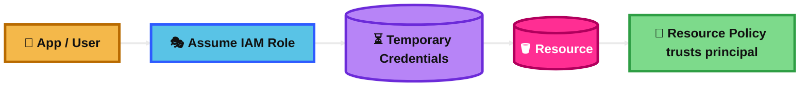
## IAM Permission Boundaries

An IAM permission boundary is a policy that sets the **maximum** permissions a user or role can get.

It does **not** grant permissions by itself. The identity still needs an identity-based policy. Final access is the intersection of both.

### Key Use Case
Use permission boundaries when you want to delegate IAM creation safely without letting users create overpowered roles or users.

### Practical Scenario
A central security team lets developers create IAM roles for their apps, but attaches a permission boundary so those roles cannot exceed approved limits.

### Exam Tip / Trigger
Look for phrases like **delegate IAM administration**, **limit the maximum permissions**, **developers can create roles but only within approved limits**, or **intersection of policies**.

A common trap is confusing permission boundaries with SCPs. Boundaries are for a specific IAM user or role, not the whole organization.

### Difference Comparison
**Permission Boundary vs SCP**

- **Permission boundary** = max permissions for a specific IAM user or role.
- **SCP** = max permissions for accounts in an organization or OU.

### Memory Hook
**Boundary = a permission ceiling for one identity.**

### Mermaid Diagram
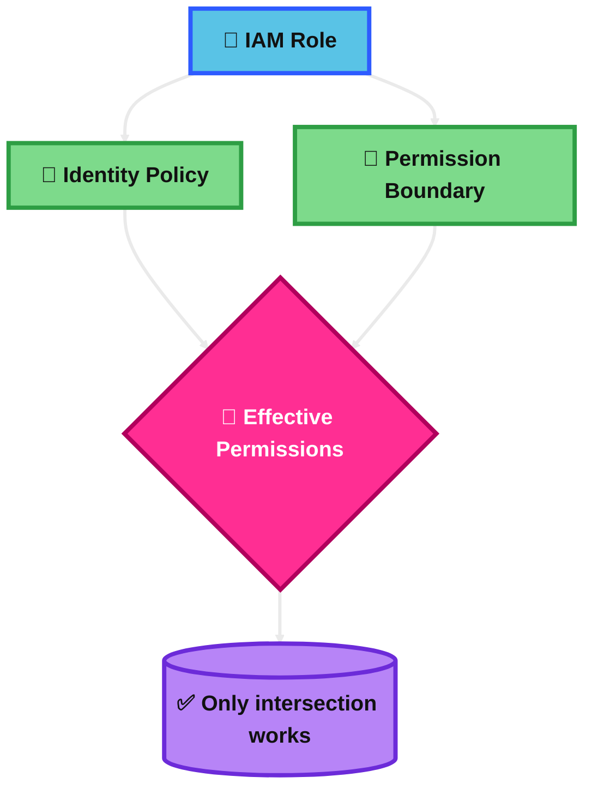
## IAM Policy Evolution Logic

For the exam, think of this as **IAM policy evaluation logic**.

AWS starts with **implicit deny**. Then it checks for any matching **explicit allow**. If there is any matching **explicit deny**, that deny wins.

When multiple policy types apply, AWS combines them using rules like **union** or **intersection** depending on the policy type.

### Key Use Case
Use this thinking when you need to figure out why a request is allowed or denied.

### Practical Scenario
A role has an allow policy for S3, but an SCP denies that S3 action. The final answer is deny, because explicit deny wins and SCP limits the maximum permissions.

### Exam Tip / Trigger
Look for phrases like **evaluate permissions**, **why access is denied**, **explicit deny**, **permission boundary + identity policy**, or **SCP + IAM policy**.

Fast exam rule:
- **Explicit deny beats everything**
- **Identity policy + resource policy** often combine
- **Boundary / SCP** limit permissions

### Difference Comparison
**IAM Evaluation Logic vs Single IAM Policy**

- **Single policy** = one permission document.
- **Evaluation logic** = how AWS combines all applicable policies and decides the final result.

### Memory Hook
**Start denied. Allow can open the door. Explicit deny slams it shut.**

### Mermaid Diagram
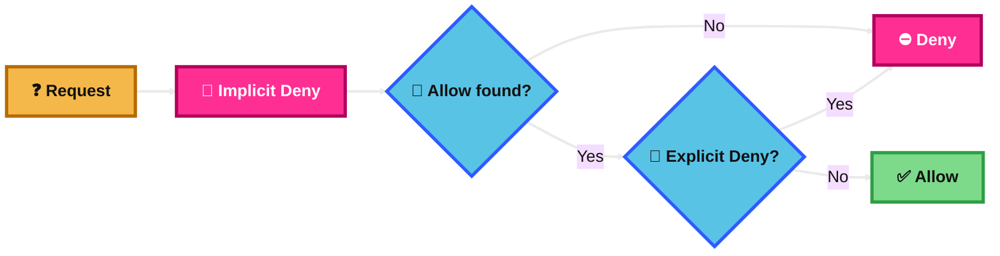
## AWS IAM Identity Center

AWS IAM Identity Center is AWS’s single sign-on service for AWS accounts and applications.

It lets workforce users sign in once and access multiple AWS accounts and cloud apps. It uses **permission sets** to assign access.

### Key Use Case
Use it when many human users need easy access to multiple AWS accounts without creating separate IAM users in each account.

### Practical Scenario
An engineer signs in once to the AWS access portal and can open the dev, test, and prod accounts based on assigned permission sets.

### Exam Tip / Trigger
Look for **single sign-on**, **central user access**, **multiple AWS accounts**, **permission sets**, **federation**, or **AWS access portal**.

A common trap is choosing plain IAM users. For many workforce users across many accounts, IAM Identity Center is the better exam answer.

### Difference Comparison
**IAM Identity Center vs IAM Users**

- **IAM Identity Center** = central workforce access across accounts and apps.
- **IAM users** = individual identities inside one AWS account.

### Memory Hook
**Identity Center = one login for many AWS accounts.**

### Mermaid Diagram
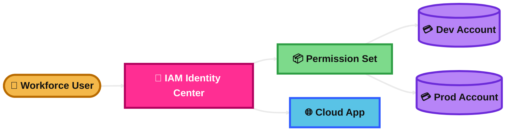
## AWS Directory Services

AWS Directory Service helps you use Microsoft Active Directory in AWS.

For the exam, the main options to remember are:
- **AWS Managed Microsoft AD** = real managed Microsoft AD in AWS
- **AD Connector** = proxy/gateway to on-premises AD
- **Simple AD** = basic low-feature directory

### Key Use Case
Use it when AWS resources or applications need directory-based authentication, domain join, or integration with Microsoft AD.

### Practical Scenario
A company wants Windows EC2 instances in AWS to join a domain and use existing AD-based authentication. It chooses the correct Directory Service option based on whether it wants a real managed AD or just a bridge to on-prem AD.

### Exam Tip / Trigger
- **Need full AD features in AWS** → AWS Managed Microsoft AD
- **Need to use existing on-prem AD without storing directory data in AWS** → AD Connector
- **Basic/simple directory needs** → Simple AD

A common trap is choosing AD Connector when the workload needs actual Microsoft AD features in AWS.

### Difference Comparison
**AWS Managed Microsoft AD vs AD Connector**

- **AWS Managed Microsoft AD** = managed directory running in AWS.
- **AD Connector** = gateway to your existing on-prem AD; it does not cache directory data in the cloud.

### Memory Hook
**Managed Microsoft AD = full AD in AWS. AD Connector = bridge to your AD.**

### Mermaid Diagram
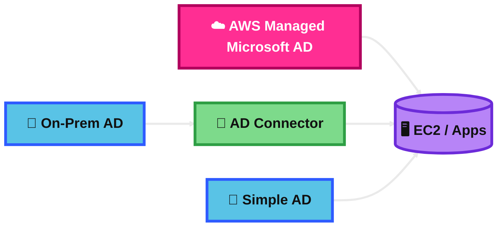
## AWS Control Tower

AWS Control Tower is a service that helps you quickly set up and govern a secure multi-account AWS environment.

It creates a **landing zone**, uses AWS Organizations underneath, and helps provision accounts in a standardized way.

### Key Use Case
Use it when you want a faster, guided, best-practice setup for a governed multi-account environment.

### Practical Scenario
A company is starting a new AWS environment and wants a standard landing zone with account vending, central governance, and built-in controls.

### Exam Tip / Trigger
Look for **landing zone**, **account factory**, **governed multi-account setup**, **best-practice environment**, or **quick setup for multi-account governance**.

A common trap is choosing AWS Organizations when the question clearly wants an easier, opinionated setup with built-in governance workflows.

### Difference Comparison
**Control Tower vs AWS Organizations**

- **Control Tower** = ready-made landing zone and governance layer.
- **Organizations** = base service for account grouping and policy control.

### Memory Hook
**Control Tower = autopilot for multi-account AWS setup.**

### Mermaid Diagram
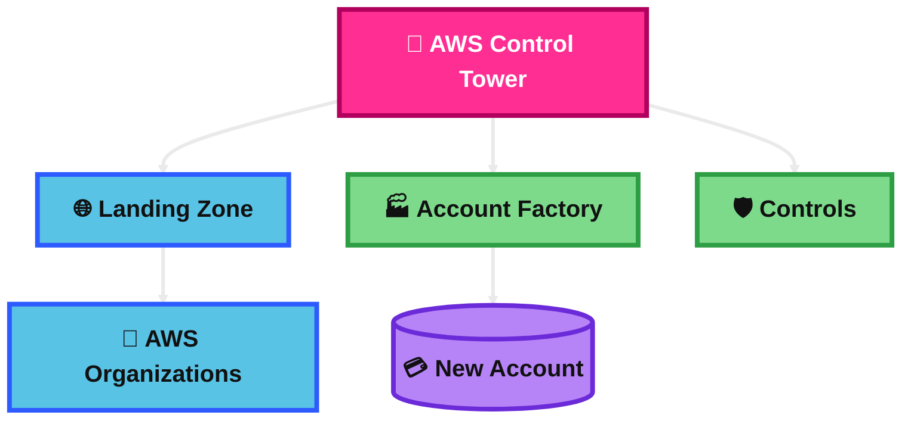
## AWS Control Tower – Guardrails

AWS Control Tower Guardrails are governance rules for your multi-account environment.

In current AWS terminology, they are called **controls**. For exam study, remember both names. Controls can be **preventive**, **detective**, or **proactive**.

### Key Use Case
Use them when you want ongoing governance rules across accounts in a Control Tower environment.

### Practical Scenario
A company wants to stop member accounts from disabling key security settings and also wants to detect drift from required configurations.

### Exam Tip / Trigger
- **Preventive** = stops bad actions before they happen
- **Detective** = checks and reports issues after the fact
- **Proactive** = checks resources before deployment against rules

A very common exam clue is:
- **Preventive guardrail** → often uses **SCP**
- **Detective guardrail** → often uses **AWS Config**
- **Control Tower guardrails** = think multi-account governance

### Difference Comparison
**Control Tower Guardrails vs SCPs**

- **Guardrails / controls** = governance rules in Control Tower; can be preventive, detective, or proactive.
- **SCPs** = one mechanism used mainly for preventive controls.

### Memory Hook
**Guardrails = safety rails for all your AWS accounts.**

### Mermaid Diagram
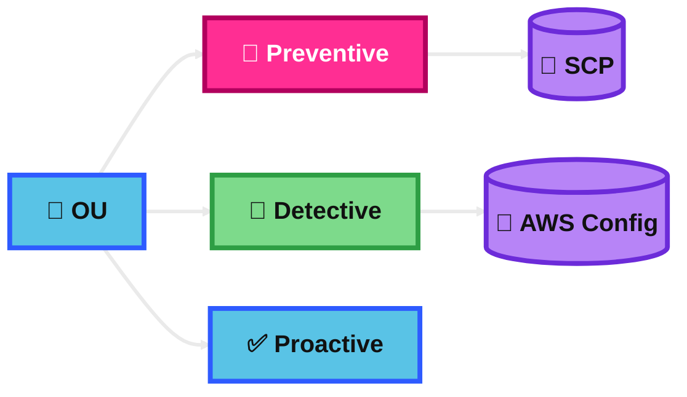
## Summary Table

| Topic | What It Is | Best Use Case | Similar Service / Confusion | Exam Trigger | Memory Hook |
|---|---|---|---|---|---|
| AWS Organizations | Central service for managing many AWS accounts | Multi-account governance and consolidated billing | Control Tower | Multi-account, root, OU, central governance | Parent folder for all AWS accounts |
| AWS Organizational Units (OU) | Folder-like group for accounts | Apply the same rules to many accounts | OU vs account | Inherit policies, group accounts by env/team | Policy folder for accounts |
| AWS Organization Policies | Org-level policies for central control | Enforce organization-wide rules | IAM policies | Root/OU/account, central control across accounts | Company-wide rules from the top |
| IAM Conditions | Extra checks inside a policy | Context-based access control | Basic IAM allow | Only if MFA/IP/tag/Region matches | Allow, but only if |
| IAM Resource-based Policies vs IAM Roles | Resource policy trusts principals; role gives temporary credentials | Cross-account resource access or temporary access | Identity-based policy vs role vs bucket policy | Bucket policy, queue policy, assume role, temp creds | Policy guards door, role gives keycard |
| IAM Permission Boundaries | Max permissions for one user or role | Safe delegated IAM administration | SCP | Maximum permissions, delegate role creation | Permission ceiling for one identity |
| IAM Policy Evolution Logic | How AWS evaluates all applicable policies | Troubleshoot allow vs deny | Single policy document | Explicit deny, implicit deny, evaluation logic | Start denied; explicit deny wins |
| AWS IAM Identity Center | SSO for AWS accounts and apps | Workforce access across many accounts | IAM users | Permission sets, AWS access portal, SSO | One login for many AWS accounts |
| AWS Directory Services | AWS options for Microsoft AD integration | Domain join, AD auth, Windows workloads | Managed Microsoft AD vs AD Connector | Domain join, on-prem AD bridge, managed AD | Full AD in AWS or bridge to your AD |
| AWS Control Tower | Guided landing zone for multi-account AWS | Fast secure multi-account setup | AWS Organizations | Landing zone, Account Factory, governed setup | Autopilot for multi-account AWS |
| AWS Control Tower – Guardrails | Governance rules in Control Tower, now called controls | Ongoing multi-account governance | SCPs | Preventive, detective, proactive | Safety rails for all accounts |