## AWS KMS

AWS KMS is the main AWS service for creating and managing encryption keys.

It is the usual exam answer when AWS services need encryption at rest with easy integration, audit logging, and key policy control.

### Practical Scenario
A company stores files in S3 and snapshots in EBS.
They want encryption and want to control access with IAM and key policies.
KMS is the right fit.

### Difference Comparison
KMS vs CloudHSM:
KMS is easier, fully managed, and deeply integrated with AWS services.
CloudHSM gives you more direct control, but you manage more.

### Memory Hook
KMS = managed keys for the AWS world.

### Mermaid Diagram
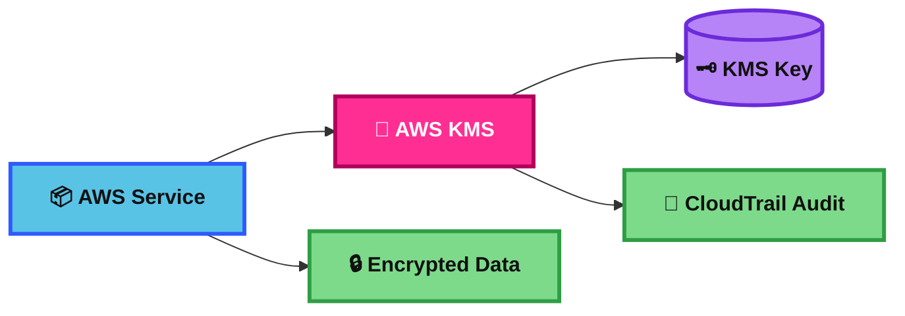
## KMS Keys Types

KMS key types matter because exam questions often test which key gives the right level of control.

The big exam split is:
customer managed keys,
AWS managed keys,
and AWS owned keys.

There is also a crypto-type split:
symmetric,
asymmetric,
and HMAC.

### Practical Scenario
A company must define its own key policy, disable a key, rotate it, and schedule deletion.
That points to a customer managed KMS key.

### Difference Comparison
Customer managed vs AWS managed vs AWS owned:
Customer managed = you control it.
AWS managed = AWS service manages it in your account.
AWS owned = AWS fully manages it for the service.

Also:
Symmetric = normal encryption choice for AWS services.
Asymmetric = signing or public/private key use.
HMAC = message authentication, not normal AWS service encryption.

### Memory Hook
Customer managed = my key, my rules.

### Mermaid Diagram
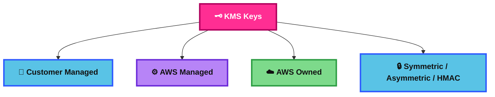
## KMS Multi-Region Keys

KMS Multi-Region Keys are related KMS keys in different Regions with the same key ID and key material.

They help when you need to encrypt in one Region and decrypt in another Region without re-encrypting first.

### Practical Scenario
An app runs in us-east-1 and eu-west-1.
It encrypts data in one Region and fails over to another Region.
Multi-Region Keys help both Regions use equivalent keys.

### Difference Comparison
Multi-Region key vs single-Region key:
Single-Region keys stay tied to one Region.
Multi-Region keys are replicated into other Regions and stay interoperable.

### Memory Hook
MRK = same key idea, different Region.

### Mermaid Diagram
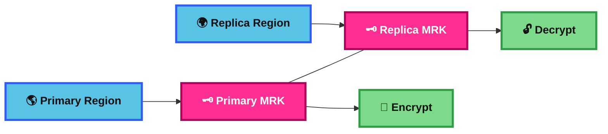
## DynamoDB Global Tables and KMS MultiRegion Keys Client-Side encryption

DynamoDB Global Tables replicate data across Regions.

If you need client-side encryption, the app encrypts the data before writing it to DynamoDB.
For multi-Region design, AWS recommends using KMS Multi-Region Keys with the AWS Database Encryption SDK.

### Practical Scenario
A banking app stores sensitive customer fields in a DynamoDB Global Table in two Regions.
The app encrypts the fields client-side and uses Multi-Region Keys so both Regions can decrypt after failover.

### Difference Comparison
DynamoDB server-side encryption vs client-side encryption:
Server-side encryption protects data at rest inside AWS.
Client-side encryption protects sensitive fields before DynamoDB sees them in clear text.

### Memory Hook
Global Tables + client-side encryption = think MRK.

### Mermaid Diagram
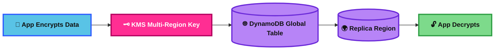
## Global Aurora and KMS Multi-Region Keys Client-Side encryption

Aurora Global Database is the Aurora multi-Region database option for global reads and disaster recovery.

Built-in Aurora encryption is server-side at the cluster/storage level.
If an exam says the application must encrypt sensitive data before it reaches the database, that is a client-side encryption pattern, not just “turn on Aurora encryption.”

### Practical Scenario
A healthcare app runs Aurora Global Database across Regions.
General database encryption at rest is handled by Aurora with KMS.
But if only the app should ever see patient fields in plaintext, the app must encrypt those fields before writing them.

### Difference Comparison
Aurora storage encryption vs client-side encryption:
Aurora storage encryption protects the DB cluster, backups, and storage.
Client-side encryption protects selected data before it enters the database.

### Memory Hook
Aurora Global = global database.
Client-side encryption = app owns the secret.

### Mermaid Diagram
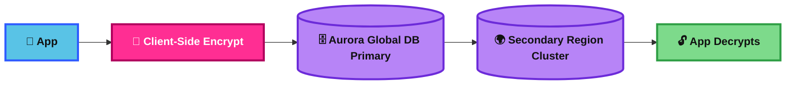
## S3 Replication Encryption

S3 Replication can copy encrypted objects to another bucket, including across Regions.

For KMS-encrypted objects, you usually need extra setup:
opt in to replicate them,
grant KMS permissions,
and specify the destination KMS key.

### Practical Scenario
A company stores files in an S3 bucket in one Region and replicates them to another Region for disaster recovery.
The objects use SSE-KMS, so replication needs a replica KMS key in the destination Region.

### Difference Comparison
SSE-S3 vs SSE-KMS in replication:
SSE-S3 is simpler.
SSE-KMS gives more control, but needs extra key permissions and destination key setup.

### Memory Hook
S3 + KMS replication = copy the object and plan the key.

### Mermaid Diagram
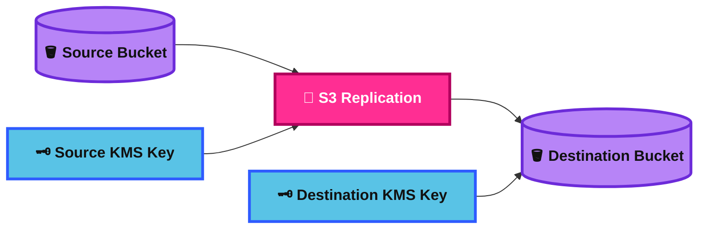
## AMI Sharing Process Encrypted via KMS

Sharing an encrypted AMI is more than sharing the AMI itself.

You also need access to the encrypted snapshot behind it and access to the customer managed KMS key used for encryption.

### Practical Scenario
A central platform team builds a hardened encrypted AMI.
They share it with app accounts.
They must also share the backing snapshot permissions and allow use of the customer managed KMS key.

### Difference Comparison
Unencrypted AMI sharing vs encrypted AMI sharing:
Unencrypted is simpler.
Encrypted adds KMS key sharing and snapshot access requirements.

### Memory Hook
Encrypted AMI sharing = share image, snapshot, and key.

### Mermaid Diagram
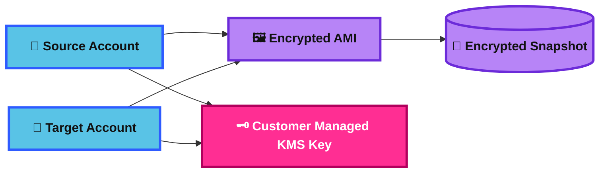
## SSM Parameter Store

Parameter Store stores configuration data and secrets in a simple hierarchical way.

It is a common exam answer for app configuration, environment variables, AMI IDs, and basic secret storage.

### Practical Scenario
A Lambda function needs database endpoint, feature flags, and an API key.
The app reads them from Parameter Store.
If the secret needs full lifecycle rotation, move that part to Secrets Manager.

### Difference Comparison
Parameter Store vs Secrets Manager:
Parameter Store is great for config and simpler secret storage.
Secrets Manager is better for secrets that need rotation and lifecycle management.

### Memory Hook
Parameter Store = settings first, secrets second.

### Mermaid Diagram
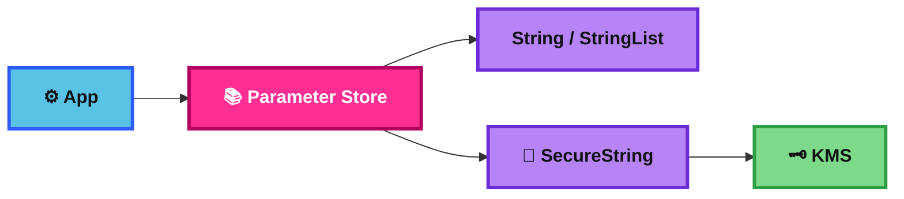
## AWS Secrets Manager

Secrets Manager is the AWS service built for secrets lifecycle management.

It stores secrets such as database credentials, API keys, and tokens, and it supports automatic rotation.

### Practical Scenario
An app uses Amazon RDS credentials.
The company wants the password to rotate automatically without manual updates.
Secrets Manager is the exam-friendly answer.

### Difference Comparison
Secrets Manager vs Parameter Store:
Secrets Manager is for secrets rotation and lifecycle.
Parameter Store is more for config storage and simpler secret use cases.

### Memory Hook
Secrets Manager = secrets that change safely.

### Mermaid Diagram
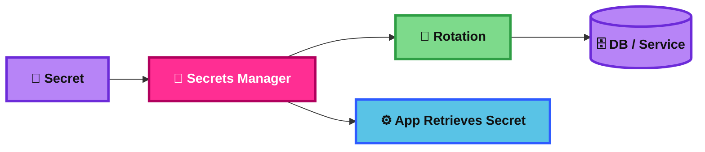
## AWS Certificate Manager (ACM)

ACM manages SSL/TLS certificates for AWS-integrated services.

It is the standard exam answer when you need HTTPS for ALB, CloudFront, or API Gateway without manually managing server certificates on instances.

### Practical Scenario
A company wants HTTPS on a public website behind an ALB.
They request a certificate in ACM and attach it to the listener.

### Difference Comparison
ACM requested cert vs imported cert:
Requested public certs can be AWS-managed for renewal.
Imported certs must be renewed by you.

### Memory Hook
ACM = AWS certificate home.

### Mermaid Diagram

## ACM – Requesting Public Certificates

When you request a public certificate from ACM, AWS issues the certificate after you validate domain ownership.

The two common validation methods are DNS validation and email validation.
DNS validation is usually the better exam answer.

### Practical Scenario
A company owns example.com and wants HTTPS on an ALB.
They request a public ACM certificate and validate the domain with DNS.

### Difference Comparison
Requesting public cert vs importing public cert:
Requesting from ACM gives AWS-issued certificates and managed renewal support.
Importing uses an external certificate and you renew it yourself.

### Memory Hook
Request in ACM = prove domain ownership, get managed cert.

### Mermaid Diagram

## ACM – Importing Public Certificates

Importing a certificate means you bring a certificate from an outside CA into ACM.

AWS can use it with ACM-integrated services, but ACM will not manage renewal for you.

### Practical Scenario
A company bought a public certificate from an external CA and wants to use it on an ALB.
They import it into ACM and attach it to the listener.

### Difference Comparison
Imported cert vs ACM-issued cert:
Imported = bring your own certificate, renew it yourself.
ACM-issued = AWS issues it and can manage renewal.

### Memory Hook
Import = bring your cert, keep your renewal job.

### Mermaid Diagram
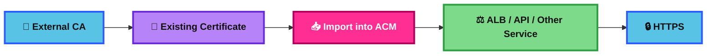
## ACM – Integration with ALB

ACM works directly with Application Load Balancer HTTPS listeners.

This is the classic exam pattern for terminating HTTPS at the load balancer.

### Practical Scenario
Users access https://app.example.com.
The ALB listener uses an ACM certificate and forwards traffic to target groups.

### Difference Comparison
ALB + ACM vs API Gateway + ACM:
ALB is for load balancing web traffic to targets.
API Gateway + ACM is for managed APIs and custom API domains.

### Memory Hook
ALB + ACM = HTTPS front door for web apps.

### Mermaid Diagram
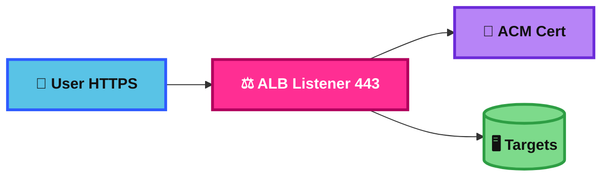
## ACM – Integration with API Gateway

ACM is used with API Gateway custom domain names.

This gives your API a friendly HTTPS domain like api.example.com.

### Practical Scenario
A company has a Regional API Gateway API.
They create api.example.com and attach an ACM certificate for secure access.

### Difference Comparison
API Gateway Regional vs edge-optimized custom domain:
Regional = certificate in same Region as API.
Edge-optimized = certificate in us-east-1 because CloudFront is involved.

### Memory Hook
API custom domain = ACM cert, and Region rules matter.

### Mermaid Diagram

## AWS CloudHSM

AWS CloudHSM gives you dedicated single-tenant hardware security modules in AWS.

It is for stricter control and specialized cryptographic requirements than normal KMS use cases.

### Practical Scenario
A company has a regulation that requires keys to live in dedicated HSM hardware under tighter control.
CloudHSM is a better fit than regular KMS.

### Difference Comparison
CloudHSM vs KMS:
CloudHSM = more control, more management, dedicated HSMs.
KMS = easier, more integrated, more managed.

### Memory Hook
CloudHSM = hardware control in the cloud.

### Mermaid Diagram
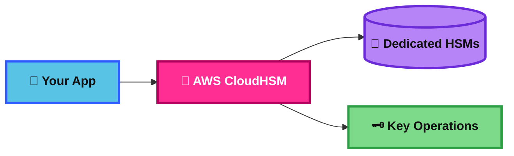
## AWS WAF – Web Application Firewall

AWS WAF protects web applications at Layer 7.

It filters HTTP and HTTPS requests using rules such as IP blocking, geo blocking, SQL injection protection, XSS protection, and rate limiting.

### Practical Scenario
A public web app behind CloudFront or ALB is getting login abuse and SQL injection attempts.
AWS WAF can block or rate-limit that traffic.

### Difference Comparison
WAF vs Shield:
WAF filters web requests at Layer 7.
Shield protects against DDoS, especially at network and transport layers.

### Memory Hook
WAF = web request filter.

### Mermaid Diagram
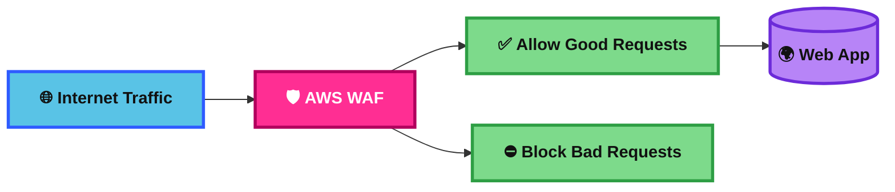
## AWS Shield

AWS Shield is AWS’s managed DDoS protection service.

Shield Standard is always on for common DDoS protection.
Shield Advanced adds stronger protection and extra support features.

### Practical Scenario
A public application is hit by a volumetric attack.
Shield helps protect the application from DDoS traffic.

### Difference Comparison
Shield Standard vs Shield Advanced:
Standard = baseline DDoS protection.
Advanced = more features, deeper visibility, and response support.

### Memory Hook
Shield = DDoS armor.

### Mermaid Diagram
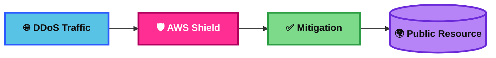
## AWS Firewall Manager

Firewall Manager lets you centrally manage security protections across multiple AWS accounts in an AWS Organization.

It is the exam answer when the problem is not “what rule” but “how do I enforce this everywhere.”

### Practical Scenario
A company has 50 AWS accounts and wants the same WAF rules and security group controls everywhere.
Firewall Manager lets the security team push and audit those policies centrally.

### Difference Comparison
Firewall Manager vs WAF:
WAF is the protection engine for web traffic.
Firewall Manager is the central policy manager across accounts.

### Memory Hook
Firewall Manager = one security team, many accounts.

### Mermaid Diagram
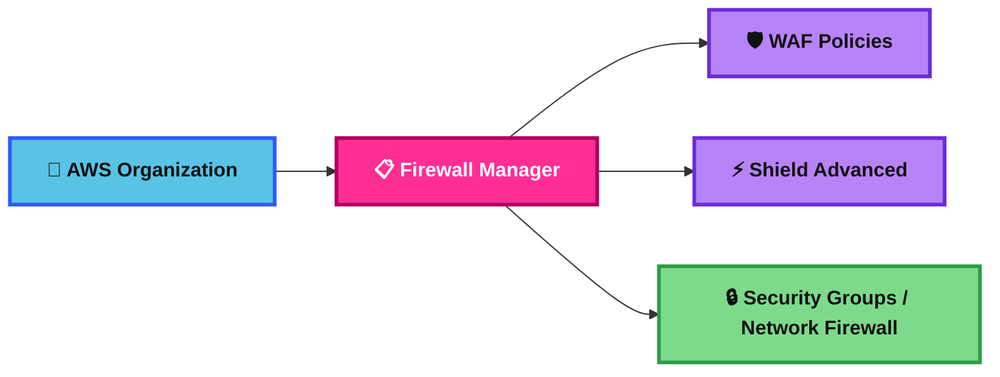
## WAF vs. Firewall Manager vs. Shield

These three are often confused, so exam questions love them.

WAF filters web requests.
Shield protects against DDoS.
Firewall Manager centrally enforces those protections across accounts.

### Practical Scenario
A company wants to block SQL injection on one web app.
Use WAF.

A company wants protection against DDoS.
Use Shield.

A company wants the same WAF and Shield setup in many accounts.
Use Firewall Manager.

### Difference Comparison
WAF = web filtering.
Shield = DDoS protection.
Firewall Manager = central governance for protections.

### Memory Hook
Filter, defend, govern.

### Mermaid Diagram
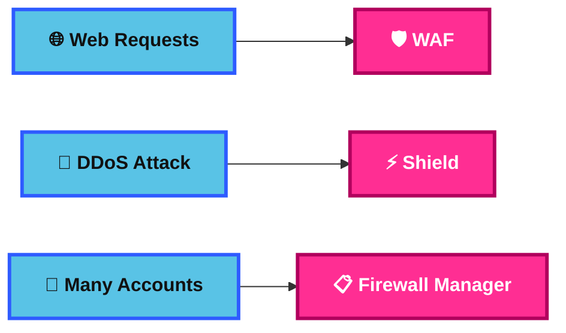
## Amazon GuardDuty

GuardDuty is a threat detection service.

It analyzes AWS data sources and signals to detect suspicious activity such as unusual API calls, malicious IP communication, credential misuse, and possible compromise.

### Practical Scenario
An EC2 instance starts talking to a known malicious IP and an IAM user makes strange API calls.
GuardDuty raises findings.

### Difference Comparison
GuardDuty vs Inspector:
GuardDuty looks for threats and suspicious behavior.
Inspector looks for vulnerabilities and exposure.

### Memory Hook
GuardDuty = detective for active threats.

### Mermaid Diagram

## Amazon Inspector

Inspector is a vulnerability management service.

It automatically discovers and scans workloads such as EC2 instances, ECR container images, and Lambda functions for software vulnerabilities and unintended network exposure.

### Practical Scenario
A company wants to find CVEs in its EC2 instances and container images and check for network exposure risks.
Inspector is the right answer.

### Difference Comparison
Inspector vs GuardDuty:
Inspector = vulnerabilities and exposure.
GuardDuty = suspicious activity and threats.

### Memory Hook
Inspector = finds weaknesses before attackers do.

### Mermaid Diagram
```mermaid
flowchart LR
    A[🖥️ EC2 / 📦 ECR / λ Lambda]:::data --> B[🔎 Inspector]:::core
    B --> C[🐞 Vulnerability Findings]:::dash
    B --> D[🌐 Exposure Findings]:::dash

    classDef core fill:#FF2E93,stroke:#B1005D,stroke-width:3px,color:#FFFFFF,font-weight:bold;
    classDef data fill:#B784F7,stroke:#6C2BD9,stroke-width:3px,color:#111111,font-weight:bold;
    classDef dash fill:#7DDA8B,stroke:#2E9E44,stroke-width:3px,color:#111111,font-weight:bold;
```
## Amazon Macie

Macie is the S3 sensitive data discovery service.

It helps find and classify sensitive data such as PII, financial data, and credentials in S3 objects.

### Practical Scenario
A company wants to know whether customer passport numbers or credit card numbers are stored in S3 buckets.
Macie can scan and report that.

### Difference Comparison
Macie vs GuardDuty:
Macie finds sensitive data in S3.
GuardDuty finds suspicious or malicious activity.

### Memory Hook
Macie = data detective for S3.

### Mermaid Diagram
```mermaid
flowchart LR
    A[(🪣 S3 Buckets)]:::data --> B[🧠 Macie]:::core
    B --> C[🔍 Sensitive Data Discovery]:::dash
    C --> D[🚨 Findings / Reports]:::app

    classDef app fill:#59C3E6,stroke:#2E5BFF,stroke-width:3px,color:#111111,font-weight:bold;
    classDef core fill:#FF2E93,stroke:#B1005D,stroke-width:3px,color:#FFFFFF,font-weight:bold;
    classDef data fill:#B784F7,stroke:#6C2BD9,stroke-width:3px,color:#111111,font-weight:bold;
    classDef dash fill:#7DDA8B,stroke:#2E9E44,stroke-width:3px,color:#111111,font-weight:bold;
```
## Summary Table

| Topic | What It Is | Best Use Case | Similar Service / Confusion | Exam Trigger | Memory Hook |
|---|---|---|---|---|---|
| AWS KMS | Managed AWS key service | Encryption at rest with control and audit | CloudHSM | “customer-managed key”, “encrypt with AWS service” | Managed keys for AWS |
| KMS Keys Types | Ownership and crypto key categories | Pick right control level and key type | Customer vs AWS managed vs AWS owned | “full lifecycle control” | My key, my rules |
| KMS Multi-Region Keys | Related interoperable keys across Regions | Multi-Region apps and DR | Single-Region KMS keys | “decrypt in another Region” | Same key idea, different Region |
| DynamoDB Global Tables and KMS MultiRegion Keys Client-Side encryption | Global table with app-side encryption pattern | Sensitive multi-Region data with app-only plaintext | DynamoDB SSE | “client-side encryption” + “Global Tables” | Global Tables + client-side = MRK |
| Global Aurora and KMS Multi-Region Keys Client-Side encryption | Aurora global database plus app-side encryption thinking | Global DB with app-owned plaintext control | Aurora storage encryption | “only app can decrypt” | Aurora Global + app owns secret |
| S3 Replication Encryption | Replicate encrypted S3 objects | DR and compliant cross-Region copies | SSE-S3 vs SSE-KMS replication | “replicate KMS-encrypted objects” | Copy object and plan key |
| AMI Sharing Process Encrypted via KMS | Cross-account sharing of encrypted AMIs | Share hardened images securely | Unencrypted AMI sharing | “shared encrypted AMI won’t launch” | Share image, snapshot, key |
| SSM Parameter Store | Central config and simple secret store | App settings and SecureString values | Secrets Manager | “hierarchical config”, “SecureString” | Settings first, secrets second |
| AWS Secrets Manager | Secret lifecycle and rotation service | Rotating DB creds and API keys | Parameter Store | “automatic rotation” | Secrets that change safely |
| AWS Certificate Manager (ACM) | Certificate service for AWS integrations | HTTPS for AWS-managed endpoints | Imported certs | “managed certificate” | AWS certificate home |
| ACM – Requesting Public Certificates | Ask ACM to issue a public cert | Public TLS with domain validation | Importing certs | “DNS validation”, “public cert” | Prove domain, get cert |
| ACM – Importing Public Certificates | Bring outside cert into ACM | Reuse external CA certificate | ACM-issued cert | “third-party certificate” | Bring your cert |
| ACM – Integration with ALB | TLS cert on ALB listener | HTTPS termination for web apps | API Gateway custom domain | “HTTPS listener on ALB” | HTTPS front door |
| ACM – Integration with API Gateway | TLS cert for API custom domain | Friendly API domain with HTTPS | ALB + ACM | “custom API domain” | Region rules matter |
| AWS CloudHSM | Dedicated single-tenant HSMs | Strict compliance and crypto control | KMS | “dedicated hardware HSM” | Hardware control in cloud |
| AWS WAF | Layer 7 web filtering | SQLi, XSS, IP/geo/rate rules | Shield | “bad HTTP requests” | Web request filter |
| AWS Shield | Managed DDoS protection | Protect public resources from DDoS | WAF | “DDoS attack” | DDoS armor |
| AWS Firewall Manager | Central policy management across accounts | Enforce WAF/Shield/security policies org-wide | WAF itself | “across many AWS accounts” | One team, many accounts |
| WAF vs. Firewall Manager vs. Shield | Comparison of roles | Choose filter vs defend vs govern | Each other | “SQLi vs DDoS vs org-wide policy” | Filter, defend, govern |
| Amazon GuardDuty | Threat detection service | Detect suspicious AWS activity | Inspector | “malicious activity”, “unusual API calls” | Detective for threats |
| Amazon Inspector | Vulnerability management service | Scan EC2, ECR, Lambda for weaknesses | GuardDuty | “CVEs”, “vulnerability scanning” | Finds weaknesses |
| Amazon Macie | S3 sensitive data discovery | Find PII and sensitive data in S3 | GuardDuty / Inspector | “PII in S3” | Data detective for S3 |