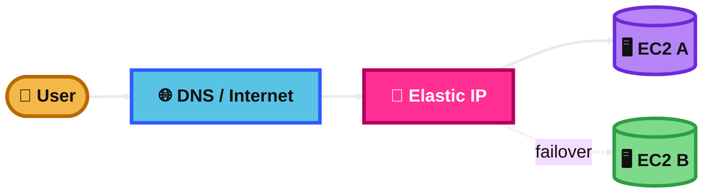
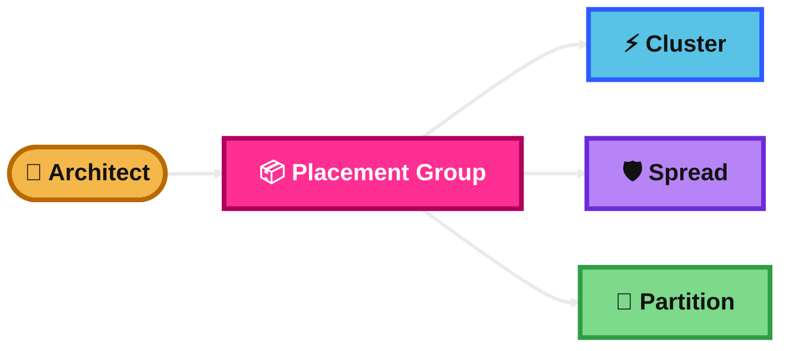
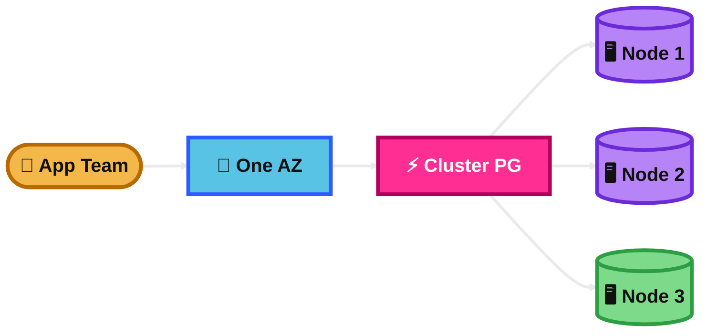
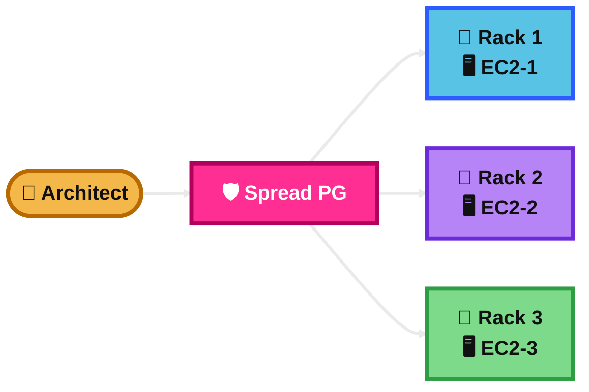
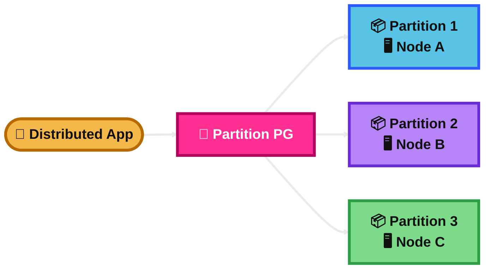
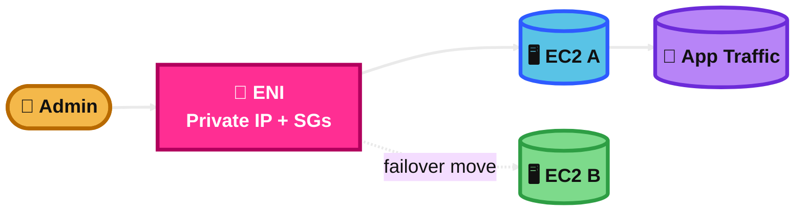

## Elastic IP

### What is it?
An Elastic IP is a static public IPv4 address for AWS.

It stays with your AWS account until you release it. You can move it from one resource to another.

### How it works?
First, you allocate the Elastic IP in a Region.

Then, you associate it with an EC2 instance or an ENI. If the server fails, you can remap the same public IP to another instance.

### Use Case
A company runs a small public web server on EC2 and wants the same public IP even if the instance is replaced.

Elastic IP is useful because the app keeps one stable internet-facing IP.

### Exam Tip
Look for clues like static public IP, remap IP after failure, fixed public address for EC2, or stable internet endpoint.

Common trap: do not choose Elastic IP for large-scale web apps when a load balancer or Route 53 is the better design. Another trap: Elastic IP is IPv4, not IPv6.

### Visual Mermaid

## Placement Groups

### What is it?
A placement group is a way to influence how EC2 instances are physically placed on AWS hardware.

It helps when the exam cares about low latency, high throughput, or reducing correlated hardware failure.

### How it works?
You create a placement group and choose a strategy: Cluster, Spread, or Partition.

Then you launch EC2 instances into that group so AWS places them according to that strategy.

### Use Case
You have several EC2 instances that must either talk very fast to each other or be kept apart to reduce the chance of failing together.

A placement group lets you control that design.

### Exam Tip
Look for clues like low latency between EC2 instances, reduce correlated failure, keep instances on separate hardware, or distributed nodes across partitions.

Common trap: this is not a security feature. It does not control traffic like a security group. Also, one instance can be in only one placement group at a time.

### Visual Mermaid

## Cluster Placement Group

### What is it?
A Cluster Placement Group puts EC2 instances close together inside one Availability Zone.

It is for very low latency and high network throughput between instances.

### How it works?
AWS places the instances in the same high-bandwidth network area.

This improves east-west traffic between the servers. It is best when most traffic is between the instances, not from users on the internet.

### Use Case
A high-performance computing job, tightly coupled analytics workload, or parallel application where nodes constantly talk to each other.

### Exam Tip
Look for clues like lowest latency, highest throughput, tightly coupled nodes, HPC, or big internal traffic between EC2 instances.

Common trap: do not choose Cluster Placement Group when the main goal is multi-AZ high availability. It is limited to one AZ. Another trap: launches can fail with insufficient capacity, especially when you mix instance types or add instances later.

### Visual Mermaid

## Spread Placement Group

### What is it?
A Spread Placement Group keeps each EC2 instance on distinct hardware.

It is for a small number of important instances that should not fail together.

### How it works?
AWS spreads the instances across separate racks.

This reduces correlated hardware failure. In a Region, rack-level spread can span multiple AZs.

### Use Case
A small set of critical application servers, domain controllers, or database nodes that must be isolated from each other.

### Exam Tip
Look for clues like keep critical instances separate, reduce simultaneous hardware failure, or small number of EC2 instances.

Common trap: do not choose Spread Placement Group for a large distributed cluster. It supports a maximum of seven running instances per Availability Zone per group in a Region.

### Visual Mermaid

## Partition Placement Group

### What is it?
A Partition Placement Group separates EC2 instances into logical partitions.

Instances in different partitions do not share the same racks.

### How it works?
AWS creates partitions, and each partition gets its own racks, power, and network path.

This limits the blast radius of a hardware failure to one partition instead of the whole application.

### Use Case
Large distributed systems such as Hadoop, HDFS, HBase, Cassandra, or Kafka where replicas should be isolated across different partitions.

### Exam Tip
Look for clues like large distributed workload, replicated nodes, fault isolation by partition, or topology-aware applications.

Common trap: do not confuse this with Spread Placement Group. Spread is for a small number of critical instances. Partition is for larger distributed systems. Another trap: capacity reservations do not reserve capacity in partition placement groups.

### Visual Mermaid

## Elastic Network Interface (ENI)

### What is it?
An ENI is a virtual network card for an EC2 instance inside a VPC.

It can hold private IP addresses, security groups, and networking settings.

### How it works?
Every EC2 instance has a primary ENI.

You can also attach secondary ENIs. A secondary ENI can be detached and attached to another instance in the same Availability Zone. This helps move network identity quickly.

### Use Case
A failover design where a secondary ENI with the app’s private IP and security groups is moved from a failed EC2 instance to a standby EC2 instance.

### Exam Tip
Look for clues like move private IPs between instances, multiple NICs on one EC2, management network plus application network, or attach a stable network identity to another server.

Common trap: an ENI cannot be moved to another subnet or another Availability Zone after creation. Also, the primary ENI cannot be detached.

### Visual Mermaid

## EC2 Hibernate

### What is it?
EC2 Hibernate lets an instance save its RAM to the EBS root volume and then shut down.

When it starts again, the in-memory state comes back.

### How it works?
AWS tells the operating system to hibernate.

The RAM is written to the EBS root volume. Later, the instance starts, the root volume is restored, and the RAM contents are loaded back.

### Use Case
An application takes a long time to start and load data into memory.

Hibernate is useful when you want faster resume with the same in-memory state instead of a full cold start.

### Exam Tip
Look for clues like preserve RAM, resume where it left off, long startup time, or in-memory application state.

Common trap: hibernate is not the same as stop. Stop preserves EBS volumes but not RAM. Another trap: hibernation must be enabled when the instance is launched, not later, and the root EBS volume must be large enough to store RAM contents.

### Visual Mermaid

## Summary Table

| Topic | What It Is | How It Works | Best Use Case | Exam Trigger |
|---|---|---|---|---|
| Elastic IP | Static public IPv4 for AWS | Allocate, then associate or remap to EC2/ENI | Stable public IP or quick failover | Static public IP, remap after failure |
| Placement Groups | EC2 placement control feature | Launch instances into Cluster, Spread, or Partition strategy | Optimize latency or failure isolation | Low latency, reduce correlated failure |
| Cluster Placement Group | Instances close together in one AZ | Same high-bandwidth network area | HPC or tightly coupled nodes | Lowest latency, high throughput, one AZ |
| Spread Placement Group | Instances on distinct hardware | Separate racks to reduce correlated failure | Small number of critical servers | Keep critical instances apart |
| Partition Placement Group | Instances split into isolated partitions | Different partitions use different racks | Large distributed replicated systems | Hadoop, Cassandra, Kafka, partition isolation |
| Elastic Network Interface (ENI) | Virtual NIC for EC2 | Attach private IPs, SGs, and move secondary ENI in same AZ | Failover network identity or multiple NIC setup | Move private IP/security groups between instances |
| EC2 Hibernate | Saves RAM to EBS root and resumes later | RAM written to root EBS, then restored on start | Long startup apps that need same in-memory state | Preserve RAM, resume quickly, not just stop |