## Scalability and Availability

### What is it?
Scalability means a system can handle more traffic without breaking.

Availability means the system stays up and keeps working, even when something fails.

For the SAA exam, these two ideas are often tested together.

### How it works?
You improve scalability by adding or removing resources when demand changes.

You improve availability by removing single points of failure and using multiple Availability Zones.

A common AWS design is Elastic Load Balancer in front of an Auto Scaling Group across multiple AZs.

### Use Case
An online store gets normal traffic most days, but traffic jumps during a sale.

AWS can spread traffic across many servers and replace failed instances automatically.

### Exam Tip
Look for words like spiky traffic, fault tolerant, highly available, multi-AZ, and automatic scaling.

A strong exam answer often combines Elastic Load Balancing + Auto Scaling + Multi-AZ.

A common trap is thinking scalability automatically means high availability. One big EC2 instance can scale up, but it is still one failure point.

### Visual Mermaid
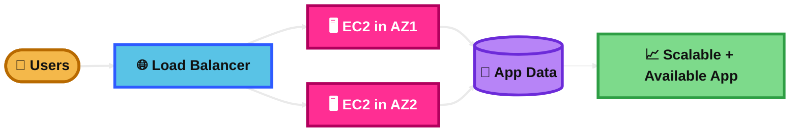
## Horizontal Scalability

### What is it?
Horizontal scalability means adding more servers instead of making one server bigger.

It is also called scale out.

### How it works?
Traffic is spread across multiple servers.

When demand increases, AWS can launch more EC2 instances. When demand drops, AWS can remove some of them.

This works best when the app is stateless or stores session data outside the instance.

### Use Case
A web application has traffic spikes during business hours.

Instead of upgrading one EC2 instance, the company adds more EC2 instances behind a load balancer.

### Exam Tip
Look for words like add more instances, stateless app, web tier, scale out, and load balancer.

Horizontal scaling is usually the better exam answer for high availability and elasticity.

A common trap is using local session storage on each server. That can make horizontal scaling harder unless you add sticky sessions or move session state to Redis or DynamoDB.

### Visual Mermaid
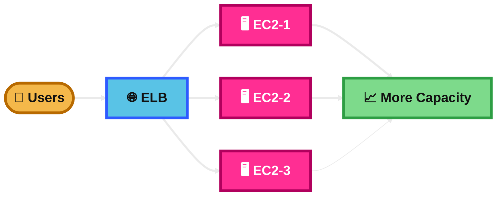
## Horizontal Scalability

### What is it?
Horizontal scalability is the idea of growing by increasing the number of machines.

For the exam, think many small servers working together.

### How it works?
A load balancer sits in front of a pool of instances.

Auto Scaling adds instances for more traffic and removes them when traffic is lower.

Because the workload is shared, the system can handle failures better than a single large server.

### Use Case
A ticket booking site gets sudden traffic when a concert opens.

The site adds more web servers quickly instead of resizing one server.

### Exam Tip
Good clues are burst traffic, unpredictable load, scale automatically, and no downtime during growth.

This is often the best answer when AWS wants elasticity, resilience, and easier fault tolerance.

A common trap is confusing it with vertical scaling, which means making one instance larger.

### Visual Mermaid
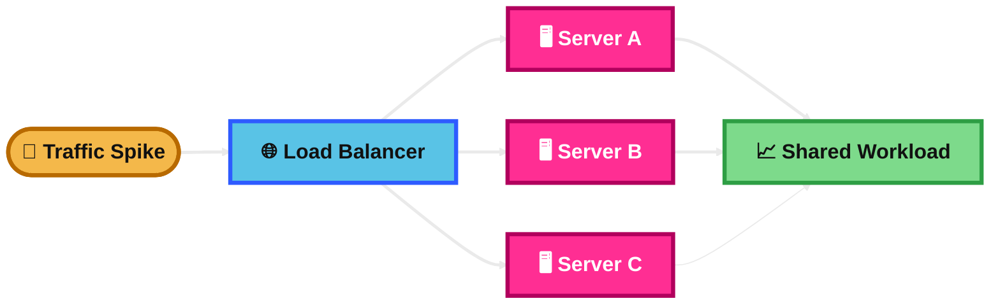
## Elastic Load Balancers

### What is it?
Elastic Load Balancing is a managed AWS service that distributes traffic across multiple targets.

It improves availability because it sends traffic only to healthy targets.

### How it works?
Clients send requests to the load balancer.

The load balancer checks target health and forwards traffic to healthy targets in one or more Availability Zones.

AWS offers different types such as ALB, NLB, and GWLB.

### Use Case
A company runs several EC2 instances for a web app.

Instead of sending users to one instance directly, users connect to the load balancer.

### Exam Tip
Look for words like distribute traffic, health checks, managed load balancer, highly available, and multiple AZs.

ELB is a strong answer when you need fault tolerance without managing the load-balancing software yourself.

A common trap is confusing ELB with CloudFront. ELB balances traffic to your backends. CloudFront caches content at edge locations.

### Visual Mermaid
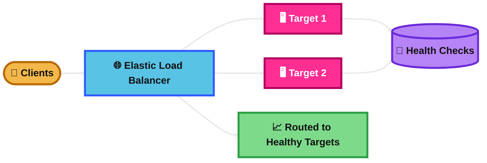
## Application Load Balancer (ALB)

### What is it?
ALB is a Layer 7 load balancer for HTTP and HTTPS traffic.

It is best for web apps and microservices.

### How it works?
ALB looks at the request details, such as host name or URL path.

It then uses listener rules to send traffic to the correct target group.

It can also terminate HTTPS at the load balancer.

### Use Case
A company runs `api.example.com` and `app.example.com` on the same load balancer.

ALB routes traffic by host name or path to different services.

### Exam Tip
Look for keywords like HTTP, HTTPS, host-based routing, path-based routing, web app, microservices, and WAF.

ALB is usually the right answer when the question needs smart routing at the application level.

A common trap is choosing NLB when the question needs path-based or host-based routing. NLB does not do that.

### Visual Mermaid
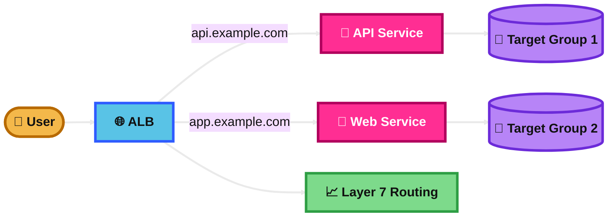
## Network Load Balancer

### What is it?
NLB is a Layer 4 load balancer for TCP, UDP, and TLS traffic.

It is built for very high performance and very low latency.

### How it works?
It forwards traffic based on IP address and port.

It can keep static IP addresses, and internet-facing NLBs can use Elastic IPs.

It is a strong choice when you need to preserve client source IP or handle non-HTTP traffic.

### Use Case
A company runs a real-time gaming or financial app that needs fast TCP traffic handling.

An NLB spreads connections across healthy targets with very low latency.

### Exam Tip
Look for keywords like TCP, UDP, TLS, static IP, Elastic IP, source IP preservation, and extreme performance.

Choose NLB when the app is not doing HTTP path-based routing and needs network-level load balancing.

A common trap is picking ALB for UDP or static IP needs. That points to NLB.

### Visual Mermaid
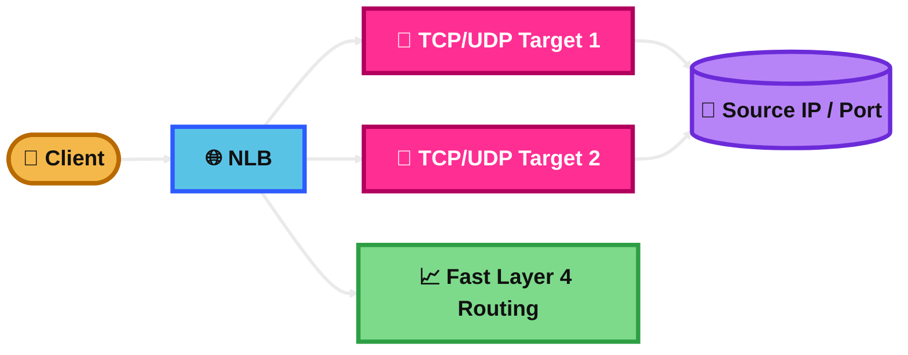
## Server Name Indication

### What is it?
Server Name Indication, or SNI, lets one secure listener use multiple TLS certificates.

This means one load balancer listener can serve multiple HTTPS domain names.

### How it works?
The client sends the domain name during the TLS handshake.

The load balancer chooses the matching certificate from its certificate list and uses it for that domain.

AWS supports this on ALB and NLB secure listeners.

### Use Case
A company hosts `shop.example.com` and `api.example.com` on one load balancer.

Each domain uses its own certificate, but both use port 443 on the same listener.

### Exam Tip
Look for clues like multiple HTTPS websites, multiple certificates, single listener, and different domains on port 443.

SNI is a good answer when you need many secure websites without a separate load balancer for each one.

A common trap is Classic Load Balancer. CLB does not support SNI.

### Visual Mermaid
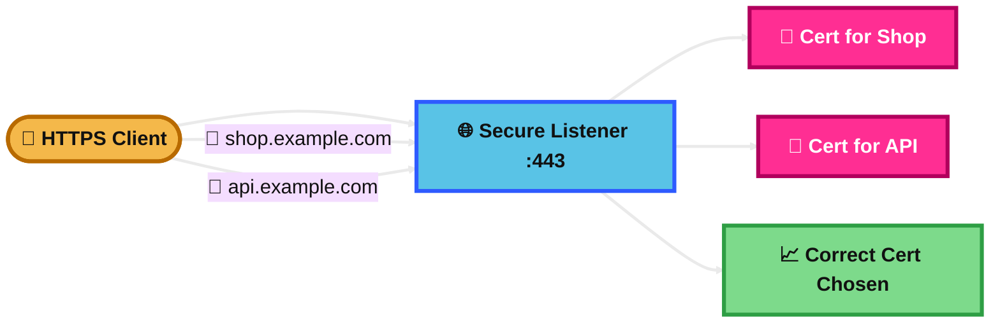
## Gateway Load Balancer (GWLB)

### What is it?
GWLB is a special load balancer for virtual network appliances.

It is used for things like firewalls, intrusion detection, and deep packet inspection.

### How it works?
GWLB works at Layer 3.

It forwards IP packets to appliance targets by using the GENEVE protocol on port 6081.

It acts like a transparent gateway and load balancer at the same time.

### Use Case
A company wants all VPC traffic inspected by a fleet of third-party firewalls.

GWLB sends traffic through those appliances and scales them as demand grows.

### Exam Tip
Look for words like firewall fleet, security appliance, traffic inspection, IDS/IPS, transparent, and GENEVE.

GWLB is the right answer when the question is about scaling network security appliances, not regular web traffic routing.

A common trap is choosing ALB or NLB for firewall inspection workloads. That points to GWLB instead.

### Visual Mermaid
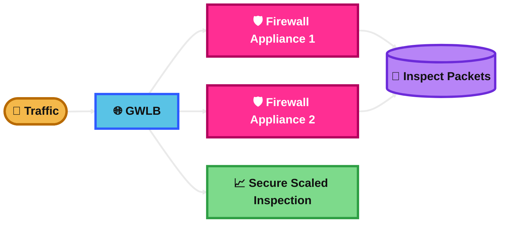
## Target Groups

### What is it?
A target group is a set of backends that a load balancer can send traffic to.

It also stores health check settings and some traffic behavior settings.

### How it works?
A listener sends traffic to a target group.

The target group contains registered targets, such as EC2 instances, IP addresses, Lambda functions, or an ALB, depending on load balancer type.

Only healthy targets receive traffic.

### Use Case
A company uses one ALB for several services.

The ALB has one target group for the API and another target group for the website.

### Exam Tip
Look for words like listener, registered targets, health checks, backend pool, and route to different services.

Target groups are important whenever a question talks about where the load balancer actually sends traffic.

A common trap is thinking the load balancer sends traffic directly by itself without target groups. In ELB v2 designs, target groups are central.

### Visual Mermaid
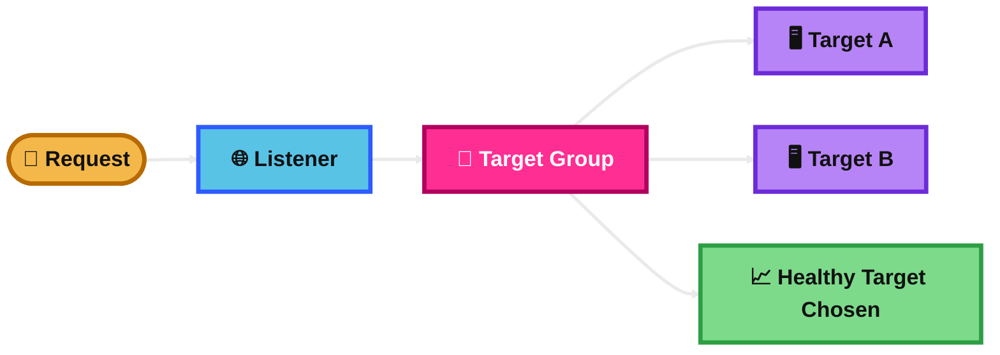
## Sticky Sessions

### What is it?
Sticky sessions, also called session affinity, keep a user tied to the same backend target.

This is useful when the app stores session data locally on the server.

### How it works?
With ALB, stickiness is commonly done with cookies.

With NLB, stickiness is based on source IP for supported cases.

This makes repeated requests from the same client go back to the same target for a period of time.

### Use Case
A legacy shopping cart app stores user session data on each EC2 instance.

Sticky sessions help the user keep hitting the same instance during the session.

### Exam Tip
Look for keywords like session affinity, shopping cart, in-memory session, user must return to same server, and cookie-based stickiness.

Sticky sessions can solve a legacy app problem, but they are usually not the best long-term design.

A common trap is choosing sticky sessions when the better architecture is storing sessions in ElastiCache or DynamoDB so the app stays truly stateless.

### Visual Mermaid
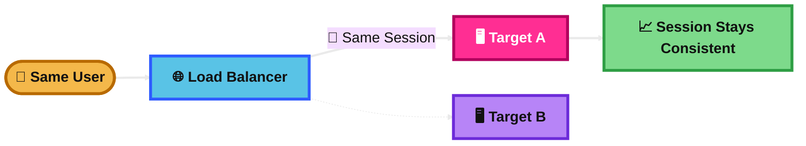
## Cross-Zone Load Balancing

### What is it?
Cross-zone load balancing lets a load balancer send traffic evenly across healthy targets in all enabled Availability Zones.

It helps when one AZ has fewer healthy targets than another.

### How it works?
Without cross-zone load balancing, a node in one AZ mainly sends traffic to targets in its own AZ.

With cross-zone load balancing enabled, traffic can be spread across targets in other AZs too.

For the exam, remember that ALB has cross-zone load balancing on by default at the load balancer level, while NLB and GWLB have it off by default.

### Use Case
AZ1 has two healthy instances and AZ2 has ten.

Cross-zone load balancing helps avoid overloading the smaller AZ target pool.

### Exam Tip
Look for clues like uneven number of targets across AZs, better traffic distribution, and multi-AZ backend imbalance.

This feature improves balancing, but it does not replace proper multi-AZ design.

A common trap is assuming all ELB types behave the same by default. They do not.

### Visual Mermaid
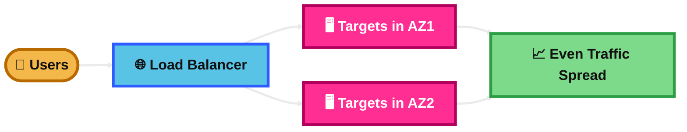
## Connection Draining

### What is it?
Connection draining means a target stops getting new requests before it is removed, but existing in-flight requests can finish.

In ELB v2, this is usually called deregistration delay.

### How it works?
When a target is being removed during deployment or scale-in, the load balancer stops sending it new traffic.

The target stays in a draining state for a configured time so active connections can finish cleanly.

The default deregistration delay is 300 seconds.

### Use Case
A company deploys a new app version and removes old EC2 instances.

Connection draining prevents user requests from being cut off during the replacement.

### Exam Tip
Look for words like graceful shutdown, finish in-flight requests, deployment without dropped connections, deregistration delay, and drain.

This is a strong answer when the scenario wants safer deployments or scale-in behavior.

A common trap is thinking the target still receives new requests during draining. It should not receive new ones.

### Visual Mermaid
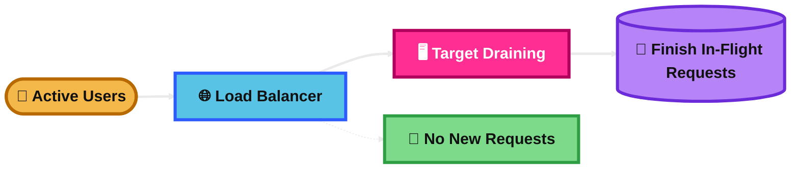
## Auto Scaling Group

### What is it?
An Auto Scaling Group, or ASG, is a logical group of EC2 instances.

It helps maintain the right number of instances and replaces unhealthy ones.

### How it works?
You define minimum, maximum, and desired capacity.

The ASG launches or terminates EC2 instances to keep the group at the desired size.

It can also use health checks and scaling policies to react automatically to demand.

### Use Case
A web application needs at least two EC2 instances at all times, but more during busy hours.

The ASG keeps the baseline capacity and adds more when needed.

### Exam Tip
Look for words like maintain desired capacity, replace unhealthy instances, min/max/desired, and automatic EC2 scaling.

ASG is the right answer when the question needs elastic EC2 capacity and self-healing.

A common trap is thinking ASG distributes traffic by itself. It usually works together with an ELB.

### Visual Mermaid
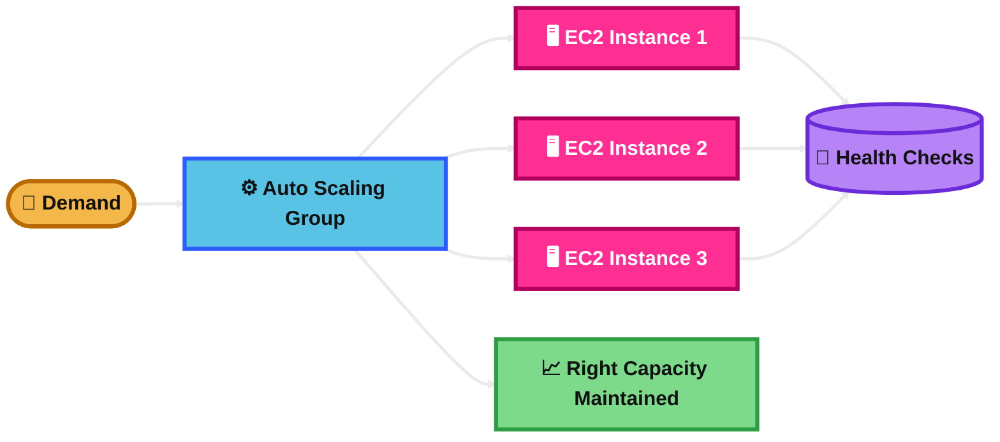
## Scaling Policies

### What is it?
Scaling policies tell an Auto Scaling Group when and how to add or remove EC2 instances.

They automate scaling based on demand.

### How it works?
Target tracking keeps a metric near a target value, like average CPU at 50%.

Step scaling adds or removes capacity in steps based on alarm size.

Simple scaling makes one adjustment after a CloudWatch alarm and then waits for cooldown.

Scheduled scaling changes capacity at specific times for predictable traffic.

### Use Case
A company wants to keep average CPU near 50% all day.

Target tracking is often the simplest and most exam-friendly choice.

### Exam Tip
Look for clues like maintain CPU at target, alarm threshold, predictable traffic, and dynamic response.

Target tracking is often the best default answer when AWS wants automatic scaling with less manual tuning.

A common trap is choosing simple scaling when target tracking or step scaling is a better fit.

### Visual Mermaid
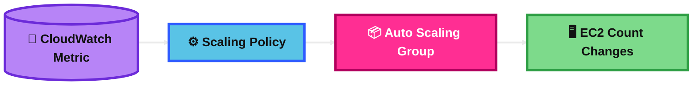
## Scaling Cooldown

### What is it?
Scaling cooldown is a wait period after a scaling activity.

Its purpose is to stop rapid repeated scaling before the system settles.

### How it works?
After a simple scaling policy adds or removes instances, the Auto Scaling Group waits before reacting again.

This gives time for the previous scaling action to take effect.

The default cooldown is 300 seconds for simple scaling policies.

For the exam, remember that target tracking and step scaling rely more on instance warmup than cooldown behavior.

### Use Case
An app scales out because CPU is high.

Without cooldown, the group might add instances again too quickly before the first new instances start helping.

### Exam Tip
Look for words like wait before scaling again, stabilize, prevent oscillation, and simple scaling policy.

Cooldown is most closely tied to simple scaling.

A common trap is thinking cooldown is the main control for target tracking scale-out. That is usually more about instance warmup.

### Visual Mermaid

## Summary Table

| Topic | What It Is | How It Works | Best Use Case | Exam Trigger |
|---|---|---|---|---|
| Scalability and Availability | Handle growth and stay up during failure | Add/remove resources and use redundancy across AZs | Web apps needing elastic and fault-tolerant design | Spiky traffic, highly available, multi-AZ |
| Horizontal Scalability | Add more servers instead of making one bigger | Load balancer spreads traffic across many instances | Stateless web tier | Scale out, many EC2 instances, burst traffic |
| Horizontal Scalability | Same core idea, with focus on resilience and elasticity | More servers share work and reduce single-server dependence | Sudden traffic spikes | Add instances automatically, no downtime during growth |
| Elastic Load Balancers | Managed traffic distribution service | Sends traffic only to healthy targets | Front end for EC2 fleets | Health checks, distribute traffic, managed load balancer |
| Application Load Balancer (ALB) | Layer 7 load balancer for HTTP/HTTPS | Uses listener rules for host/path routing | Web apps and microservices | Path-based, host-based, WAF, HTTP/HTTPS |
| Network Load Balancer | Layer 4 load balancer for TCP/UDP/TLS | Routes by IP and port with high performance | Low-latency or non-HTTP apps | Static IP, TCP, UDP, source IP preservation |
| Server Name Indication | Multiple TLS certs on one secure listener | Client sends domain name in TLS handshake | Multiple HTTPS domains on one LB | Many certs, many domains, one port 443 |
| Gateway Load Balancer (GWLB) | Load balancer for virtual appliances | Sends IP traffic to appliances with GENEVE | Firewall and packet inspection fleets | IDS/IPS, firewall, traffic inspection, GENEVE |
| Target Groups | Backend pool for the load balancer | Listener forwards to healthy registered targets | Separate services behind one LB | Listener, health checks, registered targets |
| Sticky Sessions | Session affinity to same target | Cookie or source-IP based routing keeps user on one backend | Legacy apps with local session state | Session affinity, same server, shopping cart |
| Cross-Zone Load Balancing | Balances traffic across targets in all enabled AZs | LB can send requests to healthy targets in other AZs | Uneven targets per AZ | Better balance across AZs |
| Connection Draining | Graceful target removal | Stops new requests and lets in-flight requests finish | Safe deployments and scale-in | Graceful shutdown, deregistration delay |
| Auto Scaling Group | Managed EC2 group with self-healing and scaling | Maintains min, max, desired capacity | Elastic EC2 fleets | Replace unhealthy instances, desired capacity |
| Scaling Policies | Rules for when ASG scales | Target tracking, step, simple, or scheduled actions | CPU-based or scheduled scaling | Target metric, CloudWatch alarm, schedule |
| Scaling Cooldown | Wait time after scaling action | Prevents repeated simple-scaling actions too quickly | Avoid scaling oscillation | Wait period, stabilize, simple scaling |