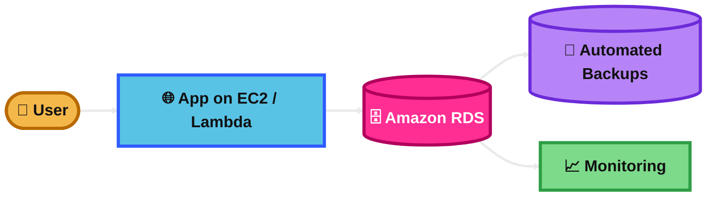
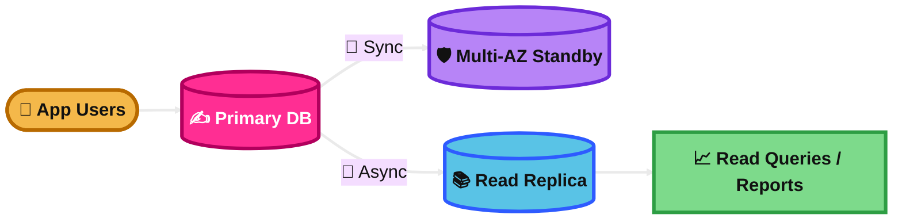
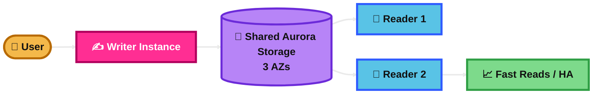
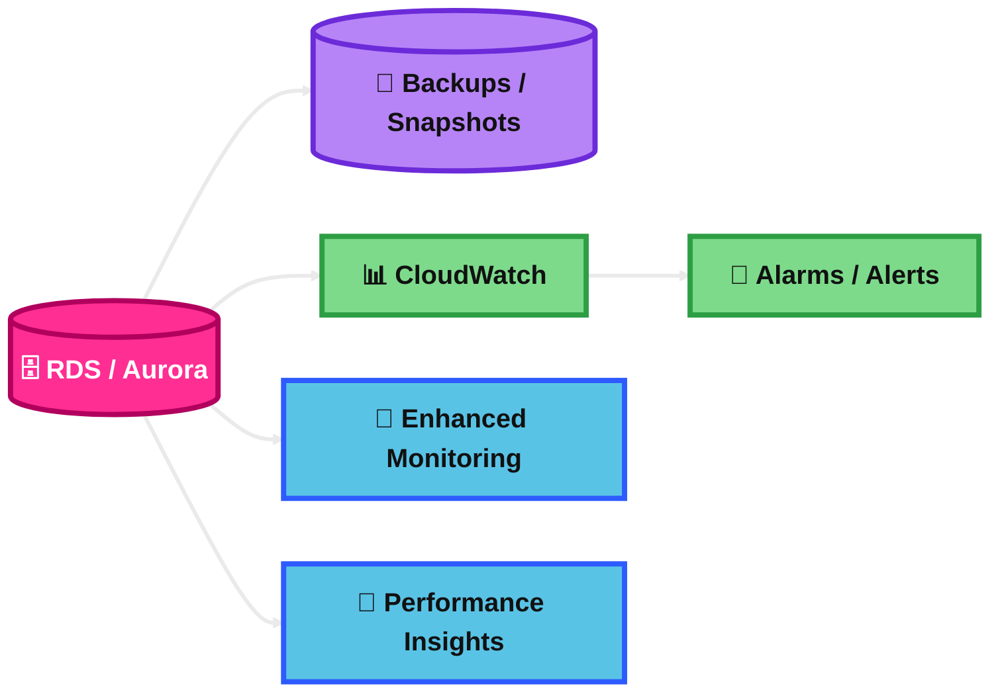
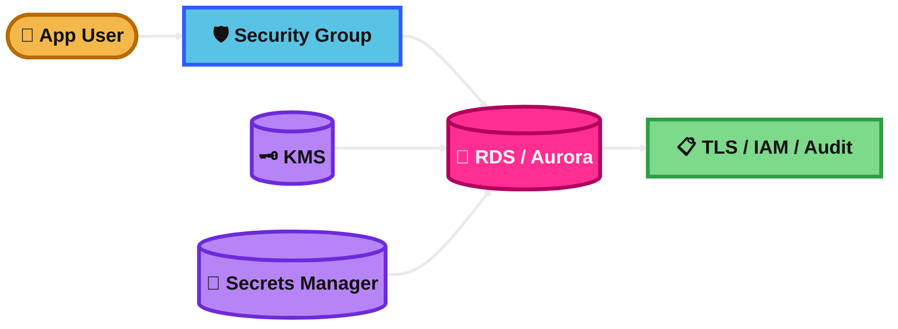
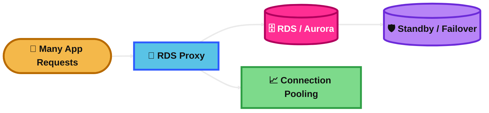
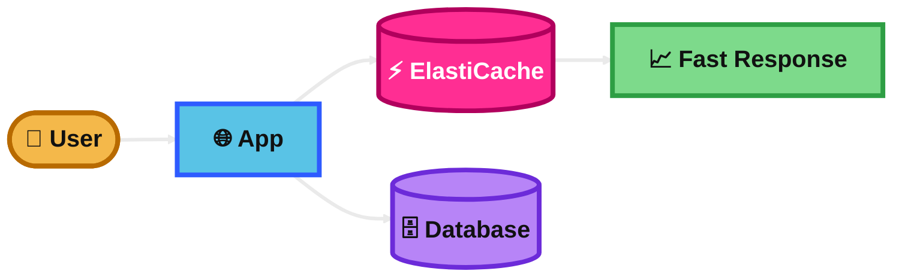
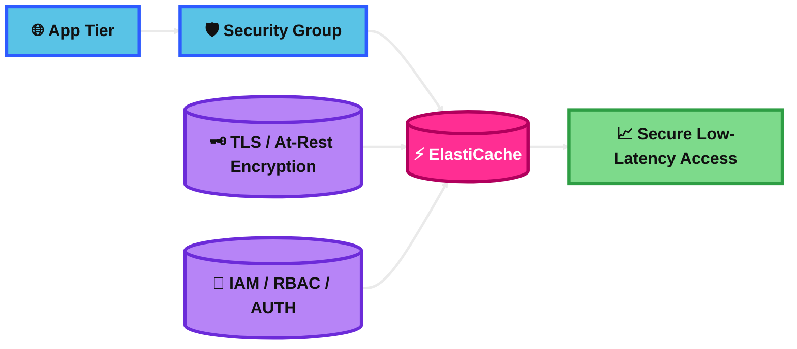

## RDS

### What is it?
Amazon RDS is a managed relational database service. It helps you run databases like MySQL, PostgreSQL, MariaDB, Oracle, SQL Server, and Db2 without managing a lot of the heavy admin work yourself. AWS handles common tasks like provisioning, patching, backups, and scaling operations. :contentReference[oaicite:0]{index=0}

### How it works?
You create a DB instance, choose the engine, storage, size, and network settings, and AWS launches it for you. Your application connects to the database endpoint just like a normal relational database. You can add features like Multi-AZ for high availability, read replicas for read scaling, backups for recovery, and monitoring for visibility. :contentReference[oaicite:1]{index=1}

### Visual Mermaid

## RDS Multi Replica vs Multi AZ

### What is it?
This topic is really about **Read Replica vs Multi-AZ** in RDS.  
**Read Replica** is mainly for **read scaling** and sometimes disaster recovery.  
**Multi-AZ** is mainly for **high availability and failover**. :contentReference[oaicite:4]{index=4}

### How it works?
A **Read Replica** is created from a snapshot and then kept up to date using **asynchronous replication**. It is usually used for read-only traffic, reporting, or DR, and it can be promoted to a standalone DB if needed. :contentReference[oaicite:5]{index=5}

A **Multi-AZ DB instance deployment** keeps a **standby copy** in another Availability Zone using **synchronous replication**. The standby is for failover support and **does not serve read traffic** in the classic setup. If the primary fails, RDS fails over automatically. :contentReference[oaicite:6]{index=6}

### Visual Mermaid

## Aurora

### What is it?
Amazon Aurora is a cloud-native relational database built for the cloud and compatible with MySQL or PostgreSQL. It is part of the RDS family, but it is designed for higher performance, high availability, and shared distributed storage. :contentReference[oaicite:11]{index=11}

### How it works?
Aurora separates **compute** from **storage**. The storage layer is distributed, fault-tolerant, and replicated across **three AZs**. Aurora supports up to **15 read replicas** for read scaling and uses continuous backups to Amazon S3 with point-in-time recovery. Storage can automatically grow up to **256 TiB**. :contentReference[oaicite:12]{index=12}

### Visual Mermaid

## RDS and Aurora Backup and Monitoring

### What is it?
This is about how RDS and Aurora protect your data and how you watch database health and performance.

For backups, both support **automated backups**, **manual snapshots**, and **point-in-time recovery**. RDS automated backups are tied to a retention period and taken during the backup window. Aurora backups are **continuous and incremental**, stored in Amazon S3, and support fast point-in-time restore. :contentReference[oaicite:16]{index=16}

For monitoring, both use tools like **Amazon CloudWatch**, **Enhanced Monitoring**, **Performance Insights / Database Insights**, and **CloudTrail**. :contentReference[oaicite:17]{index=17}

### How it works?
For **RDS backups**, AWS takes storage volume snapshots and keeps transaction logs so you can restore to any point within the retention period. :contentReference[oaicite:18]{index=18}

For **Aurora backups**, the cluster volume is backed up automatically and continuously to S3, with no performance interruption while backup data is written. :contentReference[oaicite:19]{index=19}

For monitoring:
- **CloudWatch** shows metrics like CPU, connections, storage, and latency. :contentReference[oaicite:20]{index=20}
- **Enhanced Monitoring** gives OS-level metrics in near real time. :contentReference[oaicite:21]{index=21}
- **Performance Insights / Database Insights** help find DB load, waits, and SQL bottlenecks. :contentReference[oaicite:22]{index=22}
- **CloudTrail** records API calls for auditing. :contentReference[oaicite:23]{index=23}

### Visual Mermaid

## RDS and Aurora Security

### What is it?
This topic covers how to protect RDS and Aurora using **network security**, **identity and access controls**, **encryption**, **database authentication**, and **secret management**. AWS documents security for both RDS and Aurora under the shared responsibility model. :contentReference[oaicite:27]{index=27}

### How it works?
Security usually works in layers:

1. **Network security**  
   Put the database in private subnets and control access with **VPC security groups**. :contentReference[oaicite:28]{index=28}

2. **Encryption at rest**  
   Use **AWS KMS**. RDS encryption covers storage, logs, snapshots, automated backups, and read replicas. AWS states RDS uses **AES-256** for encryption at rest. :contentReference[oaicite:29]{index=29}

3. **Encryption in transit**  
   Use **SSL/TLS** for connections to the DB. :contentReference[oaicite:30]{index=30}

4. **Authentication and authorization**  
   Use **IAM** to control API-level access. Some RDS engines also support **IAM database authentication** using tokens instead of passwords. :contentReference[oaicite:31]{index=31}

5. **Secrets management**  
   RDS integrates with **AWS Secrets Manager** to manage master user passwords. :contentReference[oaicite:32]{index=32}

### Visual Mermaid

## RDS Proxy

### What is it?
RDS Proxy is a fully managed database proxy for RDS and Aurora. It helps applications scale better by **pooling and sharing database connections**, and it improves resilience during database failover. :contentReference[oaicite:36]{index=36}

### How it works?
Your application connects to the **proxy endpoint** instead of connecting directly to the database. The proxy manages a pool of DB connections behind the scenes. This reduces the number of direct database connections and helps when many short-lived connections come from services like Lambda. During a DB failover, RDS Proxy can reconnect to the standby while preserving application connections better than direct DB access. :contentReference[oaicite:37]{index=37}

### Visual Mermaid

## ElastiCache

### What is it?
Amazon ElastiCache is a managed in-memory data store and cache service. It is used to speed up applications by storing frequently used data in memory instead of querying slower backends again and again. It supports Valkey, Redis OSS, and Memcached. :contentReference[oaicite:41]{index=41}

### How it works?
Your application checks the cache first. If the data is there, it returns very quickly. If not, the app fetches the data from the database or backend, returns it, and can store it in the cache for the next request. ElastiCache Serverless can give you a single endpoint without you planning capacity or cluster design. :contentReference[oaicite:42]{index=42}

### Visual Mermaid

## ElastiCache Security

### What is it?
ElastiCache security is about controlling **who can reach the cache**, **how they authenticate**, and **whether data is encrypted in transit and at rest**. AWS provides network controls, encryption features, and authentication options for Valkey and Redis OSS. :contentReference[oaicite:46]{index=46}

### How it works?
Security usually has these parts:

1. **Private network placement**  
   ElastiCache runs in a VPC. Node-based clusters use a **subnet group**, which is typically private. :contentReference[oaicite:47]{index=47}

2. **Security groups**  
   Use VPC security groups to restrict which app servers can connect to the cache. :contentReference[oaicite:48]{index=48}

3. **Encryption in transit**  
   Enable **TLS** to protect data moving between clients and the cache. AWS notes there can be some performance impact. :contentReference[oaicite:49]{index=49}

4. **Encryption at rest**  
   ElastiCache supports encryption at rest, and AWS states it is always enabled for **serverless cache**. :contentReference[oaicite:50]{index=50}

5. **Authentication and authorization**  
   For Valkey and Redis OSS, ElastiCache supports **IAM authentication**, **AUTH**, and **RBAC** for user permissions. IAM auth works with Valkey or Redis OSS version 7 or above. :contentReference[oaicite:51]{index=51}

### Visual Mermaid

## Summary Table

| Topic | What It Is | How It Works | Best Use Case | Exam Trigger |
|---|---|---|---|---|
| RDS | Managed relational database service. :contentReference[oaicite:55]{index=55} | Create a DB instance and AWS handles common admin tasks like backups and patching. :contentReference[oaicite:56]{index=56} | Managed MySQL/PostgreSQL/Oracle/SQL Server database. | “Managed relational DB”, “SQL”, “automated backups”, “patching”. |
| RDS Multi Replica vs Multi AZ | Read Replica = read scaling. Multi-AZ = HA and failover. :contentReference[oaicite:57]{index=57} | Read Replica uses async replication. Multi-AZ uses sync replication to a standby. :contentReference[oaicite:58]{index=58} | Use replica for read-heavy apps. Use Multi-AZ for AZ failure protection. | “Scale reads” vs “automatic failover”. |
| Aurora | Cloud-native relational DB in the RDS family, compatible with MySQL/PostgreSQL. :contentReference[oaicite:59]{index=59} | Shared distributed storage across 3 AZs, auto-scaling storage, up to 15 read replicas. :contentReference[oaicite:60]{index=60} | High-performance relational workloads needing strong HA and read scaling. | “Need better performance”, “many replicas”, “Aurora MySQL/PostgreSQL”. |
| RDS and Aurora Backup and Monitoring | Backup, restore, and visibility features for DB operations. :contentReference[oaicite:61]{index=61} | Automated backups, snapshots, PITR, CloudWatch, Enhanced Monitoring, Performance Insights. :contentReference[oaicite:62]{index=62} | Recover data and monitor DB health and performance. | “Restore to specific time”, “OS metrics”, “SQL bottleneck”, “CloudWatch alarm”. |
| RDS and Aurora Security | Security layers for network, auth, encryption, and secrets. :contentReference[oaicite:63]{index=63} | Security groups, KMS encryption, TLS, IAM, DB auth, Secrets Manager. :contentReference[oaicite:64]{index=64} | Sensitive databases needing controlled access and encrypted data. | “Encrypt at rest”, “private subnets”, “manage credentials”, “IAM DB auth”. |
| RDS Proxy | Managed DB proxy for RDS and Aurora. :contentReference[oaicite:65]{index=65} | Pools and shares connections and improves failover handling. :contentReference[oaicite:66]{index=66} | Lambda or apps that open too many DB connections. | “Connection pooling”, “serverless app”, “too many DB connections”. |
| ElastiCache | Managed in-memory cache service. :contentReference[oaicite:67]{index=67} | App checks cache first, then backend if needed. :contentReference[oaicite:68]{index=68} | Reduce DB load and improve latency for hot data. | “Cache”, “session store”, “very low latency”, “frequently accessed data”. |
| ElastiCache Security | Security model for cache access and protection. :contentReference[oaicite:69]{index=69} | Private subnets, security groups, TLS, at-rest encryption, IAM/RBAC/AUTH. :contentReference[oaicite:70]{index=70} | Secure Redis/Valkey cache inside a VPC. | “Secure Redis”, “TLS”, “RBAC”, “restrict app-tier access only”. |