## Route 53

### What is it?
Amazon Route 53 is AWS’s managed DNS service.

It connects a domain name like `example.com` to the right resource, such as an ALB, CloudFront distribution, EC2 instance, or S3 static website.

### How it works?
You create a hosted zone for your domain.

Inside that hosted zone, you create DNS records. When users ask for your domain, Route 53 answers with the correct record based on your routing setup.

### Use Case
A company owns `shop.com`.

Route 53 sends users to the company website, API endpoint, or backup site depending on the records and routing policy.

### Exam Tip
If the question is about domain names, DNS, directing users to AWS resources, or global traffic steering, think Route 53.

A common trap is mixing Route 53 with CloudFront or ELB. Route 53 answers DNS queries. It does not serve the web content itself.

### Visual Mermaid
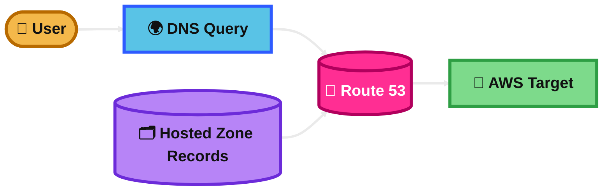
## Record Types

### What is it?
Record types tell DNS what kind of information Route 53 should return.

For the exam, the common ones are A, AAAA, CNAME, Alias, MX, TXT, NS, and SOA.

### How it works?
An A record points to an IPv4 address.

An AAAA record points to an IPv6 address. A CNAME points one name to another name. MX is for mail. TXT is often used for verification or policies like SPF. NS and SOA are core zone records.

### Use Case
You want `app.example.com` to point to a server IP, so you use an A record.

You want `www.example.com` to point to another hostname, so you use a CNAME or an Alias depending on the target.

### Exam Tip
If the question says IPv4, think A. If it says IPv6, think AAAA.

If it says “root domain” or “zone apex” like `example.com`, do not choose CNAME. That is a common trap. Use Alias when pointing the root domain to supported AWS targets.

### Visual Mermaid
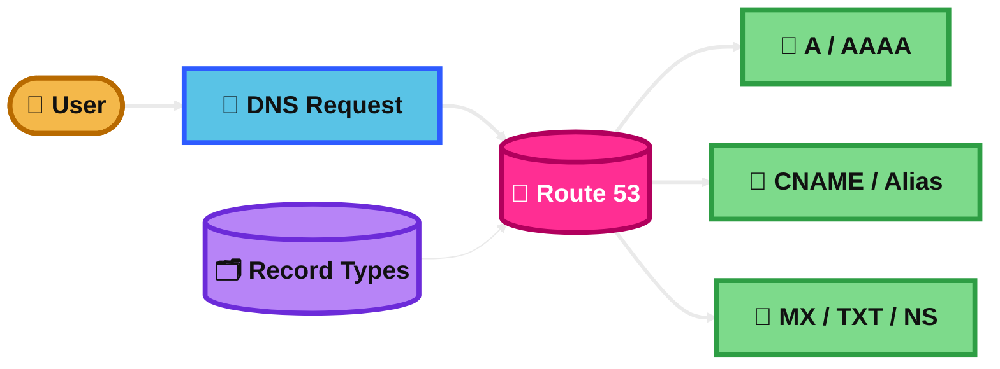
## Hosted Zones

### What is it?
A hosted zone is a container for DNS records for a domain.

Route 53 has public hosted zones and private hosted zones.

### How it works?
A public hosted zone answers DNS queries on the internet.

A private hosted zone answers DNS queries only inside associated VPCs. You add records inside the hosted zone, and Route 53 uses them when resolving names.

### Use Case
Use a public hosted zone for `example.com` on the public internet.

Use a private hosted zone for something like `internal.example.com` so only resources inside your VPC can resolve it.

### Exam Tip
If users on the internet must reach the domain, choose a public hosted zone.

If the question says “internal,” “inside VPC,” or “private DNS for EC2/services,” choose a private hosted zone. A common trap is choosing public hosted zone for internal-only DNS.

### Visual Mermaid
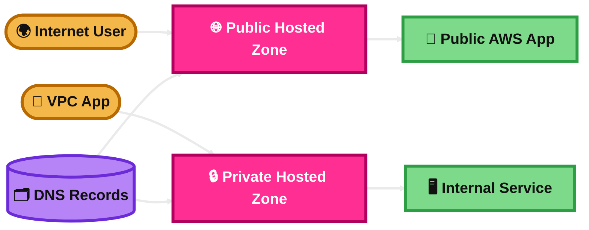
## Record TTL

### What is it?
TTL means Time To Live.

It is the number of seconds that DNS resolvers cache a record before asking Route 53 again.

### How it works?
A longer TTL means fewer DNS lookups, lower cost, and less DNS traffic.

A shorter TTL means changes happen faster, but DNS resolvers must ask Route 53 more often.

### Use Case
Before migrating a website to a new IP, a team lowers TTL to 60 or 300 seconds.

After the migration is stable, they increase TTL again.

### Exam Tip
If the question is about faster DNS change propagation, think lower TTL.

If it is about fewer queries and more caching, think higher TTL. Common trap: lowering TTL does not instantly clear all old caches everywhere, but it helps future refreshes happen sooner.

### Visual Mermaid
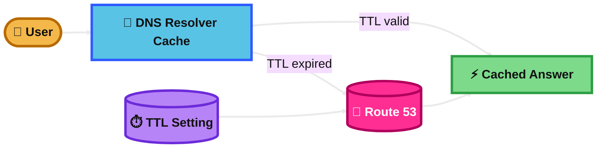
## Alias and Alias Targets Records

### What is it?
An Alias record is a Route 53 feature that points a record to selected AWS resources or to another Route 53 record in the same hosted zone.

The Alias target is the AWS resource or record that the Alias points to.

### How it works?
Instead of storing a normal IP or hostname like a standard record, Route 53 returns the DNS answer for the target resource.

This is commonly used with CloudFront, Application Load Balancer, Network Load Balancer, S3 website endpoints, API Gateway, and other Route 53 records.

### Use Case
You want `example.com` to point to an Application Load Balancer.

You create an Alias A record at the zone apex that targets the ALB.

### Exam Tip
If the question says root domain like `example.com` pointing to an AWS resource, Alias is usually the best answer.

The trap is choosing CNAME at the zone apex. Route 53 Alias is the exam-friendly answer for AWS targets and root domains. Also remember Alias records do not use a user-set TTL the same way normal records do.

### Visual Mermaid
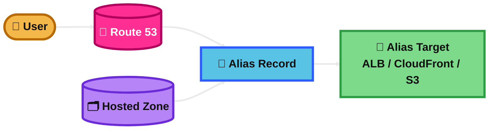
## Routing Policies

### What is it?
Routing policies tell Route 53 how to choose an answer when there are multiple possible records.

This is how Route 53 can do simple routing, traffic splitting, failover, and global traffic steering.

### How it works?
You create records with the same name and type, then assign a routing policy.

Based on the policy, Route 53 may choose by weight, latency, health, user location, resource location, or source IP mapping.

### Use Case
A company runs applications in multiple Regions.

Route 53 can send users to the lowest-latency Region, a backup Region, or a Region chosen by geography.

### Exam Tip
If the question is not just “resolve a name” but “how should traffic be directed,” think routing policy.

The key exam skill is matching the clue:
latency = fastest Region,
weighted = traffic percentage,
failover = primary/secondary,
geolocation = user location,
geoproximity = nearest resource plus bias,
IP-based = source CIDR mapping,
multi-value = multiple healthy answers.

### Visual Mermaid
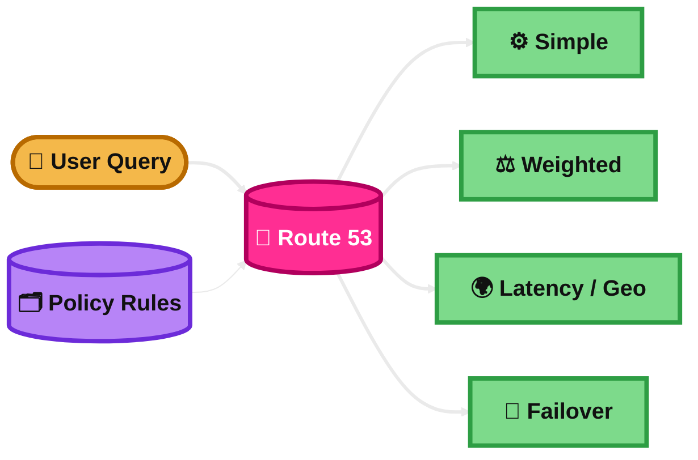
## Simple Based Routing

### What is it?
Simple routing is the basic Route 53 routing policy.

It is used when you want one record to answer the query, with no special traffic steering logic.

### How it works?
You create one record for a name, or multiple values in one simple record.

Route 53 returns the value from that record. It does not do weighted traffic splitting or primary/secondary failover logic.

### Use Case
A small website points `www.example.com` to one ALB.

There is no multi-Region design and no need to split traffic.

### Exam Tip
If the scenario is straightforward DNS with one target, simple routing is enough.

The trap is overcomplicating the answer. Do not choose weighted or failover unless the question clearly asks for traffic distribution or automatic backup behavior.

### Visual Mermaid
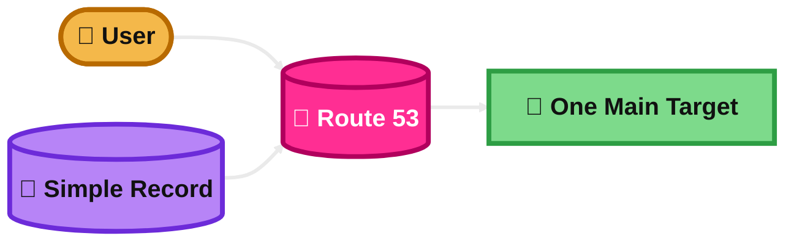
## Weighted Based Routing

### What is it?
Weighted routing lets you split traffic across multiple resources by percentage.

It is useful when you want controlled traffic distribution.

### How it works?
You create multiple records with the same name and type.

Each record gets a weight. Route 53 sends traffic according to the weight ratio.

### Use Case
A company sends 90% of traffic to the old application and 10% to the new version.

This is a simple way to do DNS-level canary or gradual migration.

### Exam Tip
If the question says “send a small percentage,” “gradually shift traffic,” or “test a new environment,” think weighted routing.

The trap is choosing failover. Weighted is for split traffic. Failover is for backup behavior.

### Visual Mermaid
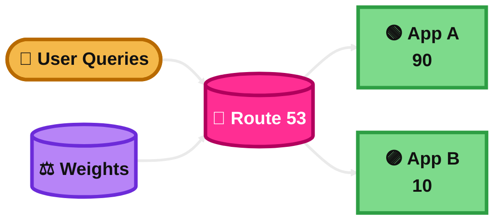
## Latency Based Routing

### What is it?
Latency routing sends users to the Region that gives them the best latency.

It is a common Route 53 answer for multi-Region applications focused on performance.

### How it works?
You create records for resources in different Regions.

When a DNS query comes in, Route 53 chooses the Region expected to provide lower latency for that user.

### Use Case
An app runs in `us-east-1` and `eu-west-1`.

Users in Europe are usually sent to Europe, while users in North America are usually sent to the US Region.

### Exam Tip
If the question says “improve response time for global users” or “send users to the lowest-latency Region,” think latency routing.

The trap is choosing geolocation. Geolocation uses where the user is. Latency routing uses the best network latency, which is not always the same thing.

### Visual Mermaid
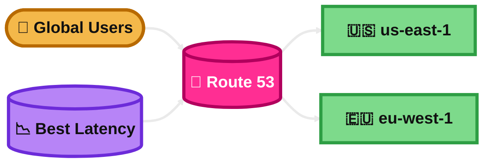
## Health Check

### What is it?
A Route 53 health check watches whether an endpoint or related signal is healthy.

It is used so Route 53 can stop returning unhealthy answers.

### How it works?
Route 53 can check an endpoint directly, calculate health from other health checks, or use a CloudWatch alarm as the health signal.

You often combine health checks with failover, weighted, geolocation, geoproximity, latency, or multi-value routing.

### Use Case
A company has a primary website and a DR website.

If the primary site becomes unhealthy, Route 53 can stop answering with the primary record and move users to the backup.

### Exam Tip
If the question says “automatic DNS failover” or “route only to healthy endpoints,” think health checks plus a routing policy.

A common trap is assuming Route 53 health checks replace ALB health checks. They do different jobs. Route 53 is DNS-level. ALB health checks are load balancer target-level.

### Visual Mermaid
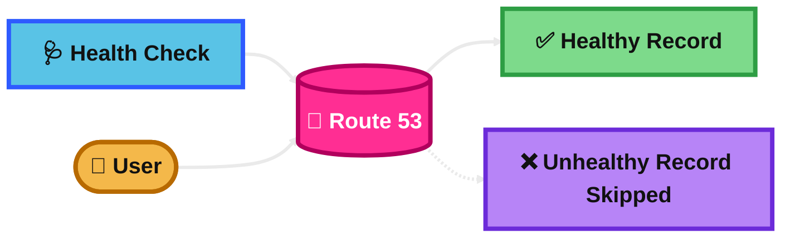
## Geolocation Routing

### What is it?
Geolocation routing sends users based on their geographic location.

You can define answers by continent, country, and for the US, even by state.

### How it works?
You create records for different user locations.

When a user makes a DNS query, Route 53 estimates the user location and returns the matching record.

### Use Case
Users in Europe go to a Europe site.

Users in the US go to a US site. This can help with localization, compliance, or region-specific content.

### Exam Tip
If the question says “send users from a country or continent to a specific endpoint,” think geolocation routing.

The trap is choosing geoproximity or latency. Geolocation is based on where the user is located, not which resource is closest or fastest.

### Visual Mermaid
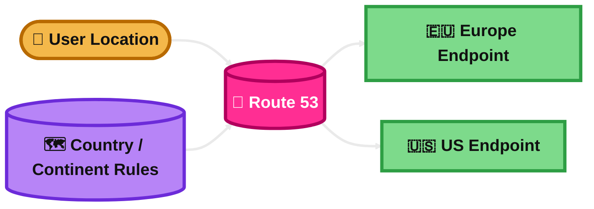
## Geoproximity Routing

### What is it?
Geoproximity routing sends traffic to the resource closest to the user based on the location of your resources.

It can also shift more or less traffic to a resource by using bias.

### How it works?
You define the location of your endpoints, such as AWS Regions or coordinates.

Route 53 routes users toward the closest resource, and bias lets you expand or shrink a resource’s traffic area.

### Use Case
A company runs endpoints in Germany and India.

By default, users go to the nearest endpoint. The company can add bias if it wants one location to take more traffic.

### Exam Tip
If the question says “closest resource” and mentions shifting the traffic area with bias, think geoproximity.

The trap is confusing it with geolocation. Geolocation is user-country rules. Geoproximity is closeness to the resource plus optional bias.

### Visual Mermaid
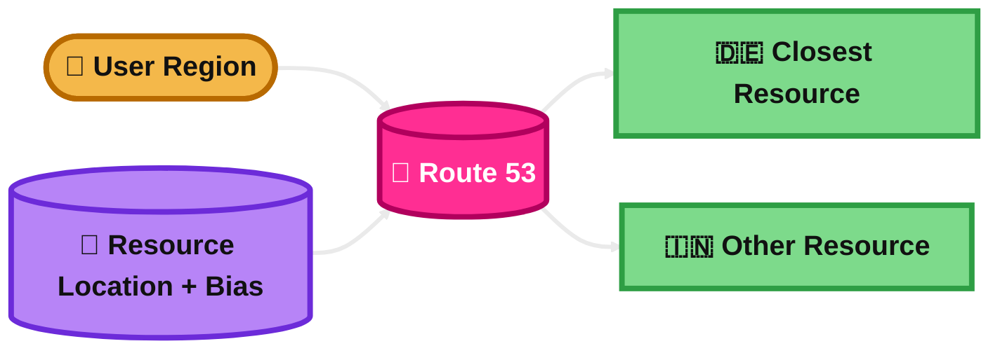
## IP-based Routing

### What is it?
IP-based routing lets you route users based on source IP CIDR ranges that you define.

It gives very specific control when you already know the client IP ranges.

### How it works?
You upload CIDR collections that map user IP ranges to named locations.

Route 53 matches the incoming source IP to that mapping and answers with the record for that location.

### Use Case
A business knows that traffic from a partner network should go to a special endpoint.

It maps that partner’s IP ranges to a location and routes only those users to that endpoint.

### Exam Tip
If the question says “route based on known source IP ranges” or “CIDR-based DNS routing,” think IP-based routing.

The trap is choosing geolocation. Geolocation uses estimated user geography. IP-based routing uses your own IP-to-endpoint mapping.

### Visual Mermaid
```mermaid
%%{init: {'theme':'base','themeVariables': {
  'background':'#0B0F19',
  'primaryTextColor':'#111111',
  'secondaryTextColor':'#111111',
  'tertiaryTextColor':'#111111',
  'lineColor':'#EAEAEA',
  'fontSize':'20px'
}}}%%
flowchart LR
    U([👤 Source IP]):::user --> R[(🧭 Route 53)]:::core
    C[(📘 CIDR Collection)]:::data --> R
    R --> P[🎯 Partner Endpoint]:::dash
    R --> D[🌐 Default Endpoint]:::dash

    classDef user fill:#F4B84A,stroke:#B86A00,stroke-width:4px,color:#111111,font-weight:bold;
    classDef app fill:#59C3E6,stroke:#2E5BFF,stroke-width:4px,color:#111111,font-weight:bold;
    classDef data fill:#B784F7,stroke:#6C2BD9,stroke-width:4px,color:#111111,font-weight:bold;
    classDef core fill:#FF2E93,stroke:#B1005D,stroke-width:4px,color:#FFFFFF,font-weight:bold;
    classDef dash fill:#7DDA8B,stroke:#2E9E44,stroke-width:4px,color:#111111,font-weight:bold;

    linkStyle 0,1,2,3,4 stroke:#EAEAEA,stroke-width:3px;
```
## Multi-Value Answer Routing

### What is it?
Multi-value answer routing lets Route 53 return multiple healthy records for the same name.

It is a simple way to improve availability without using a load balancer.

### How it works?
You create multiple records and optionally attach health checks.

Route 53 returns multiple healthy answers. If one endpoint becomes unhealthy, Route 53 stops returning that value.

### Use Case
A small app runs on several EC2 instances with public IPs.

Instead of using an ELB, the company returns multiple healthy IPs and gets basic DNS-level balancing.

### Exam Tip
If the question says “return several healthy IPs” and the design does not need a full load balancer, think multi-value answer routing.

The trap is choosing weighted routing. Weighted controls percentages. Multi-value focuses on returning multiple healthy answers.

### Visual Mermaid
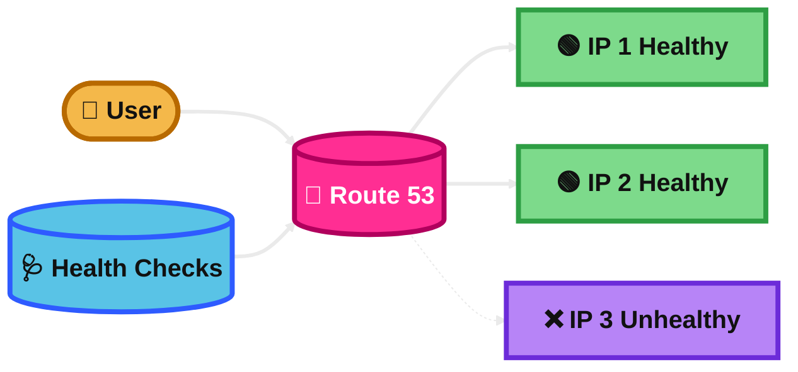
## Failover Routing

### What is it?
Failover routing is Route 53’s primary/secondary DNS routing policy.

It supports active-passive disaster recovery.

### How it works?
You create a primary record and a secondary record.

Route 53 uses health checks to decide whether to return the primary answer or switch to the backup answer.

### Use Case
A company runs a primary site in one Region and a standby site in another Region.

If the primary site fails, Route 53 directs users to the standby site.

### Exam Tip
If the question says “automatic failover,” “backup site,” “standby Region,” or “DR with DNS,” think failover routing plus health checks.

The trap is choosing weighted routing. Weighted splits traffic. Failover switches only when the primary is unhealthy.

### Visual Mermaid
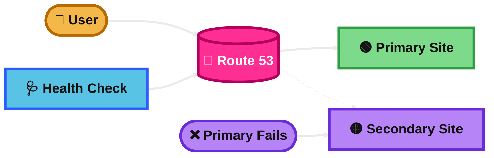
## Summary Table

| Topic | What It Is | How It Works | Best Use Case | Exam Trigger |
|---|---|---|---|---|
| Route 53 | AWS managed DNS service | Answers DNS queries using records in hosted zones | Route a domain to AWS resources | Domain names, DNS, traffic steering |
| Record Types | Different DNS answer formats | Returns IPs, names, mail info, zone info, etc. | A/AAAA for IPs, MX for mail, TXT for verification | IPv4, IPv6, root domain, mail setup |
| Hosted Zones | Container for DNS records | Public zones answer internet queries, private zones answer VPC queries | Public websites or internal VPC DNS | Public internet vs internal VPC-only DNS |
| Record TTL | DNS cache time in seconds | Resolvers cache answers until TTL expires | Faster migrations or fewer DNS queries | Faster change = lower TTL, more caching = higher TTL |
| Alias and Alias Targets Records | Route 53 record that points to supported AWS targets or another Route 53 record | Route 53 returns the answer for the target resource | Root domain to ALB, CloudFront, S3 website | Zone apex, AWS resource target, avoid CNAME trap |
| Routing Policies | Rules for choosing which record to return | Route 53 selects by policy such as weight, latency, health, geography | Global routing and traffic control | Multiple records, smart DNS decision |
| Simple Based Routing | Basic one-answer routing | Route 53 returns the simple record value | Single website or single endpoint | One target, no traffic steering |
| Weighted Based Routing | DNS traffic split by percentage | Records share same name/type and use weights | Canary release or gradual migration | 90/10 split, test new version |
| Latency Based Routing | Send users to lowest-latency Region | Route 53 picks the Region with better latency | Multi-Region app performance | Lowest latency, global users, better response time |
| Health Check | Monitors endpoint or health signal | Route 53 excludes unhealthy answers | DNS failover and healthy-only routing | Health-based routing, automatic failover |
| Geolocation Routing | Route by user geographic area | Uses country, continent, or US state rules | Country-specific content or compliance | Route users by country/continent |
| Geoproximity Routing | Route by closeness to resource, with optional bias | Sends traffic to nearest resource and can expand/shrink traffic area | Fine control of regional traffic maps | Closest resource, bias |
| IP-based Routing | Route by source IP CIDR mapping | Matches client IP to uploaded CIDR collection | Partner networks or known client ranges | CIDR-based routing, known source IPs |
| Multi-Value Answer Routing | Return multiple healthy answers | Route 53 returns several healthy records | Simple DNS-level HA without ELB | Multiple healthy IPs, no full load balancer |
| Failover Routing | Primary/secondary DNS routing | Health checks decide when to switch to backup | Active-passive disaster recovery | Primary site, standby site, automatic failover |