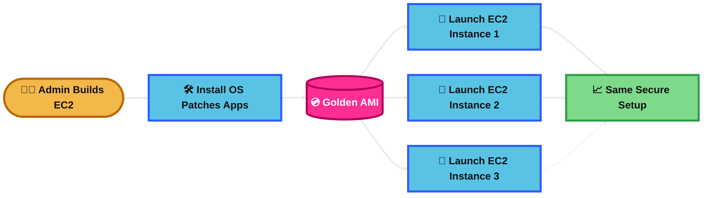
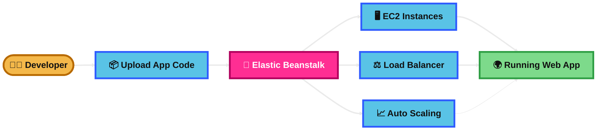

## Golden AMI

### What is it?
A Golden AMI is a prebuilt Amazon Machine Image that already has the OS, patches, security settings, and required software installed.

It is used to launch EC2 instances quickly with a standard setup.

Think of it as a “master server template” for your company.

### How it works?
You create and configure one EC2 instance the way you want.

Then you create an AMI from that instance.

After that, you launch new EC2 instances from the AMI, and they all start with the same configuration.

This improves consistency, speeds up deployments, and reduces manual setup work.

### Use Case
A company wants all application servers to have the same OS version, security patches, monitoring agent, and app dependencies.

They create a Golden AMI and use it in an Auto Scaling group so every new EC2 instance is built the same way.

### Exam Tip
Look for clues like:
- “standardized EC2 deployment”
- “preconfigured image”
- “same software on all instances”
- “faster instance launch”
- “consistent hardened server build”

Why it is a good answer:
It helps with consistency, speed, and controlled deployments.

Common trap:
Do not confuse Golden AMI with snapshots or backups.
A snapshot backs up storage.
A Golden AMI is mainly for launching identical EC2 instances.

Another trap:
If the question wants fully managed application deployment with less infrastructure management, Elastic Beanstalk may be better than managing Golden AMIs yourself.

### Visual Mermaid

## Elastic Beanstalk

### What is it?
Elastic Beanstalk is a managed service that helps you deploy and run applications on AWS.

You upload your code, and AWS handles much of the infrastructure setup for you.

It can manage EC2 instances, load balancers, Auto Scaling, monitoring, and deployments.

### How it works?
You choose a platform such as Java, Node.js, Python, .NET, Docker, or PHP.

Then you upload your application code.

Elastic Beanstalk creates the environment behind the scenes, including EC2, Auto Scaling, Elastic Load Balancing, and sometimes RDS if you choose it.

You still have access to the underlying resources, but AWS handles much of the operational work.

### Use Case
A small team wants to deploy a web app quickly without manually configuring EC2, load balancers, scaling, and health monitoring.

They use Elastic Beanstalk to push code and let AWS manage the deployment environment.

### Exam Tip
Look for clues like:
- “deploy application code quickly”
- “managed platform for web apps”
- “developer focuses on code, not infrastructure”
- “automatic scaling and load balancing”
- “easy deployment to AWS”

Why it is a good answer:
It is a strong choice when the question wants a managed app platform but still uses EC2 underneath.

Common trap:
Do not confuse Elastic Beanstalk with Lambda.
Lambda is serverless and event-driven.
Elastic Beanstalk still uses EC2 behind the scenes.

Another trap:
Do not confuse it with ECS or EKS.
If the question is specifically about container orchestration, ECS or EKS may be a better answer.

### Visual Mermaid

## Summary Table

| Topic | What It Is | How It Works | Best Use Case | Exam Trigger |
|---|---|---|---|---|
| Golden AMI | A prebuilt EC2 image with OS, patches, and software | Create one configured EC2 instance, make an AMI, launch many identical instances from it | Standardized server deployments and fast EC2 provisioning | “Preconfigured image,” “same setup on all EC2s,” “hardened base image,” “consistent launches” |
| Elastic Beanstalk | A managed application deployment service | You upload code, and AWS provisions EC2, scaling, load balancing, and monitoring | Quickly deploying web apps with less infrastructure work | “Just upload code,” “managed platform,” “automatic scaling,” “easy app deployment” |