## Amazon S3

### What is it?
Amazon S3 is AWS object storage.

You store files as objects inside buckets.
It is built for very high durability, scale, and easy access from anywhere.

### How it works?
An app uploads an object into an S3 bucket.

S3 stores the object and its metadata.
You can later retrieve it with a URL, SDK, CLI, or API call.

You usually combine S3 with IAM, bucket policies, encryption, versioning, and lifecycle rules.

### Use Case
Store website images, backups, log files, videos, and data lake files in one durable storage service.

### Exam Tip
Pick S3 when the question is about files, documents, images, backups, archives, or static content.

Main clue: "store any amount of data" or "durable object storage."

Trap: S3 is not block storage for EC2.
If the question needs a file system for many servers, think EFS instead.
If it needs a disk for one server, think EBS.

### Visual Mermaid
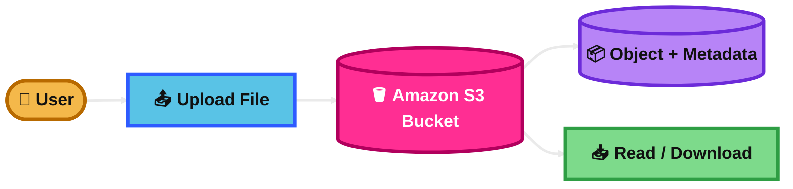
## S3 Lifecycle

### What is it?
S3 Lifecycle is an automatic rule system for your S3 objects.

It moves objects to cheaper storage classes or deletes them after a set time.

### How it works?
You create lifecycle rules on a bucket.

The rules can target all objects or only objects with a prefix or tag.
Then S3 automatically transitions or expires objects based on age.

For example, move logs to a cheaper class after 30 days and delete them after 365 days.

### Use Case
A company keeps app logs in S3 Standard for 30 days, moves them to Glacier later, and deletes them after 7 years.

### Exam Tip
Pick S3 Lifecycle when the question says "automatically move old data to cheaper storage" or "delete objects after X days."

This is a strong cost-optimization answer.

Trap: lifecycle is rule-based, not instant manual movement.
Also remember some storage classes have minimum storage duration rules.

### Visual Mermaid
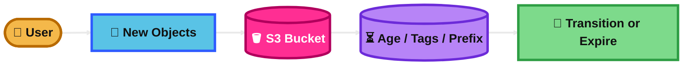
## S3 Object Lock

### What is it?
S3 Object Lock protects objects from being deleted or overwritten.

It uses a WORM model, which means write once, read many.

### How it works?
You enable Object Lock on a versioned bucket.

Then you can place a retention period or a legal hold on object versions.
Retention can be Governance mode or Compliance mode.

Governance mode is easier for authorized admins to manage.
Compliance mode is stricter.

### Use Case
A financial company must keep records unchanged for 7 years for compliance.

### Exam Tip
Pick Object Lock when the question mentions compliance, legal requirements, WORM, tamper protection, or ransomware protection.

Big clue: "cannot be deleted before retention date."

Trap: Object Lock works with object versions.
Think Versioning + Object Lock together.

### Visual Mermaid
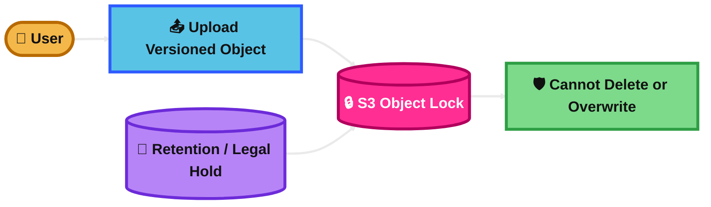
## S3 Object Replication

### What is it?
S3 Object Replication copies objects from one S3 bucket to another automatically.

It is used for backup design, compliance, isolation, and data distribution.

### How it works?
You enable versioning on source and destination buckets.

Then you create replication rules.
S3 asynchronously copies matching objects to another bucket, either in the same Region or a different Region.

### Use Case
A company stores uploaded documents in one bucket and automatically copies them to a backup bucket in another AWS Region.

### Exam Tip
Pick S3 replication when the question asks for automatic copying of S3 objects to another bucket for DR, compliance, or separate access control.

Main clue: "replicate objects automatically after upload."

Trap: standard live replication does not copy old objects that existed before the rule.
For existing objects, think Batch Replication.

### Visual Mermaid
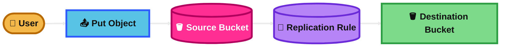
## S3 Object Batch Operations

### What is it?
S3 Batch Operations lets you run one bulk action on many S3 objects.

It is for large-scale object management.

### How it works?
You create a job and give S3 a manifest, which is the list of objects to process.

Then S3 performs one action across that list.
Examples include copy, tagging, encryption updates, restore requests, Object Lock actions, and Lambda invocation.

### Use Case
A company has millions of archived files and wants to restore all files for one project at once.

### Exam Tip
Pick S3 Batch Operations when the question says "millions," "billions," "bulk update," "bulk tagging," or "apply the same action to many objects."

Big clue: one action across a huge object list.

Trap: this is not real-time event processing.
It is batch job processing for existing objects.

### Visual Mermaid
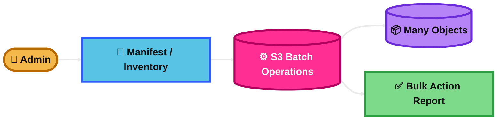
## S3 Block Public Access

### What is it?
S3 Block Public Access is a safety control that prevents public access to S3 data.

It helps stop accidental exposure.

### How it works?
You can enable it at the account, bucket, or access point level.

It overrides public bucket policies or ACL settings that would otherwise expose data.

### Use Case
A company stores private customer files in S3 and wants to make sure nobody accidentally opens the bucket to the internet.

### Exam Tip
Pick this when the question says "prevent accidental public access" or "ensure buckets cannot become public."

This is a security-first answer.

Trap: if the question requires a public static website, Block Public Access may need adjustment for that design.
For private content, keep it on.

### Visual Mermaid
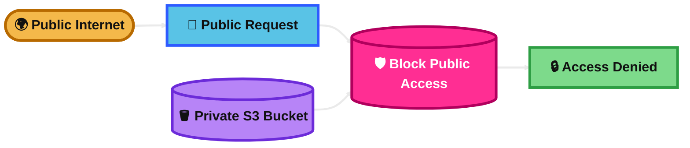
## S3 IAM Access

### What is it?
S3 IAM access means controlling S3 permissions with IAM users, groups, or roles.

This is identity-based access control.

### How it works?
You attach IAM policies to an identity.

The policy says what S3 actions are allowed on which buckets or objects.
For apps running on AWS, you usually use IAM roles instead of access keys.

### Use Case
An EC2 instance needs permission to read files from one bucket and write logs to another bucket.

### Exam Tip
Pick IAM policies when the question is about granting S3 permissions to a user, application, EC2 instance, Lambda function, or role.

Main clue: "who can access S3?"

Trap: IAM policy is identity-based.
If the question is about granting another AWS account access to a bucket, bucket policy is often the cleaner answer.

### Visual Mermaid

## S3 Bucket Policies

### What is it?
An S3 bucket policy is a resource-based policy attached directly to a bucket.

It controls who can access that bucket and under what conditions.

### How it works?
You write a JSON policy on the bucket.

The policy can allow or deny actions for specific principals, IP ranges, VPC endpoints, or other conditions.

This is very useful for cross-account access and controlled public access.

### Use Case
A company allows only one partner AWS account to upload files into a specific bucket.

### Exam Tip
Pick bucket policy when the question is about bucket-level sharing, cross-account access, IP restrictions, or enforcing conditions like HTTPS-only requests.

Main clue: "control access to this bucket."

Trap: bucket policies are resource-based, not attached to users.
Also, in modern S3 designs, policies are often preferred over ACLs.

### Visual Mermaid
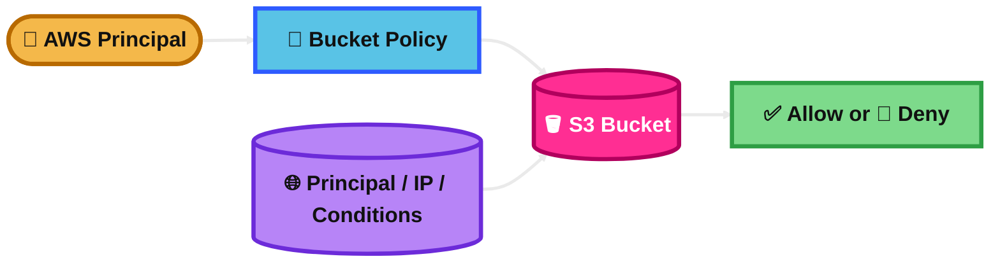
## S3 Static Website

### What is it?
S3 Static Website hosting lets you serve static web content directly from an S3 bucket.

This works for HTML, CSS, JavaScript, images, and error pages.

### How it works?
You enable static website hosting on a bucket.

Then S3 serves files from a website endpoint.
You define an index document and optional error document.

### Use Case
Host a simple company landing page or documentation site.

### Exam Tip
Pick S3 static website when the site is fully static and needs a simple low-cost hosting option.

Big clue: "no servers" and "static content only."

Trap: S3 website endpoints do not support HTTPS by themselves.
If the exam mentions HTTPS, custom domain, global caching, or better security, think CloudFront in front of S3.

### Visual Mermaid
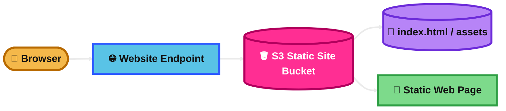
## S3 Versioning

### What is it?
S3 Versioning keeps multiple versions of the same object in one bucket.

It helps recover from accidental deletes and overwrites.

### How it works?
When versioning is enabled, each object version gets its own version ID.

If someone overwrites a file, the old version is still there.
If someone deletes a file, S3 usually adds a delete marker instead of removing every version.

### Use Case
An app stores configuration files in S3 and needs protection against accidental replacement.

### Exam Tip
Pick Versioning when the question mentions rollback, restore old versions, recover deleted files, or protect against accidental overwrite.

Main clue: "keep previous versions."

Trap: deleting an object in a versioned bucket does not always mean the data is gone.
Also, versioning is required for replication and Object Lock.

### Visual Mermaid
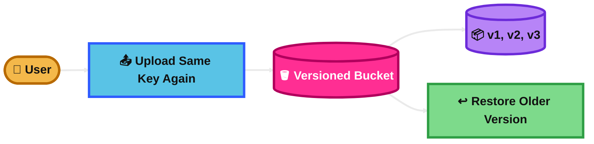
## Live Replication

### What is it?
Live Replication is the automatic continuous replication of new or updated S3 objects.

It is the normal replication behavior after you set replication rules.

### How it works?
You configure replication on a bucket.

After that, when new matching objects are written or updated, S3 replicates them automatically to the destination bucket.
This happens continuously in the background.

### Use Case
A company uploads user files all day and wants every new file copied automatically to another bucket for DR.

### Exam Tip
Pick live replication when the question says new objects should be copied automatically after upload.

Main clue: "ongoing automatic replication."

Trap: live replication is not retroactive.
Objects that already existed before the rule are not copied automatically.

### Visual Mermaid
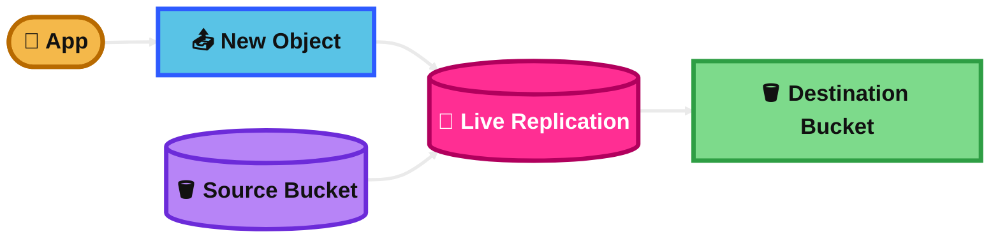
## On-Demand Replication

### What is it?
On-demand replication means replicating existing S3 objects when you choose to do it.

In AWS, this is done with S3 Batch Replication.

### How it works?
You create a Batch Replication job for existing objects.

S3 then replicates objects that were already in the bucket, failed to replicate before, or need re-replication.

### Use Case
A company turns on replication today but also needs the last 3 years of files copied to the DR bucket.

### Exam Tip
Pick on-demand replication when the question says old objects must also be replicated.

Main clue: "existing objects," "already in the bucket," or "retroactive replication."

Trap: live replication alone is not enough here.
You need Batch Replication.

### Visual Mermaid
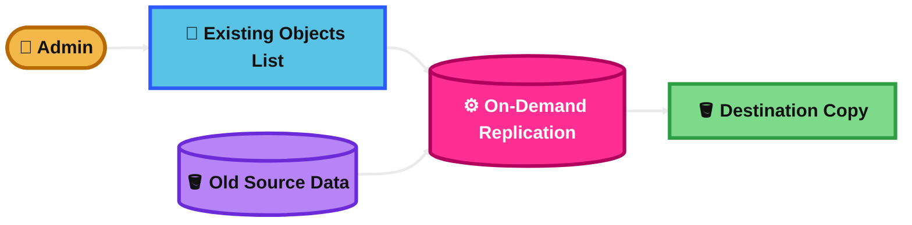
## Cross-Region Replication (CRR)

### What is it?
CRR is S3 replication from one AWS Region to another Region.

It is used for disaster recovery, compliance, and geographic separation.

### How it works?
You set a replication rule from a source bucket to a destination bucket in another Region.

New matching objects are copied asynchronously across Regions.

### Use Case
A company stores production data in Frankfurt and automatically replicates it to Ireland for regional disaster recovery.

### Exam Tip
Pick CRR when the question mentions another Region, regional DR, compliance, or lower-latency reads for users in another geography.

Main clue: "copy S3 data to another AWS Region."

Trap: CRR has cross-Region transfer cost.
If the requirement stays inside one Region, SRR may fit better.

### Visual Mermaid

## Same-Region Replication (SRR)

### What is it?
SRR is S3 replication from one bucket to another bucket in the same AWS Region.

It is used for separation without leaving the Region.

### How it works?
You create a replication rule with source and destination buckets in the same Region.

S3 then copies matching objects automatically.

### Use Case
A company keeps app uploads in one bucket and replicates them to another same-Region bucket owned by a different account for separate access control.

### Exam Tip
Pick SRR when the question wants replication but not across Regions.

Main clue: "same Region," "two buckets," "separate teams," or "same-Region compliance."

Trap: SRR does not protect against a full regional outage.
For regional DR, think CRR.

### Visual Mermaid

## Frequently Accessed Storage Classes (S3 Standard)

### What is it?
S3 Standard is the default S3 storage class.

It is for frequently accessed data and low-latency access.

### How it works?
When you upload an object without choosing another class, S3 stores it in S3 Standard.

It is designed for frequent access and general-purpose storage needs.

### Use Case
Store active website content, app assets, and user-uploaded files that are read often.

### Exam Tip
Pick S3 Standard when the data is used often and needs fast access.

Main clue: "frequently accessed" and "general purpose."

Trap: if access is unpredictable, Intelligent-Tiering may save money.
If access is clearly low, Standard-IA may be cheaper.

### Visual Mermaid

## Auto-Optimizing (S3 Intelligent-Tiering)

### What is it?
S3 Intelligent-Tiering is a storage class that automatically moves objects between access tiers based on usage.

It is made for unknown or changing access patterns.

### How it works?
S3 monitors how often objects are accessed.

Then it moves them between tiers to lower cost without changing your app.
You pay a small monitoring and automation fee.

### Use Case
A company stores documents that might be hot this month and cold next month, but it cannot predict usage well.

### Exam Tip
Pick Intelligent-Tiering when the question says "unknown," "unpredictable," or "changing" access pattern.

This is a favorite exam cost-optimization answer.

Trap: if you already know the data is always hot or always cold, another class may be simpler and cheaper.

### Visual Mermaid
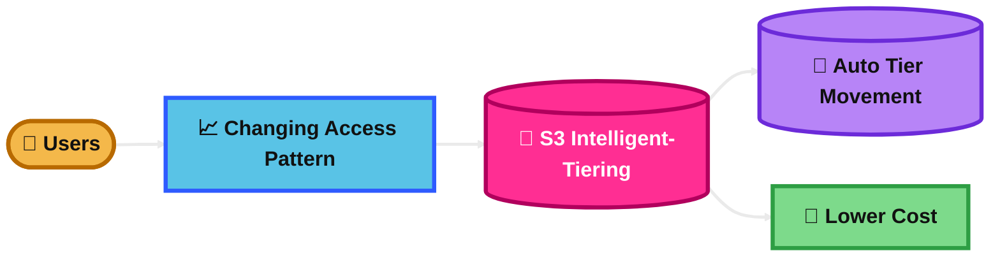
## Infrequently Accessed (S3 Standard-IA & One Zone-IA)

### What is it?
These are lower-cost S3 storage classes for data you do not access often but still need quickly.

Both provide millisecond access.

### How it works?
You store or transition objects into these classes.

S3 Standard-IA keeps data across multiple AZs.
S3 One Zone-IA keeps data in one AZ, so it is cheaper but less resilient.

### Use Case
Monthly reports are rarely opened, but when needed they must be retrieved immediately.

### Exam Tip
Pick Standard-IA when data is infrequently accessed but still important and should remain highly resilient.

Pick One Zone-IA when the data can be recreated and lower cost matters more.

Trap: these classes charge retrieval fees and have minimum storage duration.
One Zone-IA is not a good choice for the only critical copy of important data.

### Visual Mermaid
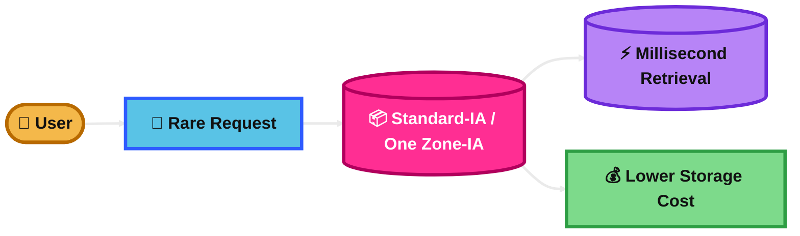
## Rarely Accessed (Glacier Classes)

### What is it?
The Glacier classes are low-cost storage classes for long-term retention and archive use cases.

They are for data you almost never read.

### How it works?
You store objects directly in a Glacier class or transition them there with Lifecycle.

S3 Glacier Instant Retrieval gives millisecond access.
S3 Glacier Flexible Retrieval is slower and is used for archive data.
S3 Glacier Deep Archive is the cheapest and slowest.

### Use Case
A company keeps compliance records for many years and rarely needs to retrieve them.

### Exam Tip
Pick Glacier classes when the question says archive, long-term retention, lowest storage cost, or rare retrieval.

Use Glacier Instant Retrieval when access must still be immediate.
Use Glacier Flexible Retrieval when minutes to hours is okay.
Use Deep Archive for very rare access and longest retention.

Trap: Flexible Retrieval and Deep Archive are archival classes.
You usually restore first before normal access.

### Visual Mermaid
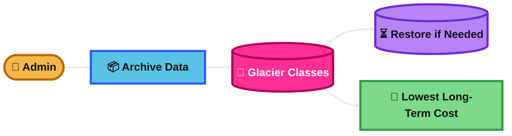
## Summary Table

| Topic | What It Is | How It Works | Best Use Case | Exam Trigger |
|---|---|---|---|---|
| Amazon S3 | AWS object storage | Stores objects in buckets | Files, backups, images, logs | Durable object storage |
| S3 Lifecycle | Automatic transition/delete rules | Rules based on age, prefix, or tag | Reduce storage cost over time | Move old data automatically |
| S3 Object Lock | WORM protection for objects | Retention dates or legal holds on versions | Compliance and tamper protection | Cannot delete or overwrite |
| S3 Object Replication | Automatic copy to another bucket | Replication rules copy matching objects | DR, compliance, separate buckets | Replicate uploaded objects |
| S3 Object Batch Operations | Bulk action on many objects | Job + manifest + one action | Bulk restore, tag, copy, encrypt | Millions or billions of objects |
| S3 Block Public Access | Prevents public exposure | Overrides public policies and ACLs | Secure private buckets | Prevent accidental public access |
| S3 IAM Access | Identity-based S3 permissions | IAM users, groups, roles, policies | App or user access to S3 | Who can access S3 |
| S3 Bucket Policies | Resource-based bucket permissions | JSON policy attached to bucket | Cross-account or conditional access | Access to this bucket |
| S3 Static Website | Static web hosting from S3 | Website endpoint serves files | Simple static site | No servers, static content |
| S3 Versioning | Keeps multiple object versions | New version ID for each change | Recover deletes and overwrites | Restore previous version |
| Live Replication | Continuous replication for new data | New matching objects copy automatically | Ongoing DR copy | Automatic replication after upload |
| On-Demand Replication | Retroactive replication for existing data | Batch Replication job copies old objects | Backfill old files | Existing objects must replicate |
| Cross-Region Replication (CRR) | Replication to another Region | Replication rule across Regions | Regional DR and compliance | Another AWS Region |
| Same-Region Replication (SRR) | Replication in same Region | Replication rule within one Region | Same-Region isolation | Same Region replication |
| Frequently Accessed Storage Classes (S3 Standard) | Default hot storage | Frequent low-latency access | Active app data | Frequently accessed |
| Auto-Optimizing (S3 Intelligent-Tiering) | Auto cost optimization | Moves objects between tiers by usage | Unknown access pattern | Unpredictable access |
| Infrequently Accessed (S3 Standard-IA & One Zone-IA) | Lower-cost quick retrieval storage | Millisecond access with retrieval fee | Rare but fast retrieval | Infrequent access, quick retrieval |
| Rarely Accessed (Glacier Classes) | Archive storage classes | Low-cost archive with slower restore options | Long-term archive | Archive and very rare access |